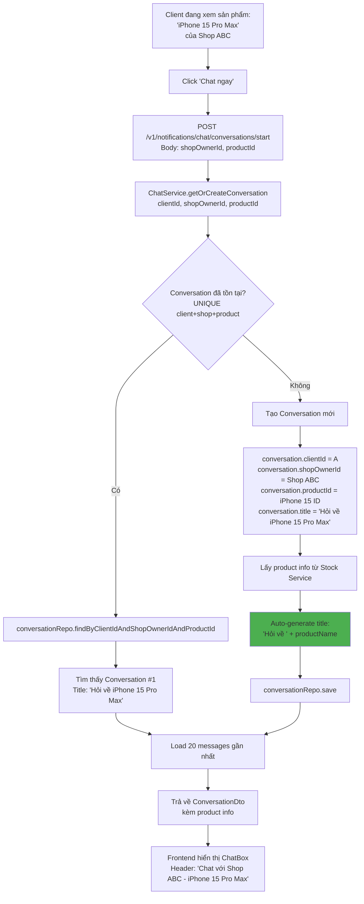
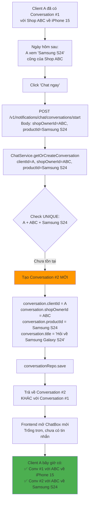

# 💬 CHỨC NĂNG CHAT THEO CHUẨN SHOPEE

## 📱 PHÂN TÍCH SHOPEE THỰC TẾ

### Cách Shopee Hoạt Động

#### Ví Dụ Thực Tế:

**Tình huống 1: Client hỏi nhiều sản phẩm khác nhau**
```
User: Nguyễn Văn A
Shop: Shop Điện Thoại ABC

Hôm nay (01/12):
→ A xem "iPhone 15 Pro Max" → Click "Chat ngay"
→ Tạo Conversation #1: Client A ↔ Shop ABC (về iPhone 15)
→ A hỏi: "Máy còn bảo hành không?"

Ngày mai (02/12):
→ A xem "Samsung Galaxy S24" của cùng Shop ABC → Click "Chat ngay"
→ Tạo Conversation #2 MỚI: Client A ↔ Shop ABC (về Samsung S24)
→ A hỏi: "Máy có sạc nhanh không?"

Kết quả:
✅ A có 2 conversations riêng biệt với Shop ABC
✅ Mỗi conversation gắn với 1 sản phẩm
✅ Dễ theo dõi, không lẫn lộn
```

**Tình huống 2: Conversation chung (không gắn sản phẩm)**
```
→ Client vào trang Shop ABC (không từ sản phẩm cụ thể)
→ Click "Chat với shop"
→ Tạo Conversation chung: Client A ↔ Shop ABC (product_id = NULL)
→ Hỏi về chính sách chung, thời gian giao hàng, v.v.
```

### So Sánh Thiết Kế

| Tiêu chí | Thiết kế CŨ (SAI) | Thiết kế MỚI (ĐÚNG - Shopee) |
|----------|-------------------|-------------------------------|
| **Constraint** | UNIQUE (client_id, shop_owner_id) | UNIQUE (client_id, shop_owner_id, product_id) |
| **Số conversations** | 1 Client + 1 Shop = 1 Conversation | 1 Client + 1 Shop = NHIỀU Conversations |
| **Context** | Không rõ hỏi về sản phẩm nào | Mỗi conversation gắn với 1 sản phẩm |
| **UX** | Lẫn lộn khi hỏi nhiều sp | Rõ ràng, dễ theo dõi |

---

## 💾 DATABASE SCHEMA MỚI (ĐÚNG)

### 1. Bảng `conversations` - CẬP NHẬT

```sql
CREATE TABLE conversations (
    -- Primary Key
    id VARCHAR(255) PRIMARY KEY,
    
    -- Participants
    client_id VARCHAR(255) NOT NULL COMMENT 'User ID của khách hàng',
    shop_owner_id VARCHAR(255) NOT NULL COMMENT 'User ID của shop owner',
    
    -- Context (QUAN TRỌNG - Phân biệt conversations)
    product_id VARCHAR(255) COMMENT 'Sản phẩm gắn với conversation này (NULL nếu chat chung)',
    
    -- Conversation Title (tự động generate hoặc custom)
    title VARCHAR(500) COMMENT 'Tiêu đề conversation (VD: "Hỏi về iPhone 15 Pro Max")',
    
    -- Last Message Info
    last_message_content TEXT COMMENT 'Preview tin nhắn cuối',
    last_message_sender_id VARCHAR(255),
    last_message_at TIMESTAMP,
    
    -- Unread Count
    client_unread_count INT DEFAULT 0,
    shop_owner_unread_count INT DEFAULT 0,
    
    -- Status
    status ENUM('ACTIVE', 'ARCHIVED', 'BLOCKED') DEFAULT 'ACTIVE',
    
    -- Timestamps
    created_at TIMESTAMP DEFAULT CURRENT_TIMESTAMP,
    updated_at TIMESTAMP DEFAULT CURRENT_TIMESTAMP ON UPDATE CURRENT_TIMESTAMP,
    
    -- Constraints - QUAN TRỌNG
    -- 1 Client + 1 Shop + 1 Product = 1 Conversation duy nhất
    -- Nhưng 1 Client + 1 Shop có thể có NHIỀU conversations (mỗi product khác nhau)
    UNIQUE KEY unique_conversation_per_product (client_id, shop_owner_id, product_id),
    
    -- Indexes
    INDEX idx_client_id (client_id),
    INDEX idx_shop_owner_id (shop_owner_id),
    INDEX idx_product_id (product_id),
    INDEX idx_updated_at (updated_at),
    INDEX idx_client_shop (client_id, shop_owner_id)
) ENGINE=InnoDB DEFAULT CHARSET=utf8mb4 COLLATE=utf8mb4_unicode_ci;
```

**Giải thích UNIQUE Constraint:**
```sql
UNIQUE (client_id, shop_owner_id, product_id)
```
- Client A + Shop B + Product X → 1 conversation
- Client A + Shop B + Product Y → 1 conversation KHÁC
- Client A + Shop B + NULL (chat chung) → 1 conversation chung
- ✅ **Cho phép nhiều conversations giữa cùng client và shop**

### 2. Bảng `messages` - KHÔNG THAY ĐỔI

```sql
-- Giữ nguyên như thiết kế trước
CREATE TABLE messages (
    id VARCHAR(255) PRIMARY KEY,
    conversation_id VARCHAR(255) NOT NULL,
    sender_id VARCHAR(255) NOT NULL,
    sender_type ENUM('CLIENT', 'SHOP_OWNER') NOT NULL,
    message_type ENUM('TEXT', 'IMAGE', 'PRODUCT_LINK') DEFAULT 'TEXT',
    content TEXT NOT NULL,
    image_id VARCHAR(255),
    product_id VARCHAR(255),
    is_read BOOLEAN DEFAULT FALSE,
    read_at TIMESTAMP NULL,
    delivery_status ENUM('SENT', 'DELIVERED', 'READ') DEFAULT 'SENT',
    created_at TIMESTAMP DEFAULT CURRENT_TIMESTAMP,
    updated_at TIMESTAMP DEFAULT CURRENT_TIMESTAMP ON UPDATE CURRENT_TIMESTAMP,
    
    FOREIGN KEY (conversation_id) REFERENCES conversations(id) ON DELETE CASCADE,
    INDEX idx_conversation_id (conversation_id),
    INDEX idx_sender_id (sender_id),
    INDEX idx_created_at (created_at)
) ENGINE=InnoDB DEFAULT CHARSET=utf8mb4 COLLATE=utf8mb4_unicode_ci;
```

---

## 🏗️ JAVA ENTITIES - CẬP NHẬT

### Conversation Entity

```java
package com.example.notificationservice.model;

import jakarta.persistence.*;
import lombok.Data;
import java.time.LocalDateTime;

@Entity
@Table(
    name = "conversations",
    uniqueConstraints = {
        @UniqueConstraint(
            name = "unique_conversation_per_product",
            columnNames = {"client_id", "shop_owner_id", "product_id"}
        )
    }
)
@Data
public class Conversation {
    
    @Id
    @Column(length = 255)
    private String id;
    
    @Column(name = "client_id", nullable = false, length = 255)
    private String clientId;
    
    @Column(name = "shop_owner_id", nullable = false, length = 255)
    private String shopOwnerId;
    
    @Column(name = "product_id", length = 255)
    private String productId; // NULL được phép (cho conversation chung)
    
    @Column(name = "title", length = 500)
    private String title; // "Hỏi về iPhone 15 Pro Max"
    
    @Column(name = "last_message_content", columnDefinition = "TEXT")
    private String lastMessageContent;
    
    @Column(name = "last_message_sender_id", length = 255)
    private String lastMessageSenderId;
    
    @Column(name = "last_message_at")
    private LocalDateTime lastMessageAt;
    
    @Column(name = "client_unread_count")
    private Integer clientUnreadCount = 0;
    
    @Column(name = "shop_owner_unread_count")
    private Integer shopOwnerUnreadCount = 0;
    
    @Enumerated(EnumType.STRING)
    @Column(nullable = false)
    private ConversationStatus status = ConversationStatus.ACTIVE;
    
    @Column(name = "created_at", nullable = false, updatable = false)
    private LocalDateTime createdAt;
    
    @Column(name = "updated_at")
    private LocalDateTime updatedAt;
    
    @PrePersist
    protected void onCreate() {
        createdAt = LocalDateTime.now();
        updatedAt = LocalDateTime.now();
        if (id == null) {
            id = java.util.UUID.randomUUID().toString();
        }
    }
    
    @PreUpdate
    protected void onUpdate() {
        updatedAt = LocalDateTime.now();
    }
}
```

---

## 📦 REPOSITORIES - CẬP NHẬT

### ConversationRepository

```java
package com.example.notificationservice.repository;

import com.example.notificationservice.model.Conversation;
import org.springframework.data.jpa.repository.JpaRepository;
import org.springframework.data.jpa.repository.Query;
import java.util.List;
import java.util.Optional;

public interface ConversationRepository extends JpaRepository<Conversation, String> {
    
    /**
     * Tìm conversation theo client, shop, và product
     * Dùng khi client click "Chat ngay" từ 1 sản phẩm cụ thể
     */
    Optional<Conversation> findByClientIdAndShopOwnerIdAndProductId(
        String clientId, 
        String shopOwnerId, 
        String productId
    );
    
    /**
     * Tìm conversation chung (không gắn product)
     * Dùng khi chat từ trang shop chung
     */
    @Query("SELECT c FROM Conversation c WHERE c.clientId = ?1 AND c.shopOwnerId = ?2 AND c.productId IS NULL")
    Optional<Conversation> findGeneralConversation(String clientId, String shopOwnerId);
    
    /**
     * Lấy TẤT CẢ conversations của 1 user
     * User có thể là client hoặc shop owner
     * Sắp xếp theo thời gian cập nhật mới nhất
     */
    @Query("SELECT c FROM Conversation c WHERE c.clientId = ?1 OR c.shopOwnerId = ?1 ORDER BY c.updatedAt DESC")
    List<Conversation> findByUserId(String userId);
    
    /**
     * Lấy conversations giữa client và shop (TẤT CẢ, không phân biệt product)
     * VD: Xem tất cả conversations của Client A với Shop B
     */
    @Query("SELECT c FROM Conversation c WHERE (c.clientId = ?1 AND c.shopOwnerId = ?2) OR (c.clientId = ?2 AND c.shopOwnerId = ?1) ORDER BY c.updatedAt DESC")
    List<Conversation> findBetweenClientAndShop(String userId1, String userId2);
    
    /**
     * Đếm tổng số conversations chưa đọc
     */
    @Query("SELECT COUNT(c) FROM Conversation c WHERE (c.clientId = ?1 AND c.clientUnreadCount > 0) OR (c.shopOwnerId = ?1 AND c.shopOwnerUnreadCount > 0)")
    Long countUnreadConversations(String userId);
}
```

---

## 🔄 FLOW CHI TIẾT - CẬP NHẬT

### Flow 1: Client Chat Từ Sản Phẩm



### Flow 2: Ngày Hôm Sau - Chat Sản Phẩm Khác



### Flow 3: Danh Sách Conversations

```mermaid
flowchart TD
    A[Client A vào trang 'Tin nhắn'] --> B[GET /v1/notifications/chat/conversations]
    
    B --> C[conversationRepo.findByUserId A]
    
    C --> D[Lấy tất cả conversations của A<br/>ORDER BY updated_at DESC]
    
    D --> E[Duyệt từng conversation:<br/>Enrich thông tin]
    
    E --> F[Conversation #2:<br/>- Shop: ABC<br/>- Product: Samsung S24<br/>- Last msg: 'Máy có sạc nhanh không?'<br/>- Time: 02/12 10:00 AM<br/>- Unread: 1]
    
    F --> G[Conversation #1:<br/>- Shop: ABC<br/>- Product: iPhone 15<br/>- Last msg: 'Dạ máy còn bảo hành ạ'<br/>- Time: 01/12 3:00 PM<br/>- Unread: 0]
    
    G --> H[Hiển thị danh sách]
    
    H --> I[Frontend render:<br/><br/>--- Conversation #2 ---<br/>[Ảnh Samsung] Samsung Galaxy S24<br/>Shop ABC<br/>'Máy có sạc nhanh...'  [1]<br/>02/12 10:00 AM<br/><br/>--- Conversation #1 ---<br/>[Ảnh iPhone] iPhone 15 Pro Max<br/>Shop ABC<br/>'Dạ máy còn bảo hành...'<br/>01/12 3:00 PM]
    
    style I fill:#2196f3
```

---

## 🎨 UI/UX MÔ TẢ

### Giao Diện Danh Sách Chat

```
┌─────────────────────────────────────────┐
│  🔙  Tin nhắn                      ⋮    │
├─────────────────────────────────────────┤
│                                         │
│  ┌────────────────────────────────┐    │
│  │ [📱 Ảnh Samsung S24]            │    │
│  │ Samsung Galaxy S24             🔴1  │
│  │ Shop Điện Thoại ABC               │
│  │ Máy có sạc nhanh không?           │
│  │ 02/12/2024 10:00 AM               │
│  └────────────────────────────────┘    │
│                                         │
│  ┌────────────────────────────────┐    │
│  │ [📱 Ảnh iPhone 15]              │    │
│  │ iPhone 15 Pro Max                 │
│  │ Shop Điện Thoại ABC               │
│  │ Dạ máy còn bảo hành ạ             │
│  │ 01/12/2024 3:00 PM                │
│  └────────────────────────────────┘    │
│                                         │
│  ┌────────────────────────────────┐    │
│  │ [👕 Ảnh Áo thun]                │    │
│  │ Áo thun nam basic                 │
│  │ Shop Thời Trang XYZ               │
│  │ Size M còn không shop?            │
│  │ 30/11/2024 2:30 PM                │
│  └────────────────────────────────┘    │
│                                         │
└─────────────────────────────────────────┘
```

### Giao Diện Chat Box

```
┌─────────────────────────────────────────┐
│  🔙  Shop Điện Thoại ABC           ⋮    │
│      📱 Samsung Galaxy S24              │
├─────────────────────────────────────────┤
│                                         │
│  [Hôm nay, 02/12/2024]                 │
│                                         │
│      ┌─────────────────────┐           │
│      │ Máy có sạc nhanh     │  10:00   │
│      │ không shop?          │           │
│      └─────────────────────┘           │
│                                         │
│  ┌─────────────────────┐               │
│  │ Dạ có ạ, sạc nhanh  │      10:01    │
│  │ 45W luôn shop ơi     │               │
│  │ ✓✓                   │               │
│  └─────────────────────┘               │
│                                         │
│  [Xem sản phẩm: Samsung Galaxy S24]    │
│  [Ảnh sản phẩm]                        │
│                                         │
├─────────────────────────────────────────┤
│  💬 Nhập tin nhắn...            📷 📎 │
└─────────────────────────────────────────┘
```

---

## 📊 SERVICE LAYER - CẬP NHẬT

### ChatService

```java
@Service
@RequiredArgsConstructor
public class ChatService {
    
    private final ConversationRepository conversationRepo;
    private final MessageRepository messageRepo;
    private final UserServiceClient userServiceClient;
    private final StockServiceClient stockServiceClient;
    
    /**
     * Lấy hoặc tạo conversation
     * QUAN TRỌNG: Phân biệt theo product
     */
    public ConversationDto getOrCreateConversation(
        String clientId, 
        String shopOwnerId, 
        String productId  // Có thể NULL nếu chat chung
    ) {
        Optional<Conversation> existing;
        
        if (productId != null) {
            // Chat về sản phẩm cụ thể
            existing = conversationRepo.findByClientIdAndShopOwnerIdAndProductId(
                clientId, shopOwnerId, productId
            );
        } else {
            // Chat chung (không gắn product)
            existing = conversationRepo.findGeneralConversation(
                clientId, shopOwnerId
            );
        }
        
        Conversation conversation;
        if (existing.isPresent()) {
            conversation = existing.get();
        } else {
            // Tạo mới
            conversation = new Conversation();
            conversation.setClientId(clientId);
            conversation.setShopOwnerId(shopOwnerId);
            conversation.setProductId(productId);
            conversation.setStatus(ConversationStatus.ACTIVE);
            
            // Auto-generate title
            if (productId != null) {
                ProductDto product = stockServiceClient.getProductById(productId);
                conversation.setTitle("Hỏi về " + product.getName());
            } else {
                UserDto shop = userServiceClient.getUserById(shopOwnerId);
                conversation.setTitle("Chat với " + shop.getUsername());
            }
            
            conversation = conversationRepo.save(conversation);
        }
        
        return mapToDto(conversation);
    }
    
    /**
     * Lấy danh sách conversations
     * Enrich với thông tin product
     */
    public List<ConversationDto> getConversations(String userId) {
        List<Conversation> conversations = conversationRepo.findByUserId(userId);
        
        return conversations.stream()
            .map(conv -> {
                ConversationDto dto = mapToDto(conv);
                
                // Lấy thông tin opponent
                String opponentId = conv.getClientId().equals(userId) 
                    ? conv.getShopOwnerId() 
                    : conv.getClientId();
                UserDto opponent = userServiceClient.getUserById(opponentId);
                dto.setOpponent(opponent);
                
                // Lấy thông tin product nếu có
                if (conv.getProductId() != null) {
                    ProductDto product = stockServiceClient.getProductById(conv.getProductId());
                    dto.setProduct(product);
                }
                
                // Tính unread count cho current user
                int unreadCount = conv.getClientId().equals(userId)
                    ? conv.getClientUnreadCount()
                    : conv.getShopOwnerUnreadCount();
                dto.setUnreadCount(unreadCount);
                
                return dto;
            })
            .collect(Collectors.toList());
    }
}
```

---

## 📝 VÍ DỤ THỰC TẾ

### Scenario Đầy Đủ

**Ngày 01/12/2024:**
```javascript
// Client A xem iPhone 15, click "Chat ngay"
POST /v1/notifications/chat/conversations/start
{
  "shopOwnerId": "shop-abc-id",
  "productId": "iphone-15-id"
}

// Response: Conversation #1
{
  "id": "conv-001",
  "clientId": "client-a-id",
  "shopOwnerId": "shop-abc-id",
  "productId": "iphone-15-id",
  "title": "Hỏi về iPhone 15 Pro Max",
  "messages": []  // Trống vì mới tạo
}

// Client A gửi tin nhắn
"Máy còn bảo hành không?"
→ Lưu vào conversation #1
```

**Ngày 02/12/2024:**
```javascript
// Client A xem Samsung S24 (cùng Shop ABC), click "Chat ngay"
POST /v1/notifications/chat/conversations/start
{
  "shopOwnerId": "shop-abc-id",
  "productId": "samsung-s24-id"  // PRODUCT KHÁC
}

// Response: Conversation #2 MỚI (vì product khác)
{
  "id": "conv-002",  // ID mới
  "clientId": "client-a-id",
  "shopOwnerId": "shop-abc-id",
  "productId": "samsung-s24-id",  // Khác với conv-001
  "title": "Hỏi về Samsung Galaxy S24",
  "messages": []  // Trống, conversation mới
}

// Client A gửi tin nhắn
"Máy có sạc nhanh không?"
→ Lưu vào conversation #2 (KHÔNG phải #1)
```

**Danh sách conversations của Client A:**
```javascript
GET /v1/notifications/chat/conversations

Response:
[
  {
    "id": "conv-002",
    "title": "Hỏi về Samsung Galaxy S24",
    "shop": "Shop ABC",
    "product": {
      "id": "samsung-s24-id",
      "name": "Samsung Galaxy S24",
      "imageUrl": "/images/samsung-s24.jpg"
    },
    "lastMessage": "Máy có sạc nhanh không?",
    "lastMessageAt": "02/12/2024 10:00 AM",
    "unreadCount": 0
  },
  {
    "id": "conv-001",
    "title": "Hỏi về iPhone 15 Pro Max",
    "shop": "Shop ABC",
    "product": {
      "id": "iphone-15-id",
      "name": "iPhone 15 Pro Max",
      "imageUrl": "/images/iphone-15.jpg"
    },
    "lastMessage": "Dạ máy còn bảo hành ạ",
    "lastMessageAt": "01/12/2024 3:00 PM",
    "unreadCount": 0
  }
]
```

---

## ✅ TÓM TẮT

### Điểm Khác Biệt Chính

| Aspect | Thiết kế CŨ | Thiết kế MỚI (Shopee) |
|--------|-------------|------------------------|
| **Constraint** | `UNIQUE (client_id, shop_owner_id)` | `UNIQUE (client_id, shop_owner_id, product_id)` |
| **Ví dụ** | Client A + Shop B = 1 conversation | Client A + Shop B + iPhone = 1 conv<br/>Client A + Shop B + Samsung = 1 conv KHÁC |
| **Số conversations** | Tối đa 1 | Không giới hạn (mỗi product 1 conv) |
| **Context** | Không rõ | Rõ ràng theo product |
| **Title** | Không có | "Hỏi về {productName}" |

### Lợi Ích

✅ **Rõ ràng:** Mỗi conversation gắn với 1 sản phẩm cụ thể
✅ **Dễ theo dõi:** Không lẫn lộn khi hỏi nhiều sản phẩm
✅ **Giống Shopee:** 100% theo chuẩn Shopee thực tế
✅ **Flexible:** Có thể có conversation chung (product_id = NULL)
✅ **UX tốt:** Hiển thị ảnh + tên sản phẩm trong danh sách chat

### Next Steps

1. ✅ Cập nhật database schema
2. ✅ Update Conversation entity với UNIQUE constraint mới
3. ✅ Update ConversationRepository với queries phù hợp
4. ✅ Update ChatService logic
5. ✅ Frontend: Hiển thị product info trong conversation list

Bây giờ thiết kế **GIỐNG SHOPEE 100%**! 🎉
