# 📊 PHÂN TÍCH DỰ ÁN SHOPEE CLONE - KIẾN TRÚC MICROSERVICE

## 📋 TỔNG QUAN DỰ ÁN

### Giới Thiệu
Dự án **Shopee Clone** là một hệ thống thương mại điện tử (E-commerce) được xây dựng theo kiến trúc **Microservices** với Spring Boot (Backend) và React + Vite (Frontend). Hệ thống mô phỏng các chức năng chính của Shopee bao gồm: quản lý người dùng, shop owner, sản phẩm, giỏ hàng, đặt hàng, và thông báo realtime.

### Mục Đích
- Xây dựng nền tảng thương mại điện tử scalable và maintainable
- Áp dụng kiến trúc Microservices để tách biệt nghiệp vụ
- Sử dụng Kafka cho event-driven architecture
- Tích hợp OAuth2 (Google Login) và JWT authentication
- Hỗ trợ thông báo realtime qua WebSocket

### Công Nghệ Sử Dụng

**Backend:**
- Java 17 + Spring Boot
- Spring Cloud (Eureka, Gateway, Config Server)
- Spring Data JPA + MySQL
- Redis (Cache + OTP)
- Apache Kafka + Zookeeper
- WebSocket (STOMP)
- Feign Client (Inter-service communication)
- JWT + OAuth2

**Frontend:**
- React 18
- Vite
- Axios
- SockJS + STOMP Client
- Context API

**Infrastructure:**
- Docker Compose
- MySQL 8.0
- Redis 7
- Kafka 3.8
- Nginx (Reverse Proxy)

---

## 🏗️ KIẾN TRÚC MICROSERVICE

### Sơ Đồ Tổng Quan

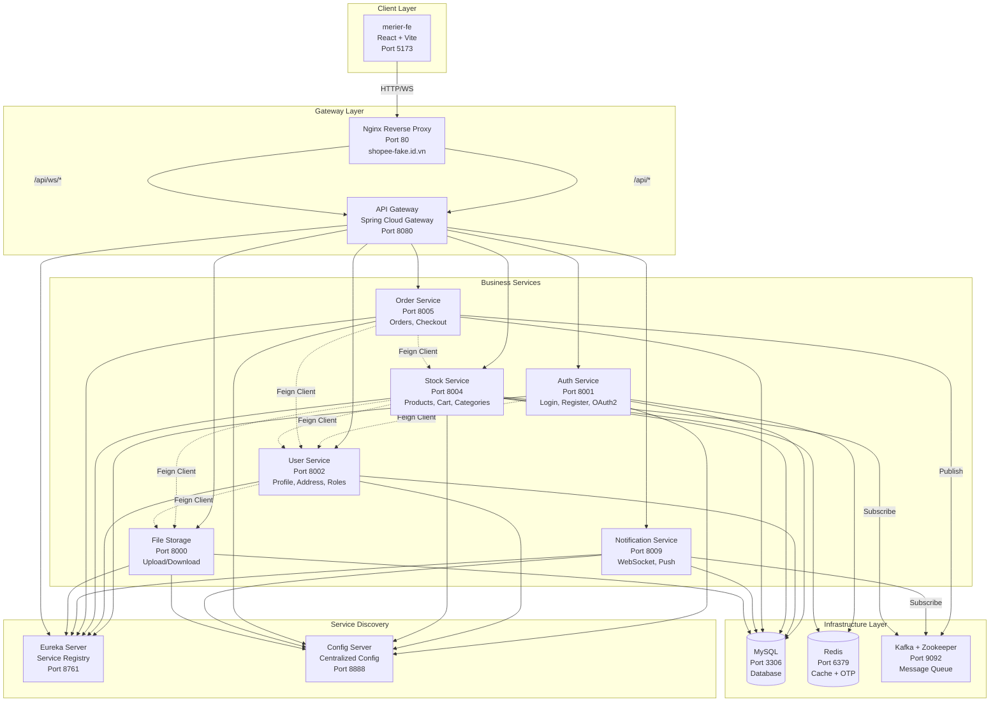

### Chi Tiết Các Microservice

| Service | Port | Nhiệm Vụ | Database | Message Queue | Cache |
|---------|------|----------|----------|---------------|-------|
| **config-server** | 8888 | Quản lý cấu hình tập trung cho tất cả services | N/A | N/A | N/A |
| **eureka-server** | 8761 | Service Discovery & Registry | N/A | N/A | N/A |
| **gateway** | 8080 | API Gateway, Routing, Load Balancing | N/A | N/A | N/A |
| **auth-service** | 8001 | Xác thực, Đăng ký, Login, Google OAuth2, OTP | MySQL (users via Feign) | N/A | Redis (OTP) |
| **user-service** | 8002 | Quản lý người dùng, địa chỉ, shop owner, role requests | MySQL (users, addresses, role_requests, shop_owners) | N/A | N/A |
| **stock-service** | 8004 | Quản lý sản phẩm, danh mục, size, giỏ hàng | MySQL (products, categories, sizes, carts, cart_items) | Kafka (order topic) | Redis (cart) |
| **order-service** | 8005 | Xử lý đơn hàng, checkout, đồng bộ tồn kho | MySQL (orders, order_items) | Kafka (order topic, notification topic) | N/A |
| **notification-service** | 8009 | Thông báo realtime qua WebSocket, lưu trữ notifications | MySQL (notifications) | Kafka (notification topic) | N/A |
| **file-storage** | 8000 | Upload/Download file (avatar, product images) | MySQL (files) | N/A | N/A |
| **merier-fe** | 5173 | Giao diện người dùng (React SPA) | N/A | N/A | LocalStorage |

---

## 👥 PHÂN TÍCH ACTORS (NGƯỜI DÙNG)

### Sơ Đồ Actors

```mermaid
graph LR
    subgraph "System Actors"
        GUEST[👤 Guest<br/>Khách Chưa Đăng Nhập]
        USER[👤 User<br/>Khách Hàng Đã Đăng Nhập]
        SHOP[🏪 Shop Owner<br/>Chủ Shop]
        ADMIN[👑 Admin<br/>Quản Trị Viên]
    end

    subgraph "External Actors"
        GOOGLE[Google OAuth2<br/>Nhà Cung Cấp Xác Thực]
        SMTP[Gmail SMTP<br/>Gửi Email OTP]
    end

    GUEST -->|Đăng ký/Đăng nhập| USER
    USER -->|Yêu cầu nâng cấp| SHOP
    ADMIN -->|Duyệt yêu cầu| SHOP

    USER -.->|Google Login| GOOGLE
    USER -.->|Nhận OTP| SMTP
```

### Chi Tiết Vai Trò

#### 1. Guest (Khách Chưa Đăng Nhập)
**Quyền hạn:**
- ✅ Xem danh sách sản phẩm
- ✅ Tìm kiếm sản phẩm
- ✅ Xem chi tiết sản phẩm
- ✅ Xem thông tin shop
- ✅ Đăng ký tài khoản mới
- ✅ Đăng nhập (Email/Password hoặc Google)

**Hạn chế:**
- ❌ Không thể thêm giỏ hàng
- ❌ Không thể đặt hàng
- ❌ Không thể theo dõi đơn hàng

#### 2. User (Khách Hàng Đã Đăng Nhập)
**Quyền hạn:**
- ✅ Tất cả quyền của Guest
- ✅ Quản lý hồ sơ cá nhân
- ✅ Quản lý sổ địa chỉ
- ✅ Thêm/Sửa/Xóa giỏ hàng
- ✅ Đặt hàng (Checkout)
- ✅ Theo dõi đơn hàng
- ✅ Nhận thông báo realtime
- ✅ Yêu cầu nâng cấp lên Shop Owner
- ✅ Upload avatar

#### 3. Shop Owner (Chủ Shop)
**Quyền hạn:**
- ✅ Tất cả quyền của User
- ✅ Quản lý thông tin shop
- ✅ Tạo/Sửa/Xóa sản phẩm
- ✅ Quản lý tồn kho (sizes, stock)
- ✅ Xem đơn hàng thuộc sản phẩm của mình
- ✅ Nhận thông báo khi có đơn hàng mới
- ✅ Upload logo shop và ảnh sản phẩm

**Lưu ý:**
- Cần được Admin duyệt từ Role Request
- Một User có thể vừa là khách hàng vừa là chủ shop

#### 4. Admin (Quản Trị Viên)
**Quyền hạn:**
- ✅ Quản lý tất cả người dùng
- ✅ Duyệt/Từ chối Role Requests (nâng cấp Shop Owner)
- ✅ Quản lý danh mục sản phẩm
- ✅ Giám sát tất cả đơn hàng
- ✅ Vô hiệu hóa/Kích hoạt tài khoản
- ✅ Xem thống kê hệ thống

---

## 📐 USE CASE DIAGRAM

### Use Case Tổng Quan

```mermaid
graph TB
    subgraph "Guest Use Cases"
        UC1[Xem Sản Phẩm]
        UC2[Tìm Kiếm Sản Phẩm]
        UC3[Xem Chi Tiết Sản Phẩm]
        UC4[Đăng Ký Tài Khoản]
        UC5[Đăng Nhập]
        UC6[Đăng Nhập Google]
        UC7[Quên Mật Khẩu]
    end

    subgraph "User Use Cases"
        UC8[Quản Lý Hồ Sơ]
        UC9[Quản Lý Địa Chỉ]
        UC10[Thêm Giỏ Hàng]
        UC11[Đặt Hàng]
        UC12[Theo Dõi Đơn Hàng]
        UC13[Nhận Thông Báo]
        UC14[Yêu Cầu Nâng Cấp Shop]
    end

    subgraph "Shop Owner Use Cases"
        UC15[Quản Lý Shop]
        UC16[Tạo Sản Phẩm]
        UC17[Cập Nhật Tồn Kho]
        UC18[Xem Đơn Hàng Shop]
    end

    subgraph "Admin Use Cases"
        UC19[Duyệt Role Request]
        UC20[Quản Lý Users]
        UC21[Quản Lý Categories]
        UC22[Giám Sát Đơn Hàng]
    end

    GUEST[👤 Guest] --> UC1
    GUEST --> UC2
    GUEST --> UC3
    GUEST --> UC4
    GUEST --> UC5
    GUEST --> UC6
    GUEST --> UC7

    USER[👤 User] --> UC8
    USER --> UC9
    USER --> UC10
    USER --> UC11
    USER --> UC12
    USER --> UC13
    USER --> UC14

    SHOP[🏪 Shop Owner] --> UC15
    SHOP --> UC16
    SHOP --> UC17
    SHOP --> UC18

    ADMIN[👑 Admin] --> UC19
    ADMIN --> UC20
    ADMIN --> UC21
    ADMIN --> UC22

    UC6 -.include.-> GOOGLE[Google OAuth2]
    UC7 -.include.-> SMTP[Gmail SMTP]
    UC11 -.include.-> KAFKA[Kafka Event]
    UC13 -.include.-> WS[WebSocket]
```

### Use Case Chi Tiết Theo Actor

#### 🎭 GUEST (Khách Chưa Đăng Nhập)

Guest là người dùng truy cập website nhưng chưa đăng nhập. Họ có thể xem sản phẩm nhưng không thể thực hiện giao dịch.

**UC1: Xem Danh Sách Sản Phẩm**
- **Trigger:** Guest truy cập trang chủ hoặc trang danh mục
- **Flow:**
  1. Guest mở website
  2. Hệ thống hiển thị danh sách sản phẩm từ database
  3. Sản phẩm được sắp xếp theo mới nhất/phổ biến
  4. Hiển thị ảnh, tên, giá, discount
- **API:** `GET /v1/stock/product`
- **Service:** Stock Service

**UC2: Tìm Kiếm Sản Phẩm**
- **Trigger:** Guest nhập từ khóa vào ô tìm kiếm
- **Flow:**
  1. Guest nhập keyword (VD: "áo thun")
  2. Frontend gửi request với keyword
  3. Stock Service tìm kiếm trong database (LIKE %keyword%)
  4. Trả về danh sách sản phẩm phù hợp
  5. Guest có thể filter theo giá, category
- **API:** `GET /v1/stock/product?keyword={keyword}`
- **Service:** Stock Service

**UC3: Xem Chi Tiết Sản Phẩm**
- **Trigger:** Guest click vào 1 sản phẩm
- **Flow:**
  1. Guest click sản phẩm
  2. Hiển thị thông tin đầy đủ: mô tả, giá, sizes, stock
  3. Hiển thị thông tin shop owner
  4. Nếu click "Thêm vào giỏ" → Redirect đến trang đăng nhập
- **API:** `GET /v1/stock/product/{id}`
- **Service:** Stock Service → User Service (lấy thông tin shop)

**UC4: Đăng Ký Tài Khoản**
- **Trigger:** Guest click "Đăng ký"
- **Flow:**
  1. Guest điền form: email, password, tên, số điện thoại
  2. Validate form (email format, password strength)
  3. Auth Service kiểm tra email đã tồn tại chưa
  4. Hash password với BCrypt
  5. Tạo User entity với role USER
  6. Lưu vào database
  7. Tự động đăng nhập và tạo JWT token
- **API:** `POST /v1/auth/register`
- **Service:** Auth Service → User Service

**UC5: Đăng Nhập Email/Password**
- **Trigger:** Guest click "Đăng nhập"
- **Flow:**
  1. Guest nhập email và password
  2. Auth Service validate credentials
  3. So sánh password đã hash
  4. Tạo JWT token (exp: 24h)
  5. Trả về token + user info
  6. Frontend lưu token vào LocalStorage
- **API:** `POST /v1/auth/login`
- **Service:** Auth Service

**UC6: Đăng Nhập Google OAuth2**
- **Trigger:** Guest click "Login with Google"
- **Flow:**
  1. Redirect đến Google consent screen
  2. User chọn tài khoản Google
  3. Google redirect về với authorization code
  4. Auth Service verify code với Google API
  5. Lấy email, tên từ Google
  6. Kiểm tra user đã tồn tại → Nếu chưa thì tạo mới
  7. Tạo JWT token và redirect về trang chủ
- **API:** `POST /v1/auth/login/google`
- **Service:** Auth Service → User Service
- **External:** Google OAuth2 API

**UC7: Quên Mật Khẩu (OTP)**
- **Trigger:** Guest click "Quên mật khẩu"
- **Flow:**
  1. Guest nhập email
  2. Auth Service kiểm tra email tồn tại
  3. Tạo OTP 6 chữ số random
  4. Lưu OTP vào Redis với TTL 5 phút
  5. Gửi email chứa OTP qua Gmail SMTP
  6. Guest nhập OTP
  7. Verify OTP từ Redis
  8. Guest nhập mật khẩu mới
  9. Hash và cập nhật password
- **API:** `POST /v1/auth/forgot-password`, `POST /v1/auth/verify-otp`, `POST /v1/auth/reset-password`
- **Service:** Auth Service
- **External:** Gmail SMTP

---

#### 👤 USER / CLIENT (Khách Hàng Đã Đăng Nhập)

User là khách hàng đã đăng ký và đăng nhập. Họ có thể mua sắm, quản lý đơn hàng, và yêu cầu trở thành shop owner.

**UC8: Quản Lý Hồ Sơ Cá Nhân**
- **Trigger:** User vào trang "Tài khoản của tôi"
- **Flow:**
  1. User click "Hồ sơ"
  2. Hiển thị thông tin: tên, email, phone, giới tính, ngày sinh, avatar
  3. User chỉnh sửa thông tin
  4. Có thể upload avatar mới (gọi File Storage)
  5. User Service cập nhật database
  6. Thông báo "Cập nhật thành công"
- **API:** `GET /v1/user`, `PUT /v1/user/update`
- **Service:** User Service → File Storage (nếu upload avatar)

**UC9: Quản Lý Sổ Địa Chỉ**
- **Trigger:** User vào "Địa chỉ của tôi"
- **Flow:**
  1. Hiển thị danh sách địa chỉ đã lưu
  2. User có thể:
     - **Thêm địa chỉ mới:** Điền form (tên người nhận, SĐT, tỉnh/thành, quận/huyện, phường/xã, địa chỉ cụ thể)
     - **Sửa địa chỉ:** Cập nhật thông tin địa chỉ hiện có
     - **Xóa địa chỉ:** Xóa địa chỉ không dùng nữa
     - **Đặt mặc định:** Chọn 1 địa chỉ làm mặc định cho checkout
  3. User Service lưu vào bảng `addresses`
- **API:** `GET /v1/user/address`, `POST /v1/user/address`, `PUT /v1/user/address/{id}`, `DELETE /v1/user/address/{id}`
- **Service:** User Service

**UC10: Thêm Sản Phẩm Vào Giỏ Hàng**
- **Trigger:** User click "Thêm vào giỏ" ở trang sản phẩm
- **Flow:**
  1. User chọn size và số lượng
  2. Frontend kiểm tra user đã login chưa
  3. Gửi request đến Stock Service
  4. Stock Service kiểm tra tồn kho
  5. Nếu đủ hàng:
     - Kiểm tra cart của user có chưa → Tạo mới nếu chưa có
     - Kiểm tra item (product + size) đã có trong cart chưa
     - Nếu có → Cập nhật quantity
     - Nếu chưa → Thêm cart item mới
     - Tính lại total_amount
     - Lưu vào MySQL và đồng bộ Redis
  6. Thông báo "Đã thêm vào giỏ hàng"
- **API:** `POST /v1/stock/cart/add`
- **Service:** Stock Service
- **Cache:** Redis (cart cache)

**UC11: Đặt Hàng (Checkout)**
- **Trigger:** User ở trang giỏ hàng, click "Đặt hàng"
- **Flow:**
  1. User review giỏ hàng (sản phẩm, số lượng, giá)
  2. User chọn địa chỉ giao hàng
  3. User chọn phương thức thanh toán (hiện tại: COD)
  4. Click "Đặt hàng"
  5. Order Service:
     - Lấy cart từ Stock Service
     - Validate cart không rỗng
     - Tạo Order entity
     - Tạo Order Items từ Cart Items
     - Lưu vào database
     - **Publish Kafka event** lên `order-topic`
  6. **Kafka Event Processing:**
     - Stock Service nhận event → Giảm stock, xóa cart items
     - Order Service publish lên `notification-topic`
     - Notification Service tạo thông báo cho user và shop owner
  7. User nhận thông báo realtime "Đặt hàng thành công"
- **API:** `POST /v1/order/create-from-cart`
- **Service:** Order Service → Stock Service → Notification Service (via Kafka)
- **Message Queue:** Kafka

**UC12: Theo Dõi Đơn Hàng**
- **Trigger:** User vào "Đơn hàng của tôi"
- **Flow:**
  1. Order Service lấy danh sách orders của user
  2. Hiển thị: mã đơn, ngày đặt, tổng tiền, trạng thái
  3. User click vào 1 đơn → Xem chi tiết:
     - Danh sách sản phẩm
     - Địa chỉ giao hàng
     - Lịch sử trạng thái
  4. User có thể hủy đơn nếu status = PENDING
- **API:** `GET /v1/order/user`, `GET /v1/order/{id}`
- **Service:** Order Service → Stock Service (lấy thông tin sản phẩm) → User Service (lấy địa chỉ)
- **Order Statuses:** PENDING → PROCESSING → SHIPPED → DELIVERED / CANCELLED

**UC13: Nhận Thông Báo Realtime**
- **Trigger:** Tự động khi có event (đơn hàng mới, cập nhật trạng thái)
- **Flow:**
  1. User login → Frontend tự động establish WebSocket connection
  2. Connect đến: `ws://shopee-fake.id.vn/api/ws/notifications`
  3. Notification Service validate JWT token
  4. Subscribe vào queue: `/user/queue/notifications`
  5. Khi có event từ Kafka:
     - Notification Service tạo Notification entity
     - Lưu vào MySQL
     - Kiểm tra user online → Push qua WebSocket
  6. Frontend nhận message → Hiển thị toast notification
  7. Cập nhật badge count (số thông báo chưa đọc)
  8. User click icon notification → Hiển thị danh sách
  9. User click 1 notification → Mark as read
- **API:** `WS /ws/notifications`, `GET /v1/notifications/user`, `PUT /v1/notifications/mark-read/{id}`
- **Service:** Notification Service
- **Protocol:** WebSocket (STOMP)

**UC14: Yêu Cầu Nâng Cấp Lên Shop Owner**
- **Trigger:** User muốn bán hàng, click "Đăng ký bán hàng"
- **Flow:**
  1. User điền form:
     - Lý do muốn bán hàng
     - Tên shop dự định
     - Thông tin liên hệ
  2. User Service tạo RoleRequest entity
  3. Set status = PENDING
  4. Lưu vào bảng `role_requests`
  5. Thông báo "Yêu cầu đã được gửi, chờ Admin duyệt"
  6. Admin sẽ nhận được yêu cầu và xem xét
- **API:** `POST /v1/user/role-requests`
- **Service:** User Service

---

#### 🏪 SHOP OWNER (Chủ Shop)

Shop Owner là user đã được admin duyệt để bán hàng. Họ có thể quản lý shop và sản phẩm của mình.

**UC15: Quản Lý Thông Tin Shop**
- **Trigger:** Shop Owner vào "Quản lý shop"
- **Flow:**
  1. Hiển thị thông tin shop hiện tại:
     - Tên shop
     - Tên chủ shop
     - Địa chỉ shop
     - Logo shop
     - Verified status
     - Số lượng followers
     - Rating trung bình
  2. Shop owner có thể:
     - Cập nhật tên shop, địa chỉ
     - Upload logo mới
     - Xem thống kê (followers, views)
  3. User Service cập nhật bảng `shop_owners`
- **API:** `GET /v1/user/shop-owners`, `PUT /v1/user/shop-owners`
- **Service:** User Service → File Storage (upload logo)

**UC16: Tạo & Quản Lý Sản Phẩm**
- **Trigger:** Shop Owner vào "Sản phẩm của tôi" → "Thêm sản phẩm"
- **Flow Tạo Sản Phẩm:**
  1. Shop owner điền form:
     - Tên sản phẩm
     - Mô tả
     - Category
     - Giá gốc
     - Giá bán (có thể giảm)
     - % Discount (tự động tính)
     - Upload ảnh sản phẩm
     - Thêm sizes/variants:
       - Tên size (S, M, L hoặc 250ml, 500ml...)
       - Tồn kho
       - Giá điều chỉnh (nếu có)
  2. Upload ảnh lên File Storage → Nhận imageId
  3. Stock Service:
     - Tạo Product entity (user_id = shop owner id)
     - Tạo Size entities liên kết với product
     - Lưu vào database
  4. Thông báo "Tạo sản phẩm thành công"

- **Flow Sửa Sản Phẩm:**
  1. Shop owner click "Sửa" trên sản phẩm
  2. Load thông tin hiện tại
  3. Cho phép chỉnh sửa tất cả thông tin
  4. Cập nhật database

- **Flow Xóa Sản Phẩm:**
  1. Shop owner click "Xóa"
  2. Confirm dialog
  3. Xóa product và các sizes liên quan (cascade)

- **API:** `POST /v1/stock/product`, `PUT /v1/stock/product/{id}`, `DELETE /v1/stock/product/{id}`, `GET /v1/stock/product/user/{userId}`
- **Service:** Stock Service → File Storage

**UC17: Cập Nhật Tồn Kho**
- **Trigger:** Shop Owner cần cập nhật số lượng hàng
- **Flow:**
  1. Shop owner vào "Quản lý kho"
  2. Hiển thị danh sách sản phẩm với tồn kho theo size
  3. Shop owner click "Cập nhật" trên 1 size
  4. Nhập số lượng mới
  5. Stock Service cập nhật `sizes.stock`
  6. Hiển thị cảnh báo nếu stock < 10 (sắp hết)
  7. Tự động ẩn sản phẩm nếu tất cả sizes đều hết hàng (stock = 0)
- **API:** `PUT /v1/stock/size/{id}`
- **Service:** Stock Service

**UC18: Xem Đơn Hàng Của Shop**
- **Trigger:** Shop Owner vào "Đơn hàng"
- **Flow:**
  1. Order Service filter orders có chứa sản phẩm của shop owner
  2. Hiển thị danh sách đơn hàng:
     - Chỉ hiển thị items thuộc sản phẩm của shop
     - Mã đơn
     - Tên khách hàng
     - Sản phẩm đã mua
     - Trạng thái
     - Tổng tiền (chỉ tính items của shop)
  3. Shop owner có thể:
     - Xem chi tiết đơn
     - Cập nhật trạng thái (PENDING → PROCESSING → SHIPPED)
     - Print invoice
  4. Khi cập nhật status → Notification Service gửi thông báo cho user
- **API:** `GET /v1/order/shop-owner`, `PUT /v1/order/{id}/status`
- **Service:** Order Service → Notification Service (via Kafka)

**UC19: Nhận Thông Báo Đơn Hàng Mới**
- **Trigger:** User đặt hàng sản phẩm của shop
- **Flow:**
  1. Order Service publish event lên Kafka
  2. Notification Service tạo 2 notifications:
     - 1 cho user (confirmation)
     - 1 cho shop owner (new order alert)
  3. Shop owner đang online → Nhận WebSocket message
  4. Frontend hiển thị: "Đơn hàng mới #12345"
  5. Click vào notification → Redirect đến trang chi tiết đơn
- **Service:** Notification Service
- **Flag:** `is_shop_owner_notification = true`

---

#### 👑 ADMIN (Quản Trị Viên)

Admin là quản trị viên hệ thống, có quyền cao nhất để quản lý toàn bộ platform.

**UC20: Duyệt/Từ Chối Role Requests**
- **Trigger:** Admin vào "Quản lý yêu cầu Shop Owner"
- **Flow:**
  1. User Service trả về danh sách role_requests với status = PENDING
  2. Hiển thị thông tin:
     - Tên user
     - Email
     - Lý do muốn bán hàng
     - Ngày gửi yêu cầu
  3. Admin review từng request
  4. **Nếu Approve:**
     - Click "Duyệt"
     - Có thể thêm admin note
     - User Service:
       - Cập nhật `role_requests.status = APPROVED`
       - Thêm role SHOP_OWNER vào `user_roles`
       - Tạo ShopOwner entity
       - Lưu `reviewed_by = admin_id`, `reviewed_at = now()`
     - User login lại → Có quyền shop owner
  5. **Nếu Reject:**
     - Click "Từ chối"
     - Điền lý do từ chối
     - User Service:
       - Cập nhật `role_requests.status = REJECTED`
       - Lưu `rejection_reason`
     - User thấy thông báo bị từ chối với lý do
- **API:** `GET /v1/user/role-requests`, `PUT /v1/user/role-requests/approve/{id}`, `PUT /v1/user/role-requests/reject/{id}`
- **Service:** User Service

**UC21: Quản Lý Users**
- **Trigger:** Admin vào "Quản lý người dùng"
- **Flow:**
  1. User Service trả về tất cả users
  2. Hiển thị danh sách với columns:
     - ID
     - Username
     - Email
     - Roles
     - Status (Active/Inactive)
     - Ngày đăng ký
  3. Admin có thể:
     - **Xem chi tiết user:** Orders, activities, shop info (nếu có)
     - **Vô hiệu hóa tài khoản:** Set `active = INACTIVE` → User không thể login
     - **Kích hoạt lại:** Set `active = ACTIVE`
     - **Xóa user:** Soft delete hoặc hard delete (cascade)
     - **Thay đổi role:** Thêm/xóa roles
  4. Search/Filter theo: email, role, status
- **API:** `GET /v1/user/getAll`, `PUT /v1/user/{id}`, `DELETE /v1/user/{id}`
- **Service:** User Service

**UC22: Quản Lý Categories**
- **Trigger:** Admin vào "Quản lý danh mục"
- **Flow:**
  1. Stock Service trả về danh sách categories
  2. Hiển thị: ID, tên, mô tả, số lượng products
  3. Admin có thể:
     - **Thêm category mới:** Điền tên, mô tả
     - **Sửa category:** Cập nhật thông tin
     - **Xóa category:** Chỉ được phép nếu không có product nào
  4. Categories được dùng cho phân loại sản phẩm
- **API:** `GET /v1/stock/category`, `POST /v1/stock/category`, `PUT /v1/stock/category/{id}`, `DELETE /v1/stock/category/{id}`
- **Service:** Stock Service

**UC23: Giám Sát Tất Cả Đơn Hàng**
- **Trigger:** Admin vào "Quản lý đơn hàng"
- **Flow:**
  1. Order Service trả về ALL orders trong hệ thống
  2. Hiển thị: mã đơn, user, shop, tổng tiền, status, ngày tạo
  3. Admin có thể:
     - Filter theo status, date range, user, shop
     - Xem chi tiết bất kỳ đơn hàng nào
     - Cập nhật status (xử lý khiếu nại)
     - Hủy đơn nếu có vấn đề
     - Export reports (Excel, PDF)
  4. Dashboard hiển thị thống kê:
     - Tổng đơn hàng hôm nay
     - Doanh thu
     - Đơn pending cần xử lý
     - Chart theo thời gian
- **API:** `GET /v1/order/all` (admin only), `PUT /v1/order/{id}/status`
- **Service:** Order Service

---

## 🔄 FLOWCHART CHI TIẾT CÁC CHỨC NĂNG

### 1. Flow Đăng Ký & Đăng Nhập

```mermaid
flowchart TD
    A[User Truy Cập Trang Đăng Nhập] --> B{Chọn Phương Thức}
    
    B -->|Email/Password| C[Nhập Email & Password]
    B -->|Google OAuth2| D[Click Login with Google]
    
    C --> E[POST /v1/auth/login]
    E --> F{Kiểm Tra Credentials}
    F -->|Sai| G[Trả về 401<br/>Sai email hoặc password]
    F -->|Đúng| H[Tạo JWT Token]
    H --> I[Trả về Token + User Info]
    
    D --> J[Redirect đến Google]
    J --> K[User Đăng Nhập Google]
    K --> L[Google Callback với Code]
    L --> M[POST /v1/auth/login/google]
    M --> N[Verify Token với Google]
    N --> O{User Đã Tồn Tại?}
    O -->|Không| P[Tạo User Mới]
    O -->|Có| Q[Lấy Thông Tin User]
    P --> R[Tạo JWT Token]
    Q --> R
    R --> S[Redirect về Frontend với Token]
    
    I --> T[Lưu Token vào LocalStorage]
    S --> T
    T --> U[Redirect đến Trang Chủ]
    
    G --> A
    
    style D fill:#4285f4,color:#fff
    style M fill:#4285f4,color:#fff
```

### 2. Flow Quên Mật Khẩu (OTP)

```mermaid
flowchart TD
    A[User Click Quên Mật Khẩu] --> B[Nhập Email]
    B --> C[POST /v1/auth/forgot-password]
    C --> D{Email Tồn Tại?}
    D -->|Không| E[Trả về 404<br/>Email không tồn tại]
    D -->|Có| F[Tạo OTP 6 chữ số]
    F --> G[Lưu OTP vào Redis<br/>TTL 5 phút]
    G --> H[Gửi Email OTP qua Gmail SMTP]
    H --> I[Thông báo: Đã gửi OTP]
    
    I --> J[User Nhập OTP]
    J --> K[POST /v1/auth/verify-otp]
    K --> L{OTP Hợp Lệ?}
    L -->|Không| M[Trả về 400<br/>OTP sai hoặc hết hạn]
    L -->|Có| N[Xóa OTP khỏi Redis]
    N --> O[Trả về Success]
    
    O --> P[User Nhập Mật Khẩu Mới]
    P --> Q[POST /v1/auth/reset-password]
    Q --> R[Hash Password Mới]
    R --> S[Cập nhật vào Database]
    S --> T[Thông báo: Đổi mật khẩu thành công]
    T --> U[Redirect đến Trang Đăng Nhập]
    
    E --> A
    M --> J
    
    style G fill:#ff6b6b
    style H fill:#4caf50
```

### 3. Flow Quản Lý Giỏ Hàng

```mermaid
flowchart TD
    A[User Xem Sản Phẩm] --> B[Click Thêm Vào Giỏ]
    B --> C{User Đã Login?}
    C -->|No| D[Redirect đến Trang Login]
    C -->|Yes| E[Chọn Size & Quantity]
    
    E --> F[POST /v1/stock/cart/add]
    F --> G{Tồn Kho Đủ?}
    G -->|Không| H[Trả về 400<br/>Hết hàng hoặc số lượng không đủ]
    G -->|Có| I[Kiểm tra Cart của User]
    
    I --> J{Cart Tồn Tại?}
    J -->|No| K[Tạo Cart Mới]
    J -->|Yes| L[Lấy Cart Hiện Tại]
    
    K --> M[Thêm CartItem]
    L --> N{Item Đã Có?}
    N -->|Yes| O[Cập Nhật Quantity]
    N -->|No| M
    
    M --> P[Tính Lại Total Amount]
    O --> P
    P --> Q[Lưu vào MySQL]
    Q --> R[Đồng bộ vào Redis Cache]
    R --> S[Trả về Cart Updated]
    
    S --> T[Hiển thị Giỏ Hàng]
    T --> U[User Có Thể:<br/>- Sửa số lượng<br/>- Xóa item<br/>- Checkout]
    
    D --> A
    H --> A
    
    style R fill:#ff9800
    style Q fill:#2196f3
```

### 4. Flow Đặt Hàng (Checkout) với Kafka

```mermaid
flowchart TD
    A[User Ở Trang Giỏ Hàng] --> B[Chọn Địa Chỉ Giao Hàng]
    B --> C[Click Đặt Hàng]
    C --> D[POST /v1/order/create-from-cart]
    
    D --> E{Validate Request}
    E -->|Invalid| F[Trả về 400<br/>Thiếu thông tin]
    E -->|Valid| G[Order Service:<br/>Lấy Cart từ Stock Service]
    
    G --> H{Cart Không Rỗng?}
    H -->|Empty| I[Trả về 400<br/>Giỏ hàng trống]
    H -->|OK| J[Tạo Order Entity]
    
    J --> K[Tạo Order Items từ Cart Items]
    K --> L[Lưu Order vào MySQL]
    L --> M[📤 Publish Event lên Kafka:<br/>Topic: order-topic]
    M --> N[Trả về Order Success]
    
    subgraph "Kafka Event Processing"
        M --> O[Stock Service Subscribe]
        M --> P[Notification Service Subscribe]
        
        O --> Q[Giảm Tồn Kho<br/>Decrease Stock]
        Q --> R[Xóa Cart Items của User]
        
        P --> S[Tạo Notification cho User]
        P --> T[Tạo Notification cho Shop Owner]
        S --> U[Lưu vào MySQL]
        T --> U
        U --> V[📡 Push qua WebSocket<br/>Realtime]
    end
    
    N --> W[Frontend Hiển thị<br/>Đơn hàng thành công]
    V --> X[User & Shop Owner<br/>Nhận Thông Báo Realtime]
    
    F --> A
    I --> A
    
    style M fill:#ff6f00,color:#fff
    style V fill:#4caf50,color:#fff
    style Q fill:#f44336,color:#fff
```

### 5. Flow Thông Báo Realtime (WebSocket)

```mermaid
flowchart TD
    A[User Login Thành Công] --> B[Frontend Khởi Tạo WebSocket]
    B --> C[Connect: ws://shopee-fake.id.vn/api/ws/notifications]
    C --> D[Nginx Proxy đến Gateway]
    D --> E[Gateway Route đến Notification Service]
    E --> F[Notification Service:<br/>WebSocket Handler]
    
    F --> G{Validate JWT Token}
    G -->|Invalid| H[Reject Connection]
    G -->|Valid| I[Establish WebSocket Connection]
    I --> J[Subscribe to /user/queue/notifications]
    
    subgraph "Event Flow"
        K[Order Created Event<br/>từ Kafka] --> L[Notification Service<br/>Kafka Listener]
        L --> M[Tạo Notification Entity]
        M --> N[Lưu vào MySQL]
        N --> O{User Đang Online?}
        O -->|No| P[Chỉ Lưu DB<br/>Sẽ hiển thị khi login]
        O -->|Yes| Q[📡 Push qua WebSocket]
        Q --> R[Frontend Nhận Message]
        R --> S[Hiển thị Toast Notification]
        S --> T[Cập Nhật Notification Badge]
    end
    
    J --> O
    
    U[User Click Notification Icon] --> V[GET /v1/notifications/user]
    V --> W[Lấy Tất Cả Notifications]
    W --> X[Hiển thị Danh Sách]
    
    X --> Y[User Click 1 Notification]
    Y --> Z[PUT /v1/notifications/mark-read]
    Z --> AA[Cập nhật is_read = true]
    AA --> AB[Giảm Badge Count]
    
    style Q fill:#00bcd4,color:#fff
    style C fill:#9c27b0,color:#fff
```

### 6. Flow Yêu Cầu Nâng Cấp Shop Owner

```mermaid
flowchart TD
    A[User Login với Role USER] --> B[Vào Trang Hồ Sơ]
    B --> C[Click Đăng Ký Làm Shop Owner]
    C --> D[Điền Form:<br/>- Lý do<br/>- Thông tin shop]
    D --> E[POST /v1/user/role-requests]
    
    E --> F{Validate}
    F -->|Invalid| G[Trả về 400<br/>Thiếu thông tin]
    F -->|Valid| H[Tạo RoleRequest Entity]
    H --> I[status = PENDING]
    I --> J[Lưu vào MySQL]
    J --> K[Thông báo: Đã gửi yêu cầu]
    
    K --> L[Admin Vào Trang Role Requests]
    L --> M[GET /v1/user/role-requests]
    M --> N[Hiển thị Danh Sách PENDING]
    
    N --> O{Admin Quyết Định}
    O -->|Approve| P[PUT /v1/user/role-requests/approve/:id]
    O -->|Reject| Q[PUT /v1/user/role-requests/reject/:id]
    
    P --> R[Cập nhật status = APPROVED]
    R --> S[Thêm Role SHOP_OWNER vào User]
    S --> T[Tạo ShopOwner Entity]
    T --> U[Lưu adminNote, reviewedBy]
    U --> V[Trả về Success]
    
    Q --> W[Cập nhật status = REJECTED]
    W --> X[Lưu rejectionReason]
    X --> Y[Trả về Success]
    
    V --> Z[User Login Lại<br/>Có quyền Shop Owner]
    Y --> AA[User Thấy Yêu Cầu Bị Từ Chối]
    
    G --> C
    
    style P fill:#4caf50,color:#fff
    style Q fill:#f44336,color:#fff
```

---

## 📨 KAFKA EVENT-DRIVEN ARCHITECTURE

### Sơ Đồ Kafka Topics và Consumers

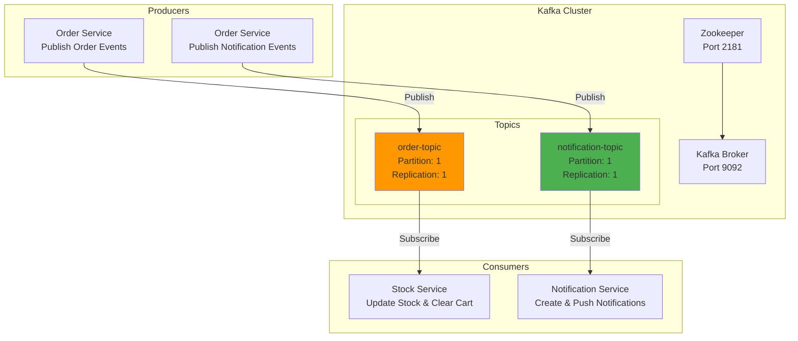

### Chi Tiết Kafka Events

#### 1. Order Topic (`order-topic`)

**Producer:** Order Service
**Consumers:** Stock Service
**Event Type:** `CheckOutKafkaRequest`

**Payload:**
```json
{
  "orderId": "uuid",
  "userId": "uuid",
  "items": [
    {
      "productId": "uuid",
      "sizeId": "uuid",
      "quantity": 3
    }
  ]
}
```

**Consumer Actions (Stock Service):**
1. Giảm tồn kho cho từng sản phẩm/size
2. Xóa các items khỏi giỏ hàng của user
3. Cập nhật vào MySQL
4. Đồng bộ Redis cache

#### 2. Notification Topic (`notification-topic`)

**Producer:** Order Service
**Consumers:** Notification Service
**Event Type:** `SendNotificationRequest`

**Payload:**
```json
{
  "userId": "uuid",
  "shopId": "uuid",
  "orderId": "uuid",
  "message": "Đơn hàng #12345 đã được đặt thành công",
  "isShopOwnerNotification": false
}
```

**Consumer Actions (Notification Service):**
1. Tạo Notification entity
2. Lưu vào MySQL
3. Kiểm tra user có đang online (WebSocket)
4. Nếu online: Push qua WebSocket
5. Nếu offline: Chỉ lưu DB (sẽ load khi login)

---

## 💾 DATABASE SCHEMA CHI TIẾT

### Sơ Đồ ERD (Entity Relationship Diagram)

```mermaid
erDiagram
    USERS ||--o{ ADDRESSES : has
    USERS ||--o{ ROLE_REQUESTS : creates
    USERS ||--|| SHOP_OWNERS : becomes
    USERS ||--o{ USER_ACTIVITIES : logs
    USERS ||--o{ USER_ROLES : has
    USERS ||--o{ CARTS : owns
    USERS ||--o{ ORDERS : places
    USERS ||--o{ NOTIFICATIONS : receives

    SHOP_OWNERS ||--o{ PRODUCTS : owns
    SHOP_OWNERS ||--o{ NOTIFICATIONS : receives

    CATEGORIES ||--o{ PRODUCTS : contains
    PRODUCTS ||--o{ SIZES : has
    PRODUCTS ||--o{ CART_ITEMS : in
    PRODUCTS ||--o{ ORDER_ITEMS : in

    CARTS ||--o{ CART_ITEMS : contains
    ORDERS ||--o{ ORDER_ITEMS : contains

    SIZES ||--o{ CART_ITEMS : selected
    SIZES ||--o{ ORDER_ITEMS : ordered

    ADDRESSES ||--o{ ORDERS : ships_to

    FILES ||--o{ PRODUCTS : image
    FILES ||--o{ SHOP_OWNERS : logo

    USERS {
        uuid id PK
        string username
        string password
        string email UK
        enum primary_role
        enum active
        string first_name
        string last_name
        string phone_number
        enum gender
        date birth_date
        string image_url
        timestamp created_at
        timestamp updated_at
    }

    USER_ROLES {
        uuid user_id FK
        enum role
    }

    ADDRESSES {
        uuid id PK
        uuid user_id FK
        string address_name
        string recipient_name
        string recipient_phone
        string street
        string district
        string city
        string province
        double latitude
        double longitude
        boolean is_default
    }

    ROLE_REQUESTS {
        uuid id PK
        uuid user_id FK
        enum requested_role
        enum status
        text reason
        text admin_note
        uuid reviewed_by FK
        timestamp reviewed_at
        text rejection_reason
        timestamp created_at
    }

    SHOP_OWNERS {
        uuid user_id PK_FK
        string shop_name
        string owner_name
        string address
        string image_url
        boolean verified
        int total_ratings
        int followers_count
        int following_count
        timestamp created_at
        timestamp updated_at
    }

    USER_ACTIVITIES {
        uuid id PK
        uuid user_id FK
        uuid shop_owner_id FK
        enum activity_type
        string description
        text details_json
        string ip_address
        string user_agent
        string session_id
        text metadata
        timestamp created_at
    }

    CATEGORIES {
        uuid id PK
        string name
        text description
    }

    PRODUCTS {
        uuid id PK
        uuid category_id FK
        uuid user_id FK
        string name
        text description
        decimal price
        decimal original_price
        decimal discount_percent
        enum status
        uuid image_id FK
        timestamp created_at
        timestamp updated_at
    }

    SIZES {
        uuid id PK
        uuid product_id FK
        string name
        text description
        int stock
        decimal price_modifier
    }

    CARTS {
        uuid id PK
        uuid user_id FK
        decimal total_amount
        timestamp created_at
        timestamp updated_at
    }

    CART_ITEMS {
        uuid id PK
        uuid cart_id FK
        uuid product_id FK
        uuid size_id FK
        int quantity
        decimal unit_price
        decimal total_price
    }

    ORDERS {
        uuid id PK
        uuid user_id FK
        uuid address_id FK
        decimal total_price
        enum status
        timestamp created_at
        timestamp updated_at
    }

    ORDER_ITEMS {
        uuid id PK
        uuid order_id FK
        uuid product_id FK
        uuid size_id FK
        int quantity
        decimal unit_price
        decimal total_price
    }

    NOTIFICATIONS {
        uuid id PK
        uuid user_id FK
        uuid shop_id FK
        uuid order_id FK
        text message
        boolean is_read
        boolean is_shop_owner_notification
        timestamp created_at
    }

    FILES {
        uuid id PK
        string type
        string file_path
    }
```

### Giải Thích Các Bảng Chính

#### User Service Database

**users**
- Bảng trung tâm chứa thông tin tài khoản
- 1 user có thể có nhiều roles (lưu trong bảng `user_roles`)
- Embedded `user_details` (first_name, last_name, phone, gender, etc.)

**addresses**
- Sổ địa chỉ của user
- Hỗ trợ nhiều địa chỉ, 1 địa chỉ mặc định
- Có lat/long để tính khoảng cách giao hàng

**role_requests**
- Lưu yêu cầu nâng cấp vai trò (USER → SHOP_OWNER)
- Admin duyệt/từ chối với `status`, `admin_note`, `reviewed_by`

**shop_owners**
- Share khóa với `users.id`
- Chứa thông tin shop: tên, địa chỉ, logo, verified, ratings

**user_activities**
- Log hành vi người dùng để phân tích

#### Stock Service Database

**category_products**
- Danh mục sản phẩm (Electronics, Fashion, etc.)

**products**
- Sản phẩm thuộc 1 category và 1 shop owner (user_id)
- Có giá gốc, giá giảm, % discount
- Liên kết với file image qua `image_id`

**sizes**
- Mỗi sản phẩm có nhiều size/variant
- Mỗi size có tồn kho riêng và price modifier

**carts & cart_items**
- Giỏ hàng của user
- Redis cache để tăng performance
- MySQL làm persistent storage

#### Order Service Database

**orders**
- Đơn hàng với status: PENDING, PROCESSING, SHIPPED, DELIVERED, CANCELLED
- Liên kết với user và address (via Feign)

**order_items**
- Chi tiết từng sản phẩm trong đơn
- Lưu snapshot giá tại thời điểm đặt hàng

#### Notification Service Database

**notifications**
- Lưu thông báo cho user và shop owner
- `is_read` để track đã đọc chưa
- `is_shop_owner_notification` phân biệt loại thông báo

#### File Storage Database

**files**
- Metadata của file upload
- `file_path` trỏ đến filesystem thực tế
- Dùng cho avatar user, logo shop, ảnh sản phẩm

---

## 🔐 BẢO MẬT VÀ XÁC THỰC

### Luồng JWT Authentication

```mermaid
sequenceDiagram
    participant U as User
    participant FE as Frontend
    participant GW as Gateway
    participant AUTH as Auth Service
    participant USER as User Service
    participant REDIS as Redis

    U->>FE: Login với Email/Password
    FE->>GW: POST /v1/auth/login
    GW->>AUTH: Forward Request
    AUTH->>USER: Feign: Lấy User Info
    USER-->>AUTH: User Entity
    AUTH->>AUTH: Verify Password
    AUTH->>AUTH: Generate JWT (HS256)
    AUTH-->>GW: Response: {token, user}
    GW-->>FE: Response
    FE->>FE: Lưu Token vào LocalStorage
    
    Note over FE: Các Request Tiếp Theo
    
    FE->>GW: GET /v1/stock/products<br/>Header: Authorization: Bearer {token}
    GW->>GW: JWT Filter: Verify Token
    GW->>GW: Extract userId, roles
    GW->>GW: Set Headers: X-User-Id, X-User-Roles
    GW->>USER: Forward với Custom Headers
    USER->>USER: JWT Filter: Lấy User từ Header
    USER-->>GW: Response Data
    GW-->>FE: Response
```

### Cơ Chế Bảo Mật

**1. JWT (JSON Web Token)**
- Algorithm: HS256
- Secret Key: Lưu trong Config Server
- Claims: userId, email, roles, exp
- Expiration: 24 giờ

**2. Password Encryption**
- BCryptPasswordEncoder
- Salt rounds: 10

**3. OTP Security**
- 6 chữ số random
- TTL: 5 phút trong Redis
- 1 email chỉ có 1 OTP active

**4. Gateway Security**
- CORS configuration cho phép origins cụ thể
- Rate limiting (future)
- Request/Response logging

**5. Service-to-Service Communication**
- Feign Client với JWT token forwarding
- Header `X-Internal-Call` để phân biệt internal vs external

---

## 🌐 API ENDPOINTS TỔNG HỢP

### Auth Service APIs

| Method | Endpoint | Description | Auth Required |
|--------|----------|-------------|---------------|
| POST | `/v1/auth/register` | Đăng ký tài khoản mới | ❌ |
| POST | `/v1/auth/login` | Đăng nhập Email/Password | ❌ |
| POST | `/v1/auth/login/google` | Đăng nhập Google OAuth2 | ❌ |
| POST | `/v1/auth/forgot-password` | Gửi OTP quên mật khẩu | ❌ |
| POST | `/v1/auth/verify-otp` | Xác thực OTP | ❌ |
| POST | `/v1/auth/reset-password` | Đặt lại mật khẩu mới | ❌ |

### User Service APIs

| Method | Endpoint | Description | Auth Required | Role |
|--------|----------|-------------|---------------|------|
| GET | `/v1/user` | Lấy thông tin user hiện tại | ✅ | USER |
| PUT | `/v1/user/update` | Cập nhật profile | ✅ | USER |
| PUT | `/v1/user/change-password` | Đổi mật khẩu | ✅ | USER |
| GET | `/v1/user/address` | Lấy danh sách địa chỉ | ✅ | USER |
| POST | `/v1/user/address` | Thêm địa chỉ mới | ✅ | USER |
| PUT | `/v1/user/address/{id}` | Sửa địa chỉ | ✅ | USER |
| DELETE | `/v1/user/address/{id}` | Xóa địa chỉ | ✅ | USER |
| POST | `/v1/user/role-requests` | Yêu cầu nâng cấp Shop Owner | ✅ | USER |
| GET | `/v1/user/role-requests` | Lấy danh sách role requests | ✅ | ADMIN |
| PUT | `/v1/user/role-requests/approve/{id}` | Duyệt yêu cầu | ✅ | ADMIN |
| PUT | `/v1/user/role-requests/reject/{id}` | Từ chối yêu cầu | ✅ | ADMIN |
| GET | `/v1/user/shop-owners` | Lấy thông tin shop | ✅ | SHOP_OWNER |
| PUT | `/v1/user/shop-owners` | Cập nhật thông tin shop | ✅ | SHOP_OWNER |
| GET | `/v1/user/getAll` | Lấy tất cả users | ✅ | ADMIN |

### Stock Service APIs

| Method | Endpoint | Description | Auth Required | Role |
|--------|----------|-------------|---------------|------|
| GET | `/v1/stock/category` | Lấy danh sách categories | ❌ | ALL |
| POST | `/v1/stock/category` | Tạo category mới | ✅ | ADMIN |
| PUT | `/v1/stock/category/{id}` | Cập nhật category | ✅ | ADMIN |
| DELETE | `/v1/stock/category/{id}` | Xóa category | ✅ | ADMIN |
| GET | `/v1/stock/product` | Tìm kiếm sản phẩm | ❌ | ALL |
| GET | `/v1/stock/product/{id}` | Chi tiết sản phẩm | ❌ | ALL |
| POST | `/v1/stock/product` | Tạo sản phẩm | ✅ | SHOP_OWNER |
| PUT | `/v1/stock/product/{id}` | Sửa sản phẩm | ✅ | SHOP_OWNER |
| DELETE | `/v1/stock/product/{id}` | Xóa sản phẩm | ✅ | SHOP_OWNER |
| GET | `/v1/stock/product/user/{userId}` | Sản phẩm của shop owner | ✅ | SHOP_OWNER |
| POST | `/v1/stock/size` | Thêm size cho sản phẩm | ✅ | SHOP_OWNER |
| PUT | `/v1/stock/size/{id}` | Cập nhật size | ✅ | SHOP_OWNER |
| DELETE | `/v1/stock/size/{id}` | Xóa size | ✅ | SHOP_OWNER |
| GET | `/v1/stock/cart` | Lấy giỏ hàng | ✅ | USER |
| POST | `/v1/stock/cart/add` | Thêm vào giỏ | ✅ | USER |
| PUT | `/v1/stock/cart/update` | Sửa số lượng | ✅ | USER |
| DELETE | `/v1/stock/cart/remove/{itemId}` | Xóa item | ✅ | USER |

### Order Service APIs

| Method | Endpoint | Description | Auth Required | Role |
|--------|----------|-------------|---------------|------|
| POST | `/v1/order/create-from-cart` | Đặt hàng từ giỏ | ✅ | USER |
| GET | `/v1/order/user` | Lấy đơn hàng của user | ✅ | USER |
| GET | `/v1/order/{id}` | Chi tiết đơn hàng | ✅ | USER |
| GET | `/v1/order/shop-owner` | Đơn hàng của shop | ✅ | SHOP_OWNER |
| PUT | `/v1/order/{id}/status` | Cập nhật trạng thái đơn | ✅ | SHOP_OWNER/ADMIN |

### Notification Service APIs

| Method | Endpoint | Description | Auth Required | Role |
|--------|----------|-------------|---------------|------|
| GET | `/v1/notifications/user` | Lấy thông báo của user | ✅ | USER |
| PUT | `/v1/notifications/mark-read/{id}` | Đánh dấu đã đọc | ✅ | USER |
| WS | `/ws/notifications` | WebSocket connection | ✅ | USER |

### File Storage APIs

| Method | Endpoint | Description | Auth Required |
|--------|----------|-------------|---------------|
| POST | `/v1/file-storage/upload` | Upload file | ✅ |
| GET | `/v1/file-storage/{id}` | Download file | ❌ |
| DELETE | `/v1/file-storage/{id}` | Xóa file | ✅ |

---

## 🚀 HƯỚNG PHÁT TRIỂN & CẢI TIẾN

### Các Chức Năng Đã Hoàn Thành ✅

- Xác thực và phân quyền (JWT + OAuth2)
- Quản lý người dùng và shop owner
- Quản lý sản phẩm, danh mục, size
- Giỏ hàng với Redis cache
- Đặt hàng với Kafka event
- Thông báo realtime WebSocket
- Upload/Download file
- Google Login OAuth2
- OTP quên mật khẩu

### Các Chức Năng Cần Bổ Sung 🔧

#### 1. Payment Gateway
- Tích hợp VNPay/Momo
- Xử lý thanh toán online
- Lưu lịch sử giao dịch
- Callback handling

#### 2. Review & Rating System
- Review sản phẩm
- Rating shop owner
- Upload ảnh review
- Báo cáo review spam

#### 3. Advanced Analytics
- Dashboard thống kê doanh thu
- Biểu đồ sản phẩm bán chạy
- Thống kê theo thời gian
- Export reports

#### 4. Shipping Integration
- Tích hợp GHN/GHTK
- Tính phí vận chuyển
- Tracking đơn hàng
- In vận đơn

#### 5. Return & Refund
- Yêu cầu trả hàng/hoàn tiền
- Quy trình duyệt return
- State machine cho return status
- Ảnh chứng minh

#### 6. Promotions & Vouchers
- Tạo mã giảm giá
- Flash sale
- Combo deals
- Loyalty program

#### 7. Search & Filter Enhancement
- Elasticsearch integration
- Faceted search
- Price range filter
- Sort by popularity/rating

#### 8. Observability
- Prometheus metrics
- Grafana dashboards
- Zipkin distributed tracing
- ELK Stack logging

#### 9. Security Enhancements
- API Rate Limiting
- File upload virus scan
- Signed URLs for file access
- 2FA authentication

#### 10. Performance Optimization
- Database indexing review
- Query optimization
- CDN for static files
- Caching strategies

---

## 📞 KẾT LUẬN

Dự án **Shopee Clone** đã xây dựng thành công một hệ thống E-commerce hoàn chỉnh với kiến trúc Microservices hiện đại, bao gồm:

✅ **9 Microservices** độc lập, có thể scale riêng biệt
✅ **Event-Driven Architecture** với Kafka
✅ **Realtime Notifications** qua WebSocket
✅ **JWT Authentication** + Google OAuth2
✅ **Redis Caching** cho hiệu năng cao
✅ **Feign Client** cho inter-service communication
✅ **Spring Cloud** ecosystem (Eureka, Gateway, Config)

Hệ thống có khả năng mở rộng cao, dễ bảo trì, và sẵn sàng cho các tính năng nâng cao trong tương lai như payment gateway, review system, và advanced analytics.
