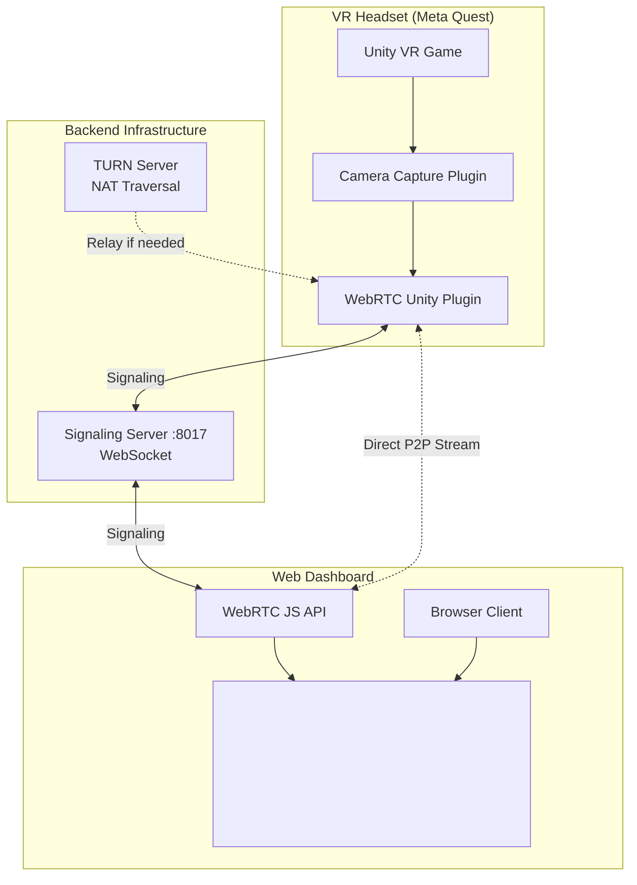
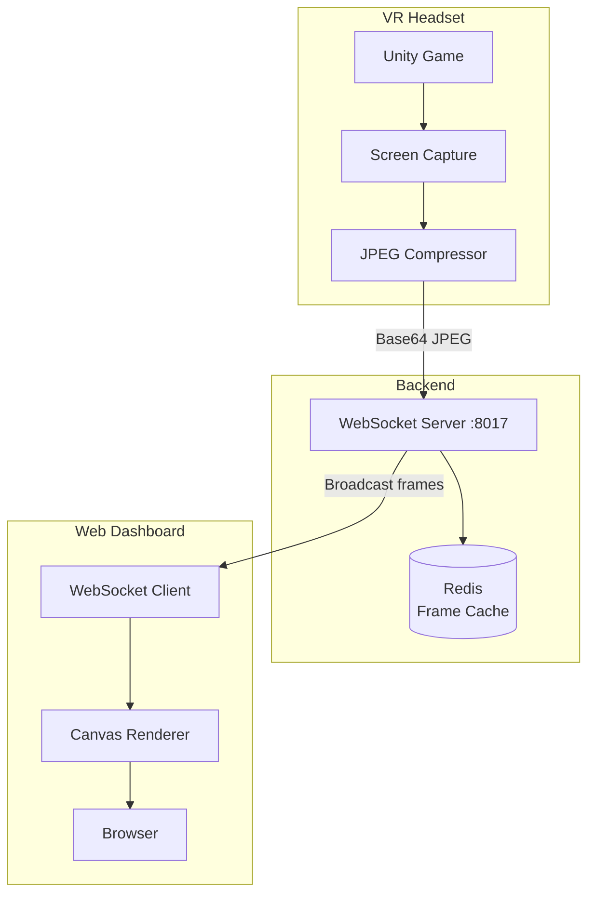
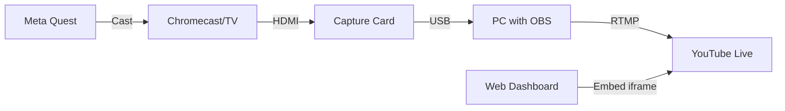

# 🎮 VR-to-Web Streaming - Technical Deep Dive

## Architecture Comparison

### Option A: WebRTC (Professional Solution)

#### Architecture Diagram


#### Unity Implementation (C#)
```csharp
using Unity.WebRTC;

public class WebRTCStreamer : MonoBehaviour
{
    private RTCPeerConnection peerConnection;
    private Camera vrCamera;
    private VideoStreamTrack videoTrack;
    
    void Start()
    {
        vrCamera = Camera.main;
        InitializeWebRTC();
    }
    
    void InitializeWebRTC()
    {
        // Create peer connection
        var config = new RTCConfiguration
        {
            iceServers = new[]
            {
                new RTCIceServer { urls = new[] { "stun:stun.l.google.com:19302" } },
                new RTCIceServer 
                { 
                    urls = new[] { "turn:your-turn-server.com:3478" },
                    username = "user",
                    credential = "pass"
                }
            }
        };
        
        peerConnection = new RTCPeerConnection(ref config);
        
        // Capture VR camera
        videoTrack = vrCamera.CaptureStreamTrack(1280, 720);
        peerConnection.AddTrack(videoTrack);
        
        // Connect to signaling server
        ConnectToSignalingServer();
    }
    
    async void ConnectToSignalingServer()
    {
        // Create offer
        var offer = await peerConnection.CreateOffer();
        await peerConnection.SetLocalDescription(ref offer);
        
        // Send offer to signaling server via WebSocket
        SendToSignalingServer(new {
            type = "offer",
            sdp = offer.sdp
        });
    }
}
```

#### Backend: Signaling Server (Node.js)
```javascript
const WebSocket = require('ws');
const wss = new WebSocket.Server({ port: 8017 });

const sessions = new Map(); // sessionId -> [vrClient, webClients[]]

wss.on('connection', (ws, req) => {
    const sessionId = req.url.split('?sessionId=')[1];
    
    ws.on('message', (message) => {
        const data = JSON.parse(message);
        
        if (data.type === 'offer') {
            // VR headset sending offer
            broadcast(sessionId, data, ws);
        } else if (data.type === 'answer') {
            // Web client sending answer
            sendToVR(sessionId, data);
        } else if (data.type === 'ice-candidate') {
            // ICE candidate exchange
            relay(sessionId, data, ws);
        }
    });
});

function broadcast(sessionId, data, sender) {
    const session = sessions.get(sessionId);
    if (session) {
        session.webClients.forEach(client => {
            if (client !== sender) {
                client.send(JSON.stringify(data));
            }
        });
    }
}
```

#### Frontend: Web Client (React)
```javascript
import React, { useEffect, useRef } from 'react';

function VRStreamViewer({ eventId }) {
    const videoRef = useRef(null);
    const pcRef = useRef(null);
    
    useEffect(() => {
        const ws = new WebSocket(`ws://shopee-fake.id.vn:8017?sessionId=${eventId}`);
        const pc = new RTCPeerConnection({
            iceServers: [
                { urls: 'stun:stun.l.google.com:19302' }
            ]
        });
        
        pcRef.current = pc;
        
        pc.ontrack = (event) => {
            // Received video stream from VR
            videoRef.current.srcObject = event.streams[0];
        };
        
        pc.onicecandidate = (event) => {
            if (event.candidate) {
                ws.send(JSON.stringify({
                    type: 'ice-candidate',
                    candidate: event.candidate
                }));
            }
        };
        
        ws.onmessage = async (event) => {
            const data = JSON.parse(event.data);
            
            if (data.type === 'offer') {
                await pc.setRemoteDescription(new RTCSessionDescription(data));
                const answer = await pc.createAnswer();
                await pc.setLocalDescription(answer);
                
                ws.send(JSON.stringify({
                    type: 'answer',
                    sdp: answer.sdp
                }));
            } else if (data.type === 'ice-candidate') {
                await pc.addIceCandidate(new RTCIceCandidate(data.candidate));
            }
        };
        
        return () => {
            pc.close();
            ws.close();
        };
    }, [eventId]);
    
    return (
        <div className="vr-stream-container">
            <video 
                ref={videoRef} 
                autoPlay 
                controls={false}
                className="w-full h-full"
            />
        </div>
    );
}
```

**Pros:**
- ✅ Low latency (~50-100ms)
- ✅ High quality (1080p possible)
- ✅ Direct P2P connection
- ✅ Adaptive bitrate

**Cons:**
- ❌ Complex setup
- ❌ Requires TURN server (costs $$$)
- ❌ Unity WebRTC plugin can be unstable
- ❌ Browser compatibility issues

---

### Option B: WebSocket + Canvas (Recommended for MVP)

#### Architecture Diagram


#### Unity Implementation (C#)
```csharp
using UnityEngine;
using WebSocketSharp;
using System;

public class WebSocketStreamer : MonoBehaviour
{
    private WebSocket ws;
    private Camera vrCamera;
    private RenderTexture renderTexture;
    private Texture2D screenShot;
    
    [Header("Settings")]
    public int targetWidth = 1280;
    public int targetHeight = 720;
    public int fps = 10; // 10 frames per second
    public int jpegQuality = 75;
    
    private float timer = 0f;
    private float interval;
    
    void Start()
    {
        vrCamera = Camera.main;
        interval = 1f / fps;
        
        // Setup render texture
        renderTexture = new RenderTexture(targetWidth, targetHeight, 24);
        vrCamera.targetTexture = renderTexture;
        
        screenShot = new Texture2D(targetWidth, targetHeight, TextureFormat.RGB24, false);
        
        // Connect to WebSocket
        string eventId = PlayerPrefs.GetString("EventID");
        ws = new WebSocket($"ws://shopee-fake.id.vn:8017/stream?eventId={eventId}");
        
        ws.OnOpen += (sender, e) => Debug.Log("✅ Connected to streaming server");
        ws.OnError += (sender, e) => Debug.LogError($"❌ WebSocket error: {e.Message}");
        
        ws.Connect();
    }
    
    void Update()
    {
        if (!ws.IsAlive) return;
        
        timer += Time.deltaTime;
        
        if (timer >= interval)
        {
            timer = 0f;
            CaptureAndSendFrame();
        }
    }
    
    void CaptureAndSendFrame()
    {
        // Capture current frame
        RenderTexture.active = renderTexture;
        screenShot.ReadPixels(new Rect(0, 0, targetWidth, targetHeight), 0, 0);
        screenShot.Apply();
        RenderTexture.active = null;
        
        // Compress to JPEG
        byte[] jpegBytes = screenShot.EncodeToJPG(jpegQuality);
        
        // Convert to Base64
        string base64 = Convert.ToBase64String(jpegBytes);
        
        // Send via WebSocket
        var frameData = new
        {
            type = "frame",
            timestamp = DateTime.UtcNow.ToString("o"),
            data = base64
        };
        
        string json = JsonUtility.ToJson(frameData);
        ws.Send(json);
    }
    
    void OnDestroy()
    {
        ws?.Close();
    }
}
```

#### Backend: WebSocket Server (Node.js + Express)
```javascript
const express = require('express');
const WebSocket = require('ws');
const Redis = require('ioredis');

const app = express();
const server = require('http').createServer(app);
const wss = new WebSocket.Server({ server });

const redis = new Redis();
const sessions = new Map(); // eventId -> { vrSocket, viewerSockets[] }

wss.on('connection', (ws, req) => {
    const url = new URL(req.url, 'http://localhost');
    const eventId = url.searchParams.get('eventId');
    const role = url.searchParams.get('role') || 'viewer'; // 'vr' or 'viewer'
    
    console.log(`📡 ${role} connected to event ${eventId}`);
    
    if (!sessions.has(eventId)) {
        sessions.set(eventId, { vrSocket: null, viewerSockets: [] });
    }
    
    const session = sessions.get(eventId);
    
    if (role === 'vr') {
        // VR headset connecting
        session.vrSocket = ws;
        
        ws.on('message', async (message) => {
            const data = JSON.parse(message);
            
            if (data.type === 'frame') {
                // Cache latest frame in Redis (fallback for new viewers)
                await redis.set(`stream:${eventId}:latest`, data.data, 'EX', 5);
                
                // Broadcast to all viewers
                session.viewerSockets.forEach(viewer => {
                    if (viewer.readyState === WebSocket.OPEN) {
                        viewer.send(message);
                    }
                });
            }
        });
        
    } else {
        // Viewer connecting
        session.viewerSockets.push(ws);
        
        // Send latest frame immediately
        redis.get(`stream:${eventId}:latest`).then(latestFrame => {
            if (latestFrame) {
                ws.send(JSON.stringify({
                    type: 'frame',
                    data: latestFrame
                }));
            }
        });
    }
    
    ws.on('close', () => {
        if (role === 'vr') {
            session.vrSocket = null;
        } else {
            const index = session.viewerSockets.indexOf(ws);
            if (index > -1) {
                session.viewerSockets.splice(index, 1);
            }
        }
        console.log(`📡 ${role} disconnected from event ${eventId}`);
    });
});

server.listen(8017, () => {
    console.log('🚀 Streaming server running on port 8017');
});
```

#### Frontend: Canvas Renderer (React)
```javascript
import React, { useEffect, useRef, useState } from 'react';

function VRStreamCanvas({ eventId }) {
    const canvasRef = useRef(null);
    const wsRef = useRef(null);
    const [fps, setFps] = useState(0);
    const [latency, setLatency] = useState(0);
    
    useEffect(() => {
        const canvas = canvasRef.current;
        const ctx = canvas.getContext('2d');
        
        const ws = new WebSocket(`ws://shopee-fake.id.vn:8017?eventId=${eventId}&role=viewer`);
        wsRef.current = ws;
        
        let frameCount = 0;
        let lastTime = Date.now();
        
        ws.onmessage = (event) => {
            const data = JSON.parse(event.data);
            
            if (data.type === 'frame') {
                // Calculate latency
                const sentTime = new Date(data.timestamp).getTime();
                const receivedTime = Date.now();
                setLatency(receivedTime - sentTime);
                
                // Decode Base64 to image
                const img = new Image();
                img.onload = () => {
                    ctx.drawImage(img, 0, 0, canvas.width, canvas.height);
                    
                    // Calculate FPS
                    frameCount++;
                    const now = Date.now();
                    if (now - lastTime >= 1000) {
                        setFps(frameCount);
                        frameCount = 0;
                        lastTime = now;
                    }
                };
                img.src = `data:image/jpeg;base64,${data.data}`;
            }
        };
        
        ws.onerror = (error) => {
            console.error('WebSocket error:', error);
        };
        
        return () => {
            ws.close();
        };
    }, [eventId]);
    
    return (
        <div className="relative">
            <canvas
                ref={canvasRef}
                width={1280}
                height={720}
                className="w-full h-auto bg-black rounded-lg"
            />
            <div className="absolute top-2 right-2 bg-black/70 text-white px-3 py-1 rounded text-sm">
                {fps} FPS | {latency}ms latency
            </div>
        </div>
    );
}

export default VRStreamCanvas;
```

**Pros:**
- ✅ Simple implementation
- ✅ No external dependencies (TURN server)
- ✅ Works on all browsers
- ✅ Easy to debug

**Cons:**
- ⚠️ Higher latency (200-500ms)
- ⚠️ Lower quality at high FPS (bandwidth)
- ⚠️ More server load (relay all frames)

---

### Option C: Hardware Casting (Easiest)

#### Setup Diagram


#### Step-by-Step Setup

**Hardware Required:**
- Chromecast ($30)
- HDMI Capture Card ($20-100)
- PC/Laptop with OBS Studio (free)

**Steps:**
1. **Meta Quest → Chromecast**
   ```
   1. Open Quest settings
   2. Enable "Casting"
   3. Select Chromecast device
   4. Start casting
   ```

2. **Chromecast → Capture Card → PC**
   ```
   1. Connect Chromecast HDMI to Capture Card
   2. Connect Capture Card USB to PC
   3. Open OBS Studio
   4. Add "Video Capture Device" source
   5. Select Capture Card
   ```

3. **OBS → YouTube Live**
   ```
   1. Get YouTube Live stream key
   2. In OBS: Settings → Stream
   3. Service: YouTube
   4. Stream Key: [your key]
   5. Click "Start Streaming"
   ```

4. **Web Dashboard → Embed YouTube**
   ```javascript
   function YouTubeEmbed({ eventId }) {
       return (
           <iframe
               width="1280"
               height="720"
               src={`https://www.youtube.com/embed/${eventId}?autoplay=1`}
               frameBorder="0"
               allow="autoplay; encrypted-media"
               allowFullScreen
           />
       );
   }
   ```

**Pros:**
- ✅ Easiest setup (no coding)
- ✅ Best quality (1080p 60fps possible)
- ✅ Reliable (proven technology)
- ✅ Can use other platforms (Twitch, Facebook Live)

**Cons:**
- ❌ Requires hardware purchase
- ❌ Not portable (needs PC at event)
- ❌ Can't customize overlay easily
- ❌ YouTube has ~10-20s delay

---

## Recommendation Matrix

| Criteria | Option A (WebRTC) | Option B (WebSocket) | Option C (Hardware) |
|----------|-------------------|----------------------|---------------------|
| **Latency** | ⭐⭐⭐⭐⭐ (50ms) | ⭐⭐⭐☆☆ (300ms) | ⭐⭐☆☆☆ (10s) |
| **Quality** | ⭐⭐⭐⭐⭐ (1080p) | ⭐⭐⭐☆☆ (720p) | ⭐⭐⭐⭐⭐ (1080p+) |
| **Easy Setup** | ⭐☆☆☆☆ | ⭐⭐⭐⭐☆ | ⭐⭐⭐⭐⭐ |
| **Cost** | High (TURN server) | Low (just server) | Medium (hardware) |
| **Reliability** | ⭐⭐⭐☆☆ | ⭐⭐⭐⭐☆ | ⭐⭐⭐⭐⭐ |
| **Custom UI** | ⭐⭐⭐⭐⭐ | ⭐⭐⭐⭐⭐ | ⭐⭐☆☆☆ |
| **Scale** | P2P (limited) | Server relay | Unlimited (YouTube) |

---

## **Final Recommendation**

### For MVP (2-3 weeks): **Option B - WebSocket**
- Easiest to implement
- Good enough quality for in-store display
- Full control over UI
- No hardware dependencies

### For Production (if successful): **Upgrade to Option A - WebRTC**
- Professional quality
- Low latency
- Better user experience

### For Events/Marketing: **Option C - Hardware as backup**
- Use for large events
- Stream to YouTube for virality
- Most reliable for demos
