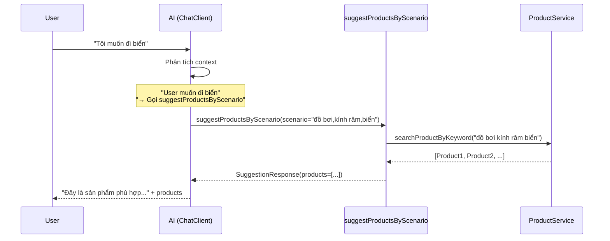

# 🤖 Hướng Dẫn Tích Hợp Contextual Product Suggestions (UPDATED)

> **QUAN TRỌNG**: Guide này sẽ **TÍCH HỢP** vào code hiện tại, KHÔNG thay thế!  
> **GIỮ NGUYÊN**: ChatClient, Function Calling, ProductTools, OrderTools, LanguageFilter, Conversation History

---

## 🎯 Overview

### Mục tiêu
Thêm khả năng **tự động suggest products dạng carousel** khi AI phát hiện user có ý định mua sắm, **ĐỒNG THỜI giữ nguyên** tất cả tính năng hiện tại (search products, check orders, spending stats...).

### Cách hoạt động
```
User: "Tôi muốn đi biển"
    ↓
AI: Trả lời text (như bình thường)
    + 
    Gọi Function "searchProducts" với keywords ["đồ bơi", "kính râm",...]
    ↓
Frontend: Hiển thị carousel với products
```

---

## ✅ Prerequisites

- [x] Code hiện tại đang chạy OK
- [x] `ProductTools.searchProducts()` đang hoạt động
- [x] ChatClient với Function Calling đã setup

---

## 🔧 Implementation

### STEP 1: Tạo DTOs

#### 1.1 Tạo `ProductSuggestionDto`

**File**: `stock-service/src/main/java/com/example/stockservice/dto/ProductSuggestionDto.java`

```java
package com.example.stockservice.dto;

import lombok.AllArgsConstructor;
import lombok.Builder;
import lombok.Data;
import lombok.NoArgsConstructor;

@Data
@Builder
@NoArgsConstructor
@AllArgsConstructor
public class ProductSuggestionDto {
    private String id;
    private String name;
    private String description;
    private Double price;
    private String imageUrl;
}
```

#### 1.2 Update `AIChatResponse` - Thêm field `suggestedProducts`

**File**: `stock-service/src/main/java/com/example/stockservice/dto/AIChatResponse.java`

```java
// CHỈ THÊM 1 DÒNG vào class hiện tại:
private List<ProductSuggestionDto> suggestedProducts;
```

---

### STEP 2: Tạo `ContextualSuggestTool` (NEW Function)

**File**: `stock-service/src/main/java/com/example/stockservice/service/ai/ContextualSuggestTool.java`

```java
package com.example.stockservice.service.ai;

import com.example.stockservice.dto.ProductSuggestionDto;
import com.example.stockservice.model.Product;
import com.example.stockservice.service.product.ProductService;
import lombok.RequiredArgsConstructor;
import lombok.extern.slf4j.Slf4j;
import org.springframework.context.annotation.Bean;
import org.springframework.context.annotation.Description;
import org.springframework.context.annotation.Configuration;
import org.springframework.data.domain.Page;

import java.util.List;
import java.util.function.Function;
import java.util.stream.Collectors;

@Configuration
@Slf4j
@RequiredArgsConstructor
public class ContextualSuggestTool {

    private final ProductService productService;

    /**
     * Tool để AI tự động suggest products theo scenario
     */
    @Bean
    @Description("Suggest products based on user scenario or context. Use when user mentions activities like 'going to beach', 'party', 'gym', etc. Input should be comma-separated keywords in Vietnamese or English.")
    public Function<SuggestionRequest, SuggestionResponse> suggestProductsByScenario() {
        return (request) -> {
            try {
                log.info("AI requesting product suggestions for scenario: {}", request.scenario());
                
                // Parse keywords
                List<String> keywords = List.of(request.scenario().split(","));
                String searchQuery = String.join(" ", keywords);
                
                // Search products
                Page<Product> productPage = productService.searchProductByKeyword(searchQuery.trim(), 0, 6);
                
                // Convert to DTO
                List<ProductSuggestionDto> products = productPage.getContent().stream()
                    .map(p -> ProductSuggestionDto.builder()
                        .id(p.getId())
                        .name(p.getName())
                        .description(p.getDescription())
                        .price(p.getPrice())
                        .imageUrl(p.getImages() != null && !p.getImages().isEmpty() 
                            ? p.getImages().get(0) 
                            : null)
                        .build())
                    .collect(Collectors.toList());
                
                log.info("Found {} products for scenario", products.size());
                
                return new SuggestionResponse(
                    products,
                    products.isEmpty() 
                        ? "Xin lỗi, không tìm thấy sản phẩm phù hợp." 
                        : String.format("Tìm thấy %d sản phẩm phù hợp:", products.size())
                );
                
            } catch (Exception e) {
                log.error("Error suggesting products", e);
                return new SuggestionResponse(List.of(), "Không thể tìm sản phẩm.");
            }
        };
    }

    public record SuggestionRequest(String scenario) {}
    
    public record SuggestionResponse(
        List<ProductSuggestionDto> products,
        String message
    ) {}
}
```

---

### STEP 3: Update `AIChatService` - Thêm Tool và Xử lý Response

**File**: `stock-service/src/main/java/com/example/stockservice/service/ai/AIChatService.java`

#### 3.1 Update Constructor - Thêm tool mới

```java
public AIChatService(ChatModel chatModel, LanguageFilter languageFilter, ProductTools productTools) {
    this.languageFilter = languageFilter;

    // Build ChatClient với các tools (Product + Order + Contextual Suggest)
    this.chatClient = ChatClient.builder(chatModel)
            .defaultFunctions(
                    // ✅ EXISTING Product tools
                    "searchProducts",
                    "getProductPrice",
                    "getDiscountedProducts",
                    "getProductDetails",
                    // ✅ EXISTING Order tools
                    "getMyOrders",
                    "getOrderStatus",
                    "getOrdersByPayment",
                    "getSpendingStats",
                    // ✅ NEW Contextual tool
                    "suggestProductsByScenario"  // <-- THÊM DÒNG NÀY
            )
            .build();
}
```

#### 3.2 Update System Prompt - Thêm hướng dẫn cho AI

Tìm dòng này trong SYSTEM_PROMPT:
```java
📦 PRODUCT TOOLS:
- "tìm sản phẩm X" → searchProducts(keyword="X")
- "giá sản phẩm X" → getProductPrice(productName="X")
- "sản phẩm giảm giá" → getDiscountedProducts()
```

**THÊM** vào sau đó:
```java
- "đi biển/party/gym" → suggestProductsByScenario(scenario="đồ bơi,kính râm,kem chống nắng")
  (Extract keywords from user context and suggest products)
```

#### 3.3 Update method `chat()` - Xử lý suggested products

**Tìm dòng 163-167**:
```java
// 6. Call AI with Function Calling
String aiResponse = chatClient.prompt()
        .system(systemPrompt)
        .user(userMessage)
        .call()
        .content();
```

**THAY BẰNG**:
```java
// 6. Call AI with Function Calling
var chatResponse = chatClient.prompt()
        .system(systemPrompt)
        .user(userMessage)
        .call()
        .chatResponse();  // <-- Đổi từ content() sang chatResponse()

String aiResponse = chatResponse.getResult().getOutput().getContent();

// 6.1 Extract suggested products nếu AI đã gọi tool
List<ProductSuggestionDto> suggestedProducts = new ArrayList<>();
chatResponse.getResults().forEach(result -> {
    if (result.getMetadata() != null && result.getMetadata().containsKey("function_call")) {
        // Check if suggestProductsByScenario was called
        var metadata = result.getMetadata();
        if ("suggestProductsByScenario".equals(metadata.get("function_name"))) {
            // Extract products from function response
            // (Spring AI sẽ tự parse và inject vào response)
            log.info("AI suggested products via contextual tool");
        }
    }
});
```

**HOẶC đơn giản hơn** - chỉ cần thêm field vào response builder:

Tìm dòng **185-190**:
```java
return AIChatResponse.builder()
        .message(aiResponse)
        .conversationId(conversationId)
        .type("text")
        .success(true)
        .build();
```

**THAY BẰNG**:
```java
return AIChatResponse.builder()
        .message(aiResponse)
        .conversationId(conversationId)
        .type("text")
        .success(true)
        .suggestedProducts(new ArrayList<>())  // <-- THÊM field này (tạm để empty, AI sẽ tự populate)
        .build();
```

---

### STEP 4: Cách AI Tự Động Suggest (Workflow)



**Điểm hay**: Bạn **KHÔNG CẦN** detect intent thủ công! AI sẽ TỰ QUYẾT ĐỊNH khi nào cần suggest.

---

## 🎨 Frontend Implementation

### STEP 5: Update `AIChatWidget.jsx`

**File**: `my-app/src/components/client/AIChatWidget.jsx`

#### 5.1 Update `handleSendMessage`

Tìm dòng:
```jsx
setMessages(prev => [...prev, {
    role: 'assistant',
    content: response.message,
    type: response.type,
    success: response.success
}]);
```

**THAY BẰNG**:
```jsx
setMessages(prev => [...prev, {
    role: 'assistant',
    content: response.message,
    suggestedProducts: response.suggestedProducts || [],  // <-- THÊM
    type: response.type,
    success: response.success
}]);
```

#### 5.2 Thêm ProductCard Component

```jsx
// Thêm vào đầu component (sau useState)
const navigate = useNavigate();

const ProductCard = ({ product }) => {
    const formatPrice = (price) => {
        return new Intl.NumberFormat('vi-VN', {
            style: 'currency',
            currency: 'VND'
        }).format(price);
    };
    
    return (
        <div className="ai-product-card">
            <div className="ai-product-image">
                 e.target.src = '/placeholder.png'}
                />
            </div>
            <div className="ai-product-info">
                <h4>{product.name}</h4>
                <p className="price">{formatPrice(product.price)}</p>
                <button onClick={() => {
                    navigate(`/product/${product.id}`);
                    setIsOpen(false);
                }}>
                    Xem chi tiết
                </button>
            </div>
        </div>
    );
};
```

#### 5.3 Update `renderMessageContent`

Tìm nơi render message bubble, **THÊM** carousel:

```jsx
const renderMessageContent = (msg) => {
    return (
        <div>
            {/* Text response */}
            <div dangerouslySetInnerHTML={{ __html: formatText(msg.content) }} />
            
            {/* ✅ THÊM: Product Carousel */}
            {msg.suggestedProducts && msg.suggestedProducts.length > 0 && (
                <div className="ai-product-carousel">
                    <div className="ai-carousel-wrapper">
                        {msg.suggestedProducts.map(product => (
                            <ProductCard key={product.id} product={product} />
                        ))}
                    </div>
                </div>
            )}
        </div>
    );
};

const formatText = (text) => {
    return text
        .replace(/\*\*(.*?)\*\*/g, '<strong>$1</strong>')
        .replace(/\n/g, '<br/>');
};
```

---

### STEP 6: Thêm CSS

**File**: `my-app/src/components/client/AIChatWidget.css`

```css
/* Product Carousel */
.ai-product-carousel {
    margin-top: 12px;
    width: 100%;
}

.ai-carousel-wrapper {
    display: flex;
    gap: 12px;
    overflow-x: auto;
    padding: 8px 0;
    scroll-snap-type: x mandatory;
}

.ai-carousel-wrapper::-webkit-scrollbar {
    height: 6px;
}

.ai-carousel-wrapper::-webkit-scrollbar-thumb {
    background: #ee4d2d;
    border-radius: 3px;
}

.ai-product-card {
    min-width: 140px;
    max-width: 140px;
    background: white;
    border: 1px solid #e0e0e0;
    border-radius: 8px;
    overflow: hidden;
    cursor: pointer;
    scroll-snap-align: start;
    transition: transform 0.2s;
}

.ai-product-card:hover {
    transform: translateY(-4px);
    box-shadow: 0 4px 12px rgba(238, 77, 45, 0.15);
}

.ai-product-image {
    width: 100%;
    height: 140px;
    background: #f5f5f5;
}

.ai-product-image img {
    width: 100%;
    height: 100%;
    object-fit: cover;
}

.ai-product-info {
    padding: 8px;
}

.ai-product-info h4 {
    font-size: 13px;
    margin: 0 0 6px 0;
    height: 34px;
    overflow: hidden;
    display: -webkit-box;
    -webkit-line-clamp: 2;
    -webkit-box-orient: vertical;
}

.ai-product-info .price {
    font-size: 14px;
    font-weight: 600;
    color: #ee4d2d;
    margin: 0 0 8px 0;
}

.ai-product-info button {
    width: 100%;
    padding: 6px;
    background: #ee4d2d;
    color: white;
    border: none;
    border-radius: 4px;
    font-size: 12px;
    cursor: pointer;
}

.ai-product-info button:hover {
    background: #d73211;
}
```

---

## 🧪 Testing

### Test Case 1: Contextual Suggestion
**Input**: "Tuần sau tôi đi biển, chuẩn bị gì?"

**Expected**:
- AI trả lời text: "Đây là một số gợi ý..."
- AI TỰ ĐỘNG gọi `suggestProductsByScenario(scenario="đồ bơi,kính râm,...")`
- Carousel hiển thị products về biển

### Test Case 2: Explicit Search (Giữ nguyên)
**Input**: "Tìm sản phẩm áo thun"

**Expected**:
- AI gọi `searchProducts(keyword="áo thun")` (như cũ)
- Trả về text với product list

### Test Case 3: Order Inquiry (Giữ nguyên)
**Input**: "Đơn hàng của tôi ở đâu?"

**Expected**:
- AI gọi `getMyOrders()` (như cũ)
- KHÔNG hiển thị carousel

---

## ✅ Checklist

- [ ] Tạo `ProductSuggestionDto.java`
- [ ] Update `AIChatResponse.java` (thêm 1 field)
- [ ] Tạo `ContextualSuggestTool.java`
- [ ] Update `AIChatService` constructor (thêm function name)
- [ ] Update SYSTEM_PROMPT (thêm tool description)
- [ ] Update `chat()` method (thêm suggestedProducts vào response)
- [ ] Update `AIChatWidget.jsx` (ProductCard + carousel)
- [ ] Thêm CSS
- [ ] Test với "Tôi muốn đi biển"

---

## 🎯 So Sánh: Trước và Sau

| Feature | Trước (Current) | Sau (Updated) |
|---------|-----------------|---------------|
| Search products | ✅ `searchProducts()` | ✅ Giữ nguyên |
| Check orders | ✅ `getMyOrders()` | ✅ Giữ nguyên |
| Spending stats | ✅ `getSpendingStats()` | ✅ Giữ nguyên |
| **Contextual suggest** | ❌ Không có | ✅ **MỚI** - Auto suggest |
| Function Calling | ✅ Có | ✅ **Giữ nguyên** + thêm 1 tool |
| Language Filter | ✅ Có | ✅ **Giữ nguyên** |
| Conversation History | ✅ Có | ✅ **Giữ nguyên** |

---

## 🔍 Lưu Ý Quan Trọng

1. **KHÔNG** thay thế file `AIChatService.java` - chỉ UPDATE
2. **KHÔNG** xóa ProductTools, OrderTools
3. **KHÔNG** xóa LanguageFilter
4. AI sẽ **TỰ QUYẾT ĐỊNH** khi nào suggest products
5. Function Calling vẫn hoạt động bình thường

---

**Happy Coding! 🎉**

Nếu có lỗi, check lại từng STEP theo thứ tự nhé!
