# 🎯 Implementation Plan - User Behavior Analytics & AI Features

## 📌 Tổng Quan Luồng Hoạt Động

```mermaid
sequenceDiagram
    participant U as 👤 User
    participant FE as 🖥️ Frontend
    participant BE as ⚙️ Backend
    participant K as 📬 Kafka
    participant R as 🔴 Redis
    participant DB as 🗄️ MySQL
    participant AI as 🤖 Ollama

    Note over U,AI: === PHASE 1: TRACKING ===
    U->>FE: Đăng nhập & lướt sản phẩm
    FE->>BE: POST /track/view {productId, sessionId}
    BE->>K: Publish event (async)
    BE->>R: INCR view_count:{productId}
    BE-->>FE: 200 OK (5ms)
    
    U->>FE: Search "áo thun"
    FE->>BE: POST /track/search {keyword}
    BE->>K: Publish search event
    BE->>R: INCR search:{keyword}
    
    Note over U,AI: === PHASE 2: PERSONALIZATION ===
    K->>DB: Consumer insert behavior_logs
    K->>DB: UPDATE product_analytics
    
    U->>FE: Mở trang Home/Category
    FE->>BE: GET /recommendations?userId=xxx
    BE->>R: GET recent_views:{userId}
    BE->>DB: Query similar products
    BE-->>FE: Personalized products
    FE->>U: 🎯 Hiển thị "Có thể bạn quan tâm"
    
    Note over U,AI: === PHASE 3: AI INSIGHTS (Shop Owner) ===
    FE->>BE: GET /analytics/shop/ai-insights
    BE->>DB: Query shop analytics data
    BE->>AI: Generate insights
    AI-->>BE: Recommendations
    BE-->>FE: AI insights for shop owner
```



---

## 🗂️ Feature Groups & Priority

### 🔴 PHASE 1: Core Behavior Tracking (Ưu tiên CAO NHẤT)
> **Mục tiêu**: Thu thập dữ liệu hành vi người dùng - NỀN TẢNG cho mọi tính năng khác

| # | Feature | Mô tả | Độ phức tạp | Thời gian |
|---|---------|-------|-------------|-----------|
| 1.1 | **Event Tracking API** | Track VIEW, SEARCH, ADD_CART, PURCHASE | Medium | 3 ngày |
| 1.2 | **Kafka Producer** | Async event publishing | Low | 1 ngày |
| 1.3 | **Redis Counters** | Real-time view/search counters | Low | 1 ngày |
| 1.4 | **Kafka Consumer** | Process events → MySQL | Medium | 2 ngày |
| 1.5 | **Frontend Hooks** | useTrackBehavior() hook | Low | 1 ngày |

**Tổng: ~8 ngày**

---

### 🔴 PHASE 2: Personalized Recommendations (Ưu tiên CAO)
> **Mục tiêu**: Hiển thị sản phẩm cá nhân hóa dựa trên behavior

| # | Feature | Mô tả | Độ phức tạp | Thời gian |
|---|---------|-------|-------------|-----------|
| 2.1 | **RecommendationService** | Logic đề xuất sản phẩm | High | 4 ngày |
| 2.2 | **Similar Products** | Sản phẩm tương tự (cùng category/keyword) | Medium | 2 ngày |
| 2.3 | **Recently Viewed** | Sản phẩm đã xem gần đây | Low | 1 ngày |
| 2.4 | **Trending Products** | Sản phẩm hot trong 24h | Medium | 2 ngày |
| 2.5 | **Frontend Section** | "Có thể bạn quan tâm" UI | Medium | 2 ngày |

**Tổng: ~11 ngày**

---

### 🟡 PHASE 3: Search Superpromax (Ưu tiên TRUNG BÌNH)
> **Mục tiêu**: Search mạnh mẽ với cache và autocomplete

| # | Feature | Mô tả | Độ phức tạp | Thời gian |
|---|---------|-------|-------------|-----------|
| 3.1 | **SearchService + Cache** | Redis cache 24h cho search results | Medium | 3 ngày |
| 3.2 | **Autocomplete** | Gợi ý keyword khi gõ | Medium | 2 ngày |
| 3.3 | **Trending Keywords** | Top 10 từ khóa hot | Low | 1 ngày |
| 3.4 | **Search History** | Lịch sử tìm kiếm của user | Low | 1 ngày |

**Tổng: ~7 ngày**

---

### 🟡 PHASE 4: Shop Owner Analytics Dashboard (Ưu tiên TRUNG BÌNH)
> **Mục tiêu**: Shop owner xem được behavior của khách hàng

| # | Feature | Mô tả | Độ phức tạp | Thời gian |
|---|---------|-------|-------------|-----------|
| 4.1 | **Overview Stats** | Tổng views, carts, purchases | Medium | 2 ngày |
| 4.2 | **Top Products** | Sản phẩm được xem nhiều nhất | Low | 1 ngày |
| 4.3 | **Conversion Funnel** | View → Cart → Purchase | Medium | 2 ngày |
| 4.4 | **Abandoned Products** | Views cao nhưng không mua | Medium | 2 ngày |
| 4.5 | **Dashboard UI** | React dashboard với charts | High | 4 ngày |

**Tổng: ~11 ngày**

---

### 🟢 PHASE 5: AI Smart Shopping Assistant (Thiết thực & Nổi bật)
> **Mục tiêu**: AI không chỉ chat mà còn HIỂU ngữ cảnh và TÌM sản phẩm thông minh (kết hợp cả Text & Ảnh)

| # | Feature | Mô tả | Độ phức tạp | Thời gian |
|---|---------|-------|-------------|-----------|
| 5.1 | **Contextual Recommendation** | Hiểu ngữ cảnh: "Đi biển" -> Gợi ý đồ bơi, kính râm, kem chống nắng | High | 3 ngày |
| 5.2 | **Smart Product Carousel** | Hiển thị list sản phẩm dạng thẻ ngay trong khung chat | Medium | 2 ngày |
| 5.3 | **Visual Search (Image)** | (Gộp từ Phase 6) Gửi ảnh -> Tìm sản phẩm tương tự | Very High | 4 ngày |

**Tổng: ~9 ngày**

---

### 🟢 PHASE 6: (Đã gộp vào Phase 5 hoặc Future)
> Các tính năng Voice/Push đã được loại bỏ theo yêu cầu để tập trung vào trải nghiệm cốt lõi.

---

## 📊 Luồng Chi Tiết: User Journey

### Scenario: User lướt và mua sản phẩm

```
┌─────────────────────────────────────────────────────────────────────────────┐
│  👤 USER JOURNEY                                                            │
├─────────────────────────────────────────────────────────────────────────────┤
│                                                                             │
│  1️⃣ ĐĂNG NHẬP                                                              │
│     └── System: Tạo sessionId, gắn với userId                              │
│                                                                             │
│  2️⃣ LƯỚT TRANG CHỦ                                                         │
│     ├── Event: PAGE_VIEW (homepage)                                        │
│     └── System: Load "Gợi ý cho bạn" (nếu có history)                      │
│                                                                             │
│  3️⃣ SEARCH "áo thun nam"                                                   │
│     ├── Event: SEARCH {keyword: "áo thun nam"}                             │
│     ├── Redis: INCR search:áo thun nam                                     │
│     ├── Cache: Check search:áo thun nam:page1 (24h TTL)                    │
│     └── Response: Kết quả search (cached hoặc fresh)                       │
│                                                                             │
│  4️⃣ XEM SẢN PHẨM A                                                         │
│     ├── Event: VIEW {productId: A, duration: 45s}                          │
│     ├── Redis: INCR view:{productId:A}                                     │
│     ├── Redis: LPUSH recent_views:{userId} productA                        │
│     └── Kafka: Publish to analytics-topic                                  │
│                                                                             │
│  5️⃣ QUAY LẠI TRANG CHỦ                                                     │
│     └── 🎯 "Có thể bạn quan tâm": [áo thun tương tự A]                     │
│                                                                             │
│  6️⃣ XEM SẢN PHẨM B (cùng category)                                         │
│     ├── Event: VIEW {productId: B}                                         │
│     └── 🎯 Section: "Khách hàng cũng xem": [sản phẩm liên quan]            │
│                                                                             │
│  7️⃣ THÊM VÀO GIỎ                                                           │
│     ├── Event: ADD_CART {productId: B, quantity: 1}                        │
│     └── Kafka: Update cart_count cho product B                             │
│                                                                             │
│  8️⃣ CHECKOUT & THANH TOÁN                                                  │
│     ├── Event: PURCHASE {orderId: xxx, productIds: [B]}                    │
│     └── Kafka: Update purchase_count, calculate conversion                 │
│                                                                             │
└─────────────────────────────────────────────────────────────────────────────┘
```

---

## 🏪 Shop Owner Analytics View

```
┌────────────────────────────────────────────────────────────────────────────┐
│  📊 SHOP ANALYTICS DASHBOARD                                               │
├────────────────────────────────────────────────────────────────────────────┤
│                                                                            │
│  ┌──────────────┐  ┌──────────────┐  ┌──────────────┐  ┌──────────────┐   │
│  │ 👁️ Views     │  │ 🛒 Add Cart  │  │ 💳 Purchases │  │ 📈 CVR       │   │
│  │   12,450     │  │    1,823     │  │     456      │  │   3.66%      │   │
│  │   +12% ↑     │  │    +8% ↑     │  │    +15% ↑    │  │   +0.5% ↑    │   │
│  └──────────────┘  └──────────────┘  └──────────────┘  └──────────────┘   │
│                                                                            │
│  ╔══════════════════════════════════╗  ╔═══════════════════════════════╗  │
│  ║  🔥 TOP SẢN PHẨM                 ║  ║  🤖 AI INSIGHTS               ║  │
│  ╠══════════════════════════════════╣  ╠═══════════════════════════════╣  │
│  ║  1. iPhone 15 Pro    2,340 👁️    ║  ║  💡 iPhone 15 đang hot        ║  │
│  ║  2. Samsung S24      1,890 👁️    ║  ║     Views +45% tuần này       ║  │
│  ║  3. AirPods Pro      1,567 👁️    ║  ║                               ║  │
│  ╚══════════════════════════════════╝  ║  ⚠️ 3 sản phẩm cần review:    ║  │
│                                        ║     Views cao, 0 đơn hàng     ║  │
│  ╔══════════════════════════════════╗  ║                               ║  │
│  ║  📉 PHỄU CHUYỂN ĐỔI              ║  ║  💰 Đề xuất giảm giá          ║  │
│  ╠══════════════════════════════════╣  ║     Samsung S24 (CVR 1.2%)    ║  │
│  ║  Views  ████████████  12,450     ║  ╚═══════════════════════════════╝  │
│  ║  Cart   ████          1,823      ║                                     │
│  ║  Buy    ██              456      ║                                     │
│  ╚══════════════════════════════════╝                                     │
└────────────────────────────────────────────────────────────────────────────┘
```

---

## 🗓️ Implementation Roadmap

```mermaid
gantt
    title Implementation Roadmap - 2025
    dateFormat YYYY-MM-DD
    
    section 🔴 Phase 1: Tracking
    Event Tracking API       :crit, p1a, 2025-01-02, 3d
    Kafka Producer + Redis   :crit, p1b, after p1a, 2d
    Kafka Consumer           :crit, p1c, after p1b, 2d
    Frontend Hooks           :p1d, after p1c, 1d
    
    section 🔴 Phase 2: Recommendations
    RecommendationService    :crit, p2a, after p1d, 4d
    Similar/Trending         :p2b, after p2a, 3d
    Frontend UI              :p2c, after p2b, 2d
    
    section 🟡 Phase 3: Search
    SearchService + Cache    :p3a, after p2c, 3d
    Autocomplete + History   :p3b, after p3a, 3d
    
    section 🟡 Phase 4: Shop Dashboard
    Analytics APIs           :p4a, after p1c, 3d
    Dashboard UI             :p4b, after p3b, 4d
    
    section 🟢 Phase 5: AI Enhance
    Recommendation Tool      :p5a, after p4b, 2d
    Quick Actions            :p5b, after p5a, 2d
    AI Insights              :p5c, after p5b, 3d
```



---

## 📁 File Structure Đề Xuất

```
stock-service/src/main/java/com/example/stockservice/
├── controller/
│   └── analytics/
│       ├── TrackingController.java          [NEW] Phase 1
│       ├── RecommendationController.java    [NEW] Phase 2
│       ├── SearchController.java            [NEW] Phase 3
│       └── ShopAnalyticsController.java     [NEW] Phase 4
├── service/
│   └── analytics/
│       ├── TrackingService.java             [NEW] Phase 1
│       ├── BehaviorKafkaProducer.java       [NEW] Phase 1
│       ├── BehaviorKafkaConsumer.java       [NEW] Phase 1
│       ├── AnalyticsRedisService.java       [NEW] Phase 1
│       ├── RecommendationService.java       [NEW] Phase 2
│       ├── SearchCacheService.java          [NEW] Phase 3
│       └── ShopAnalyticsService.java        [NEW] Phase 4
│   └── ai/
│       ├── AIChatService.java               [MODIFY] Phase 5
│       └── RecommendationTools.java         [NEW] Phase 5
├── model/analytics/
│       ├── BehaviorLog.java                 [NEW] Phase 1
│       ├── ProductAnalytics.java            [NEW] Phase 1
│       └── SearchAnalytics.java             [NEW] Phase 3
└── dto/analytics/
        ├── TrackEventRequest.java           [NEW] Phase 1
        ├── RecommendationResponse.java      [NEW] Phase 2
        └── ShopAnalyticsResponse.java       [NEW] Phase 4

my-app/src/
├── api/
│   ├── tracking.js                          [NEW] Phase 1
│   ├── recommendation.js                    [NEW] Phase 2
│   └── shopAnalytics.js                     [NEW] Phase 4
├── hooks/
│   └── useTrackBehavior.js                  [NEW] Phase 1
└── components/
    ├── client/
    │   └── RecommendationSection.jsx        [NEW] Phase 2
    └── shop-owner/
        └── AnalyticsDashboard.jsx           [NEW] Phase 4
```

---

## ✅ Tóm Tắt

| Phase | Tên | Độ ưu tiên | Thời gian | Phụ thuộc |
|-------|-----|------------|-----------|-----------|
| 1 | Behavior Tracking | 🔴 Critical | 8 ngày | - |
| 2 | Recommendations | 🔴 High | 11 ngày | Phase 1 |
| 3 | Search Superpromax | 🟡 Medium | 7 ngày | Phase 1 |
| 4 | Shop Dashboard | 🟡 Medium | 11 ngày | Phase 1 |
| 5 | AI Chat Enhance | 🟢 Later | 7 ngày | Phase 1, 2 |
| 6 | Advanced (Image/Voice) | 🟢 Future | TBD | Phase 5 |

> [!IMPORTANT]
> **Phase 1 (Behavior Tracking) là NỀN TẢNG** - Tất cả các tính năng khác đều phụ thuộc vào dữ liệu từ Phase 1!
