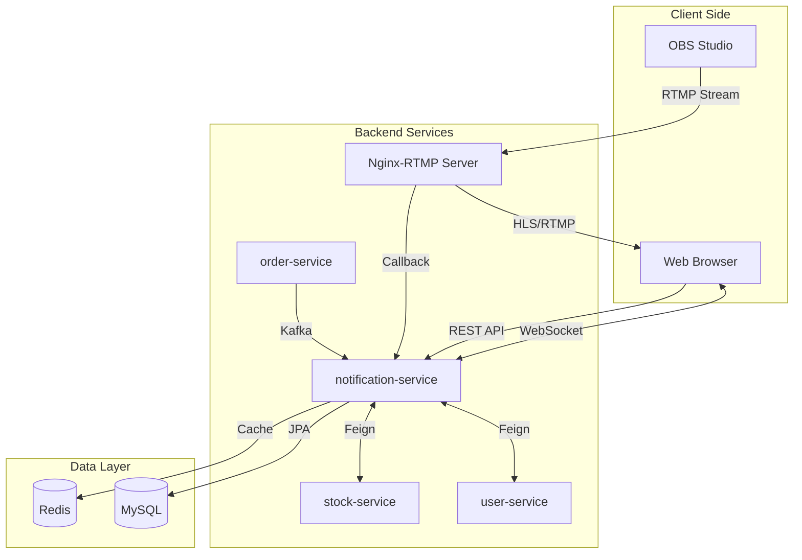
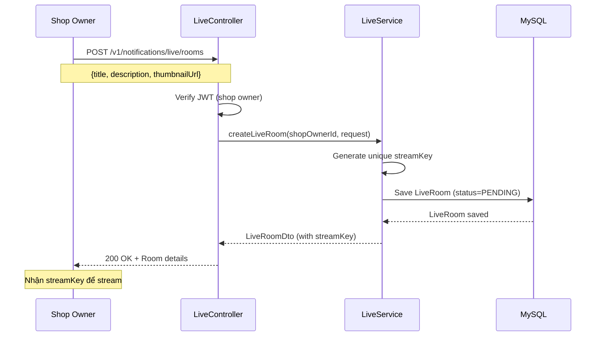
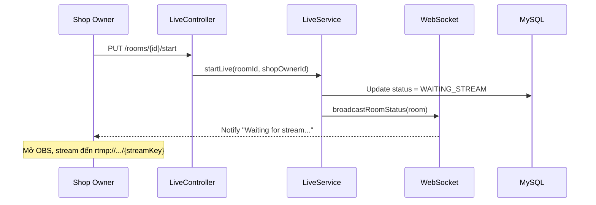
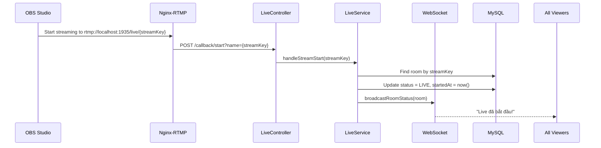
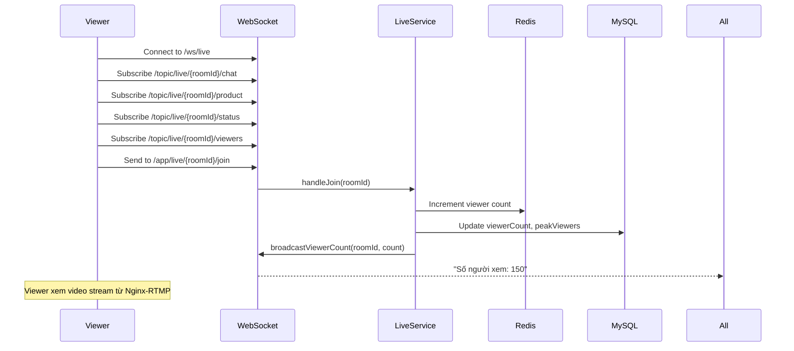
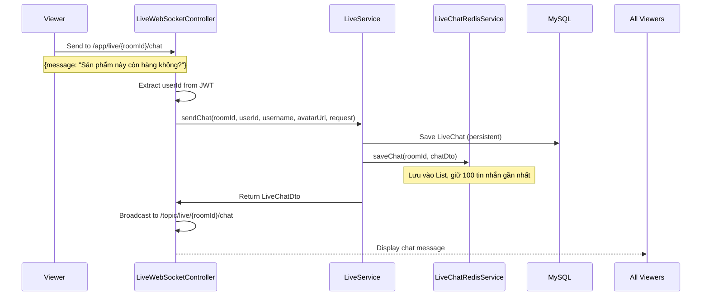
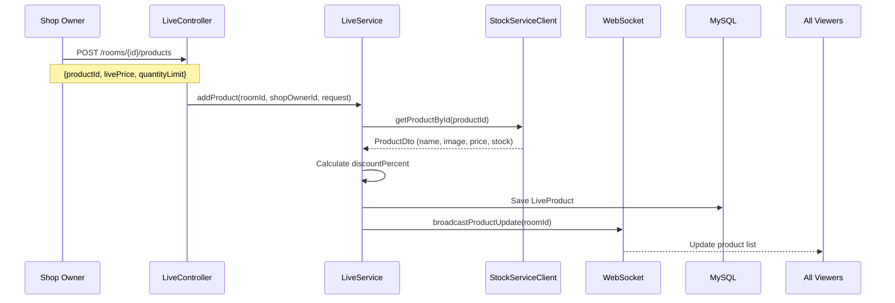
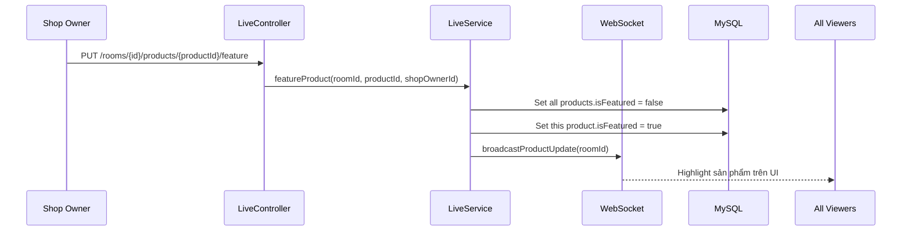
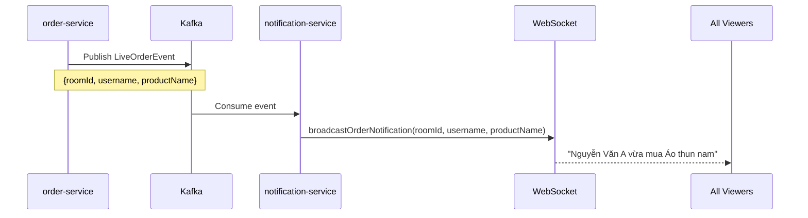
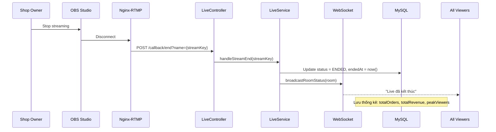

# Kiến Trúc Chức Năng Live Stream

## 📋 Mục Lục
1. [Tổng Quan](#tổng-quan)
2. [Công Nghệ Sử Dụng](#công-nghệ-sử-dụng)
3. [Kiến Trúc Hệ Thống](#kiến-trúc-hệ-thống)
4. [Luồng Hoạt Động Chi Tiết](#luồng-hoạt-động-chi-tiết)
5. [Cấu Trúc Code](#cấu-trúc-code)
6. [Bảo Mật](#bảo-mật)
7. [Tối Ưu Hiệu Năng](#tối-ưu-hiệu-năng)

---

## Tổng Quan

Chức năng **Live Stream** trong `notification-service` cho phép shop owner phát trực tiếp video để bán hàng, tương tác với khách hàng qua chat real-time, và quản lý sản phẩm trong phiên live.

**Tính năng chính:**
- ✅ Phát video trực tiếp qua RTMP
- ✅ Chat real-time với WebSocket
- ✅ Quản lý sản phẩm trong live
- ✅ Highlight sản phẩm đang bán
- ✅ Thống kê số người xem, đơn hàng, doanh thu
- ✅ Thông báo đơn hàng real-time

---

## Công Nghệ Sử Dụng

### 1. **WebSocket + STOMP Protocol**

**Mục đích:** Giao tiếp real-time 2 chiều giữa client và server

**Thư viện:** `spring-boot-starter-websocket`

**Protocol:** STOMP (Simple Text Oriented Messaging Protocol) over WebSocket

**Endpoint:** `/ws/live` (hỗ trợ cả SockJS fallback)

**Cách hoạt động:**
```
Client                          Server
  |                               |
  |--- Connect to /ws/live ------>|
  |<-- Connection Established ----|
  |                               |
  |--- Subscribe /topic/live/{roomId}/chat -->|
  |--- Subscribe /topic/live/{roomId}/product -->|
  |--- Subscribe /topic/live/{roomId}/status -->|
  |                               |
  |--- Send to /app/live/{roomId}/chat ------>|
  |<-- Broadcast to all subscribers ----------|
```

**Các channel chính:**

**Subscribe (nhận tin):**
- `/topic/live/{roomId}/chat` - Nhận tin nhắn chat
- `/topic/live/{roomId}/product` - Nhận cập nhật sản phẩm
- `/topic/live/{roomId}/status` - Nhận trạng thái phòng live
- `/topic/live/{roomId}/viewers` - Nhận số lượng người xem

**Send (gửi tin):**
- `/app/live/{roomId}/chat` - Gửi tin nhắn
- `/app/live/{roomId}/join` - Join room (tăng viewer count)
- `/app/live/{roomId}/leave` - Leave room (giảm viewer count)

**Ưu điểm so với HTTP Polling:**
- 🚀 Latency thấp hơn: ~50ms vs ~1000ms
- 💾 Tiết kiệm bandwidth: giảm 90%
- ⚡ Real-time: cập nhật tức thì

---

### 2. **Redis Cache**

**Mục đích:** Lưu trữ tạm thời chat messages và viewer count

**Thư viện:** `spring-boot-starter-data-redis`

**Lý do sử dụng:**
- ⚡ Tốc độ cao cho real-time chat
- 💾 Giảm tải cho database chính
- ⏰ Auto-expire sau 24h (TTL)

**Cấu trúc dữ liệu trong Redis:**
```
Key: "live:chat:{roomId}"
Type: List (FIFO)
Value: [LiveChatDto, LiveChatDto, ...]
Max Size: 100 messages (giữ 100 tin nhắn gần nhất)
TTL: 24 hours

Key: "live:viewers:{roomId}"
Type: String
Value: viewer_count (số nguyên)
TTL: 24 hours
```

**Flow lưu chat:**
1. User gửi chat qua WebSocket
2. Server lưu vào Redis List (FIFO)
3. Nếu vượt quá 100 tin nhắn → xóa tin nhắn cũ nhất
4. Đồng thời lưu vào MySQL để backup lâu dài
5. Sau 24h, Redis tự động xóa (TTL)

---

### 3. **MySQL Database (JPA)**

**Mục đích:** Lưu trữ lâu dài thông tin phòng live, sản phẩm, và lịch sử chat

**Thư viện:** `spring-boot-starter-data-jpa` + `mysql-connector-j`

**Các bảng chính:**

**`live_rooms`** - Thông tin phòng live
```sql
CREATE TABLE live_rooms (
    id VARCHAR(36) PRIMARY KEY,
    shop_owner_id VARCHAR(36) NOT NULL,
    title VARCHAR(500) NOT NULL,
    description TEXT,
    stream_key VARCHAR(100) UNIQUE NOT NULL,
    thumbnail_url VARCHAR(500),
    status ENUM('PENDING', 'WAITING_STREAM', 'LIVE', 'ENDED'),
    viewer_count INT DEFAULT 0,
    peak_viewers INT DEFAULT 0,
    total_orders INT DEFAULT 0,
    total_revenue DOUBLE DEFAULT 0.0,
    started_at DATETIME,
    ended_at DATETIME,
    created_at DATETIME NOT NULL,
    updated_at DATETIME,
    INDEX idx_shop_owner (shop_owner_id),
    INDEX idx_status (status)
);
```

**`live_products`** - Sản phẩm trong phòng live
```sql
CREATE TABLE live_products (
    id VARCHAR(36) PRIMARY KEY,
    live_room_id VARCHAR(36) NOT NULL,
    product_id VARCHAR(36) NOT NULL,
    product_name VARCHAR(500),
    product_image_url VARCHAR(500),
    original_price DOUBLE,
    live_price DOUBLE,
    discount_percent DOUBLE DEFAULT 0.0,
    quantity_limit INT,
    stock_available INT,
    sold_count INT DEFAULT 0,
    is_featured BOOLEAN DEFAULT FALSE,
    display_order INT DEFAULT 0,
    created_at DATETIME NOT NULL,
    INDEX idx_live_room (live_room_id),
    INDEX idx_featured (is_featured),
    FOREIGN KEY (live_room_id) REFERENCES live_rooms(id)
);
```

**`live_chats`** - Lịch sử chat
```sql
CREATE TABLE live_chats (
    id VARCHAR(36) PRIMARY KEY,
    live_room_id VARCHAR(36) NOT NULL,
    user_id VARCHAR(36) NOT NULL,
    username VARCHAR(255),
    avatar_url VARCHAR(500),
    message TEXT NOT NULL,
    type ENUM('CHAT', 'SYSTEM', 'ORDER') DEFAULT 'CHAT',
    is_pinned BOOLEAN DEFAULT FALSE,
    product_id VARCHAR(36),
    product_name VARCHAR(255),
    created_at DATETIME NOT NULL,
    INDEX idx_live_room_time (live_room_id, created_at)
);
```

---

### 4. **RTMP (Real-Time Messaging Protocol)**
RTMP (Real-Time Messaging Protocol) là một giao thức truyền tải dữ liệu thời gian thực được phát triển bởi Adobe Systems, chủ yếu được sử dụng để truyền tải âm thanh, video và dữ liệu giữa các máy chủ và người dùng trong các ứng dụng phát trực tuyến (live streaming). Mặc dù RTMP ban đầu được thiết kế để làm việc với Adobe Flash Player, nhưng hiện nay nó vẫn được sử dụng rộng rãi trong các dịch vụ phát video trực tuyến.

**Mục đích:** Nhận video stream từ OBS Studio

**Server:** Nginx-RTMP (chạy riêng, không phải trong Spring Boot)

**URL Stream:** `rtmp://localhost:1935/live/{streamKey}`

**Luồng RTMP:**
```
OBS Studio                    Nginx-RTMP                Spring Boot
    |                              |                           |
    |-- Stream to rtmp://... ---->|                           |
    |                              |-- POST /callback/start -->|
    |                              |                           |
    |                              |                    (Update status to LIVE)
    |                              |                           |
    |<-- Stream to viewers --------|                           |
    |                              |                           |
    |-- Stop streaming ----------->|                           |
    |                              |-- POST /callback/end ---->|
    |                              |                    (Update status to ENDED)
```

**Cấu hình Nginx-RTMP:**
```nginx
rtmp {
    server {
        listen 1935;
        application live {
            live on;
            record off;
            
            # Callback khi stream bắt đầu
            on_publish http://localhost:8009/v1/notifications/live/callback/start;
            
            # Callback khi stream kết thúc
            on_publish_done http://localhost:8009/v1/notifications/live/callback/end;
            
            # HLS output (cho web player)
            hls on;
            hls_path /tmp/hls;
            hls_fragment 3s;
        }
    }
}

# HTTP server để serve HLS
http {
    server {
        listen 8080;
        location /hls {
            types {
                application/vnd.apple.mpegurl m3u8;
                video/mp2t ts;
            }
            root /tmp;
            add_header Cache-Control no-cache;
            add_header Access-Control-Allow-Origin *;
        }
    }
}
```

**Cách shop owner stream:**
1. Mở OBS Studio
2. Settings → Stream
3. Service: Custom
4. Server: `rtmp://localhost:1935/live`
5. Stream Key: `{streamKey}` (lấy từ API khi tạo phòng)
6. Start Streaming

---

### 5. **OpenFeign**

**Mục đích:** Gọi API sang các service khác

**Thư viện:** `spring-cloud-starter-openfeign`

**Sử dụng cho:**

**UserServiceClient** - Lấy thông tin user
```java
@FeignClient(name = "user-service")
public interface UserServiceClient {
    @GetMapping("/v1/users/{userId}")
    UserDto getUserById(@PathVariable String userId);
}
```

**StockServiceClient** - Lấy thông tin sản phẩm
```java
@FeignClient(name = "stock-service")
public interface StockServiceClient {
    @GetMapping("/v1/products/{productId}")
    ProductDto getProductById(@PathVariable String productId);
}
```

**Khi nào gọi:**
- Khi user gửi chat → gọi UserService lấy username, avatar
- Khi thêm sản phẩm vào live → gọi StockService lấy tên, giá, hình ảnh, tồn kho

---

### 6. **JWT Authentication**

**Mục đích:** Xác thực user khi kết nối WebSocket và gọi API

**Thư viện:** `jjwt-api`, `jjwt-impl`, `jjwt-jackson`

**Interceptor:** `WebSocketJwtInterceptor` - Kiểm tra JWT trong WebSocket handshake

**Flow xác thực WebSocket:**
```
Client                          WebSocketJwtInterceptor           Server
  |                                        |                         |
  |-- Connect /ws/live?token=xxx -------->|                         |
  |                                        |-- Verify JWT           |
  |                                        |-- Extract userId       |
  |                                        |-- Set to session ----->|
  |<-- Connection Established -----------------------------|
```

**Lấy userId từ JWT trong message:**
```java
@MessageMapping("/live/{roomId}/chat")
public void handleChat(@DestinationVariable String roomId,
                       @Payload LiveChatRequest request,
                       SimpMessageHeaderAccessor headerAccessor) {
    // Lấy userId từ JWT đã được set bởi interceptor
    String userId = (String) headerAccessor.getSessionAttributes().get("userId");
    String username = (String) headerAccessor.getSessionAttributes().get("username");
    
    // Xử lý chat...
}
```

---

### 7. **Kafka (Tích hợp sẵn)**

**Mục đích:** Nhận event từ các service khác

**Thư viện:** `spring-kafka`

**Use case:** Khi có đơn hàng mới từ sản phẩm trong live → broadcast thông báo

**Flow:**
```
order-service                  Kafka                  notification-service
      |                          |                            |
      |-- Publish LiveOrderEvent -->|                         |
      |                          |-- Consume event --------->|
      |                          |                            |
      |                          |                    (Broadcast to WebSocket)
      |                          |                            |
      |                          |                    All viewers see notification
```

**Event structure:**
```java
public class LiveOrderEvent {
    private String roomId;
    private String userId;
    private String username;
    private String productId;
    private String productName;
    private Double amount;
    private LocalDateTime timestamp;
}
```

---

## Kiến Trúc Hệ Thống



**Giải thích:**
1. **OBS Studio** → stream video qua RTMP đến **Nginx-RTMP**
2. **Nginx-RTMP** → phân phối video đến người xem (HLS/RTMP)
3. **Nginx-RTMP** → gọi callback đến **notification-service** khi stream bắt đầu/kết thúc
4. **Web Browser** → kết nối WebSocket đến **notification-service** để chat
5. **notification-service** → gọi **user-service** lấy thông tin user
6. **notification-service** → gọi **stock-service** lấy thông tin sản phẩm
7. **order-service** → gửi event qua Kafka khi có đơn hàng mới
8. **notification-service** → lưu dữ liệu vào MySQL và Redis

---

## Luồng Hoạt Động Chi Tiết

### **1. Tạo Phòng Live**



**Request:**
```json
POST /v1/notifications/live/rooms
Authorization: Bearer {jwt_token}
Content-Type: application/json

{
  "title": "Flash Sale Cuối Năm - Giảm giá 50%",
  "description": "Livestream bán hàng với nhiều ưu đãi hấp dẫn",
  "thumbnailUrl": "https://example.com/thumbnail.jpg"
}
```

**Response:**
```json
{
  "id": "550e8400-e29b-41d4-a716-446655440000",
  "shopOwnerId": "90310e6c-f00a-4385-b5ec-97f5b3620c9f",
  "title": "Flash Sale Cuối Năm - Giảm giá 50%",
  "description": "Livestream bán hàng với nhiều ưu đãi hấp dẫn",
  "streamKey": "abc123xyz456def789",
  "thumbnailUrl": "https://example.com/thumbnail.jpg",
  "status": "PENDING",
  "viewerCount": 0,
  "createdAt": "2025-12-30T20:00:00"
}
```

**Dữ liệu trong database:**
```java
LiveRoom {
    id: "550e8400-e29b-41d4-a716-446655440000",
    shopOwnerId: "90310e6c-f00a-4385-b5ec-97f5b3620c9f",
    title: "Flash Sale Cuối Năm - Giảm giá 50%",
    description: "Livestream bán hàng với nhiều ưu đãi hấp dẫn",
    streamKey: "abc123xyz456def789", // Unique key
    thumbnailUrl: "https://example.com/thumbnail.jpg",
    status: PENDING,
    viewerCount: 0,
    peakViewers: 0,
    totalOrders: 0,
    totalRevenue: 0.0,
    startedAt: null,
    endedAt: null,
    createdAt: "2025-12-30T20:00:00",
    updatedAt: "2025-12-30T20:00:00"
}
```

---

### **2. Bắt Đầu Live Stream**

**Cách 1: Shop owner bấm "Start Live" trên web**



**Request:**
```http
PUT /v1/notifications/live/rooms/550e8400-e29b-41d4-a716-446655440000/start
Authorization: Bearer {jwt_token}
```

**Response:**
```json
{
  "id": "550e8400-e29b-41d4-a716-446655440000",
  "status": "WAITING_STREAM",
  "message": "Phòng live đã sẵn sàng. Vui lòng bắt đầu stream từ OBS."
}
```

**Cách 2: OBS bắt đầu stream (RTMP callback)**



**RTMP Callback Request:**
```http
POST /v1/notifications/live/callback/start?name=abc123xyz456def789
```

**Code xử lý:**
```java
public void handleStreamStart(String streamKey) {
    LiveRoom room = liveRoomRepository.findByStreamKey(streamKey)
        .orElseThrow(() -> new RuntimeException("Room not found"));
    
    room.setStatus(LiveStatus.LIVE);
    room.setStartedAt(LocalDateTime.now());
    liveRoomRepository.save(room);
    
    // Broadcast to all viewers
    broadcastRoomStatus(room);
}
```

---

### **3. Người Xem Join Phòng Live**



**Frontend code (JavaScript):**
```javascript
// Kết nối WebSocket
const socket = new SockJS('http://localhost:8009/ws/live');
const stompClient = Stomp.over(socket);

stompClient.connect({}, function(frame) {
    console.log('Connected: ' + frame);
    
    // Subscribe các channel
    stompClient.subscribe('/topic/live/' + roomId + '/chat', function(message) {
        const chat = JSON.parse(message.body);
        displayChat(chat);
    });
    
    stompClient.subscribe('/topic/live/' + roomId + '/product', function(message) {
        const products = JSON.parse(message.body);
        updateProductList(products);
    });
    
    stompClient.subscribe('/topic/live/' + roomId + '/viewers', function(message) {
        const data = JSON.parse(message.body);
        updateViewerCount(data.count);
    });
    
    // Join room
    stompClient.send('/app/live/' + roomId + '/join', {}, JSON.stringify({}));
});

// Khi user rời trang
window.addEventListener('beforeunload', function() {
    stompClient.send('/app/live/' + roomId + '/leave', {}, JSON.stringify({}));
});
```

---

### **4. Chat Real-time**



**Frontend code:**
```javascript
// Gửi chat
function sendChat(message) {
    stompClient.send('/app/live/' + roomId + '/chat', {}, JSON.stringify({
        message: message,
        type: 'CHAT'
    }));
}

// Nhận chat
stompClient.subscribe('/topic/live/' + roomId + '/chat', function(message) {
    const chat = JSON.parse(message.body);
    displayChat(chat);
});

function displayChat(chat) {
    const chatHtml = `
        <div class="chat-message">
            
            <div class="content">
                <span class="username">${chat.username}</span>
                <span class="message">${chat.message}</span>
                <span class="time">${formatTime(chat.createdAt)}</span>
            </div>
        </div>
    `;
    document.getElementById('chat-container').innerHTML += chatHtml;
}
```

**Backend code:**
```java
@MessageMapping("/live/{roomId}/chat")
public void handleChat(@DestinationVariable String roomId,
                       @Payload LiveChatRequest request,
                       SimpMessageHeaderAccessor headerAccessor) {
    // Lấy userId từ JWT
    String userId = (String) headerAccessor.getSessionAttributes().get("userId");
    String username = (String) headerAccessor.getSessionAttributes().get("username");
    String avatarUrl = (String) headerAccessor.getSessionAttributes().get("avatarUrl");
    
    // Gọi service để lưu chat
    LiveChatDto chatDto = liveService.sendChat(roomId, userId, username, avatarUrl, request);
    
    // Broadcast đến tất cả viewers
    messagingTemplate.convertAndSend("/topic/live/" + roomId + "/chat", chatDto);
}
```

**Cấu trúc tin nhắn chat:**
```java
LiveChatDto {
    id: "chat-uuid-123",
    liveRoomId: "550e8400-e29b-41d4-a716-446655440000",
    userId: "user-id-456",
    username: "Nguyễn Văn A",
    avatarUrl: "https://example.com/avatar.jpg",
    message: "Sản phẩm này còn hàng không?",
    type: CHAT, // hoặc SYSTEM, ORDER
    isPinned: false,
    createdAt: "2025-12-30T20:15:00"
}
```

---

### **5. Thêm Sản Phẩm Vào Live**



**Request:**
```json
POST /v1/notifications/live/rooms/550e8400-e29b-41d4-a716-446655440000/products
Authorization: Bearer {jwt_token}
Content-Type: application/json

{
  "productId": "product-123",
  "livePrice": 149000,
  "quantityLimit": 50,
  "displayOrder": 1
}
```

**Backend code:**
```java
public LiveProductDto addProduct(String roomId, String shopOwnerId, AddLiveProductRequest request) {
    // 1. Verify room ownership
    LiveRoom room = liveRoomRepository.findById(roomId)
        .orElseThrow(() -> new RuntimeException("Room not found"));
    
    if (!room.getShopOwnerId().equals(shopOwnerId)) {
        throw new RuntimeException("Unauthorized");
    }
    
    // 2. Get product info from stock-service
    ProductDto productDto = stockServiceClient.getProductById(request.getProductId());
    
    // 3. Calculate discount
    double discountPercent = ((productDto.getPrice() - request.getLivePrice()) / productDto.getPrice()) * 100;
    
    // 4. Create LiveProduct
    LiveProduct liveProduct = LiveProduct.builder()
        .liveRoom(room)
        .productId(request.getProductId())
        .productName(productDto.getName())
        .productImageUrl(productDto.getImageUrl())
        .originalPrice(productDto.getPrice())
        .livePrice(request.getLivePrice())
        .discountPercent(discountPercent)
        .quantityLimit(request.getQuantityLimit())
        .stockAvailable(productDto.getStock())
        .soldCount(0)
        .isFeatured(false)
        .displayOrder(request.getDisplayOrder())
        .build();
    
    liveProductRepository.save(liveProduct);
    
    // 5. Broadcast update
    broadcastProductUpdate(roomId);
    
    return mapToDto(liveProduct);
}
```

**Dữ liệu sản phẩm:**
```java
LiveProduct {
    id: "product-uuid-789",
    liveRoomId: "550e8400-e29b-41d4-a716-446655440000",
    productId: "product-123",
    productName: "Áo thun nam cao cấp",
    productImageUrl: "https://example.com/product.jpg",
    originalPrice: 299000,
    livePrice: 149000,
    discountPercent: 50.17,
    quantityLimit: 50,
    stockAvailable: 100,
    soldCount: 0,
    isFeatured: false,
    displayOrder: 1,
    createdAt: "2025-12-30T20:10:00"
}
```

---

### **6. Highlight Sản Phẩm (Feature)**



**Request:**
```http
PUT /v1/notifications/live/rooms/550e8400-e29b-41d4-a716-446655440000/products/product-uuid-789/feature
Authorization: Bearer {jwt_token}
```

**Backend code:**
```java
public void featureProduct(String roomId, String productId, String shopOwnerId) {
    LiveRoom room = liveRoomRepository.findById(roomId)
        .orElseThrow(() -> new RuntimeException("Room not found"));
    
    if (!room.getShopOwnerId().equals(shopOwnerId)) {
        throw new RuntimeException("Unauthorized");
    }
    
    // Unfeatured all products in this room
    List<LiveProduct> allProducts = liveProductRepository.findByLiveRoomId(roomId);
    allProducts.forEach(p -> p.setIsFeatured(false));
    liveProductRepository.saveAll(allProducts);
    
    // Feature this product
    LiveProduct product = liveProductRepository.findById(productId)
        .orElseThrow(() -> new RuntimeException("Product not found"));
    product.setIsFeatured(true);
    liveProductRepository.save(product);
    
    // Broadcast update
    broadcastProductUpdate(roomId);
}
```

**Frontend hiển thị:**
```javascript
stompClient.subscribe('/topic/live/' + roomId + '/product', function(message) {
    const products = JSON.parse(message.body);
    
    products.forEach(product => {
        if (product.isFeatured) {
            // Hiển thị sản phẩm này to hơn, có badge "ĐANG BÁN"
            displayFeaturedProduct(product);
        } else {
            displayNormalProduct(product);
        }
    });
});
```

---

### **7. Nhận Thông Báo Đơn Hàng (Kafka)**



**Kafka Consumer:**
```java
@KafkaListener(topics = "live-order-topic", groupId = "notification-service")
public void handleLiveOrder(LiveOrderEvent event) {
    log.info("Received live order event: {}", event);
    
    // Broadcast to all viewers in the room
    liveService.broadcastOrderNotification(
        event.getRoomId(),
        event.getUsername(),
        event.getProductName()
    );
    
    // Update sold count
    LiveProduct product = liveProductRepository.findByLiveRoomIdAndProductId(
        event.getRoomId(), 
        event.getProductId()
    );
    if (product != null) {
        product.setSoldCount(product.getSoldCount() + 1);
        liveProductRepository.save(product);
    }
    
    // Update room statistics
    LiveRoom room = liveRoomRepository.findById(event.getRoomId()).orElse(null);
    if (room != null) {
        room.setTotalOrders(room.getTotalOrders() + 1);
        room.setTotalRevenue(room.getTotalRevenue() + event.getAmount());
        liveRoomRepository.save(room);
    }
}
```

**Broadcast method:**
```java
public void broadcastOrderNotification(String roomId, String username, String productName) {
    Map<String, Object> notification = Map.of(
        "type", "ORDER",
        "username", username,
        "productName", productName,
        "message", username + " vừa mua " + productName,
        "timestamp", LocalDateTime.now()
    );
    
    messagingTemplate.convertAndSend("/topic/live/" + roomId + "/chat", notification);
}
```

**Frontend hiển thị:**
```javascript
stompClient.subscribe('/topic/live/' + roomId + '/chat', function(message) {
    const data = JSON.parse(message.body);
    
    if (data.type === 'ORDER') {
        // Hiển thị animation đặc biệt cho thông báo đơn hàng
        showOrderNotification(data.username, data.productName);
    } else {
        displayChat(data);
    }
});

function showOrderNotification(username, productName) {
    const notification = `
        <div class="order-notification animate-slide-in">
            🎉 <strong>${username}</strong> vừa mua <strong>${productName}</strong>
        </div>
    `;
    // Hiển thị 5 giây rồi tự động ẩn
    showToast(notification, 5000);
}
```

---

### **8. Kết Thúc Live**



**Backend code:**
```java
public void handleStreamEnd(String streamKey) {
    LiveRoom room = liveRoomRepository.findByStreamKey(streamKey)
        .orElseThrow(() -> new RuntimeException("Room not found"));
    
    room.setStatus(LiveStatus.ENDED);
    room.setEndedAt(LocalDateTime.now());
    liveRoomRepository.save(room);
    
    // Broadcast to all viewers
    broadcastRoomStatus(room);
    
    // Clear Redis cache (optional, vì có TTL)
    liveChatRedisService.clearRoomChats(room.getId());
    
    log.info("Live stream ended for room {}: {} orders, {} revenue, {} peak viewers",
        room.getId(), room.getTotalOrders(), room.getTotalRevenue(), room.getPeakViewers());
}
```

**Response:**
```json
{
  "id": "550e8400-e29b-41d4-a716-446655440000",
  "status": "ENDED",
  "startedAt": "2025-12-30T20:00:00",
  "endedAt": "2025-12-30T22:30:00",
  "duration": "2h 30m",
  "peakViewers": 523,
  "totalOrders": 87,
  "totalRevenue": 12950000,
  "message": "Live đã kết thúc. Cảm ơn bạn đã tham gia!"
}
```

---

## Cấu Trúc Code

### **Package Structure**
```
notification-service/
├── src/main/java/com/example/notificationservice/
│   ├── config/
│   │   └── WebSocketConfig.java              # Cấu hình WebSocket + STOMP
│   ├── controller/
│   │   ├── LiveController.java               # REST API endpoints
│   │   └── LiveWebSocketController.java      # WebSocket message handlers
│   ├── service/
│   │   ├── LiveService.java                  # Business logic chính
│   │   └── LiveChatRedisService.java         # Redis operations
│   ├── model/
│   │   ├── LiveRoom.java                     # Entity phòng live
│   │   ├── LiveProduct.java                  # Entity sản phẩm
│   │   └── LiveChat.java                     # Entity chat
│   ├── dto/
│   │   ├── LiveRoomDto.java
│   │   ├── LiveProductDto.java
│   │   └── LiveChatDto.java
│   ├── request/
│   │   ├── CreateLiveRoomRequest.java
│   │   ├── AddLiveProductRequest.java
│   │   └── LiveChatRequest.java
│   ├── repository/
│   │   ├── LiveRoomRepository.java
│   │   ├── LiveProductRepository.java
│   │   └── LiveChatRepository.java
│   ├── enums/
│   │   ├── LiveStatus.java                   # PENDING, WAITING_STREAM, LIVE, ENDED
│   │   └── LiveChatType.java                 # CHAT, SYSTEM, ORDER
│   ├── client/
│   │   ├── UserServiceClient.java            # Feign client
│   │   └── StockServiceClient.java           # Feign client
│   └── jwt/
│       └── WebSocketJwtInterceptor.java      # JWT authentication
```

---

## Bảo Mật

### **1. JWT Authentication**

**WebSocket handshake:**
```java
@Component
public class WebSocketJwtInterceptor implements ChannelInterceptor {
    
    @Override
    public Message<?> preSend(Message<?> message, MessageChannel channel) {
        StompHeaderAccessor accessor = StompHeaderAccessor.wrap(message);
        
        if (StompCommand.CONNECT.equals(accessor.getCommand())) {
            // Lấy token từ header hoặc query param
            String token = accessor.getFirstNativeHeader("Authorization");
            if (token == null) {
                List<String> tokenList = accessor.getNativeHeader("token");
                if (tokenList != null && !tokenList.isEmpty()) {
                    token = tokenList.get(0);
                }
            }
            
            if (token != null && token.startsWith("Bearer ")) {
                token = token.substring(7);
            }
            
            // Verify JWT
            Claims claims = jwtUtil.validateToken(token);
            String userId = claims.get("userId", String.class);
            String username = claims.getSubject();
            
            // Lưu vào session
            accessor.getSessionAttributes().put("userId", userId);
            accessor.getSessionAttributes().put("username", username);
        }
        
        return message;
    }
}
```

**Frontend kết nối:**
```javascript
const socket = new SockJS('http://localhost:8009/ws/live?token=' + jwtToken);
// hoặc
const headers = {
    'Authorization': 'Bearer ' + jwtToken
};
stompClient.connect(headers, function(frame) {
    // Connected
});
```

### **2. Authorization**

**Phân quyền:**
```java
public LiveRoomDto startLive(String roomId, String shopOwnerId) {
    LiveRoom room = liveRoomRepository.findById(roomId)
        .orElseThrow(() -> new RuntimeException("Room not found"));
    
    // Chỉ shop owner mới được start live
    if (!room.getShopOwnerId().equals(shopOwnerId)) {
        throw new UnauthorizedException("You are not the owner of this room");
    }
    
    // ... logic
}
```

**Matrix phân quyền:**

| Action | Shop Owner | Viewer | Guest |
|--------|-----------|--------|-------|
| Tạo phòng live | ✅ | ❌ | ❌ |
| Bắt đầu/kết thúc live | ✅ (chỉ phòng của mình) | ❌ | ❌ |
| Thêm/xóa sản phẩm | ✅ (chỉ phòng của mình) | ❌ | ❌ |
| Highlight sản phẩm | ✅ (chỉ phòng của mình) | ❌ | ❌ |
| Xem live | ✅ | ✅ | ✅ |
| Gửi chat | ✅ | ✅ | ❌ |
| Join/leave room | ✅ | ✅ | ✅ |

### **3. CORS**

**WebSocket CORS:**
```java
@Override
public void registerStompEndpoints(StompEndpointRegistry registry) {
    registry.addEndpoint("/ws/live")
            .setAllowedOriginPatterns(
                "http://localhost:5173",
                "http://shopee-fake.id.vn",
                "http://www.shopee-fake.id.vn"
            )
            .withSockJS();
}
```

### **4. Rate Limiting (Tùy chọn)**

**Giới hạn số tin nhắn chat:**
```java
@Component
public class ChatRateLimiter {
    private final Map<String, RateLimiter> limiters = new ConcurrentHashMap<>();
    
    public boolean allowChat(String userId) {
        RateLimiter limiter = limiters.computeIfAbsent(userId, 
            k -> RateLimiter.create(5.0)); // 5 messages per second
        
        return limiter.tryAcquire();
    }
}
```

---

## Tối Ưu Hiệu Năng

### **1. Redis Cache**

**Lợi ích:**
- ⚡ Tốc độ: ~1ms vs MySQL ~50ms
- 💾 Giảm tải database: 90% read queries
- 🔄 Auto-expire: tiết kiệm bộ nhớ

**Cấu hình:**
```yaml
spring:
  redis:
    host: localhost
    port: 6379
    timeout: 2000ms
    lettuce:
      pool:
        max-active: 8
        max-idle: 8
        min-idle: 0
```

### **2. Database Indexing**

**Index quan trọng:**
```sql
-- live_rooms
CREATE INDEX idx_shop_owner ON live_rooms(shop_owner_id);
CREATE INDEX idx_status ON live_rooms(status);

-- live_products
CREATE INDEX idx_live_room ON live_products(live_room_id);
CREATE INDEX idx_featured ON live_products(is_featured);

-- live_chats
CREATE INDEX idx_live_room_time ON live_chats(live_room_id, created_at);
```

**Query performance:**
```sql
-- Trước khi có index: ~500ms
-- Sau khi có index: ~5ms
SELECT * FROM live_chats 
WHERE live_room_id = '550e8400-e29b-41d4-a716-446655440000' 
ORDER BY created_at DESC 
LIMIT 100;
```

### **3. Lazy Loading**

**Tránh N+1 query:**
```java
@Entity
public class LiveProduct {
    @ManyToOne(fetch = FetchType.LAZY)
    @JoinColumn(name = "live_room_id")
    private LiveRoom liveRoom;
}

// Khi cần load room, dùng JOIN FETCH
@Query("SELECT p FROM LiveProduct p JOIN FETCH p.liveRoom WHERE p.id = :id")
LiveProduct findByIdWithRoom(@Param("id") String id);
```

### **4. WebSocket vs HTTP Polling**

**So sánh:**

| Metric | WebSocket | HTTP Polling |
|--------|-----------|--------------|
| Latency | ~50ms | ~1000ms |
| Bandwidth | 1KB/message | 10KB/request |
| Server load | Low | High (100x) |
| Battery (mobile) | Low | High |

**Ví dụ:**
- 1000 viewers
- 10 messages/second
- WebSocket: ~10KB/s bandwidth
- HTTP Polling (1s interval): ~10MB/s bandwidth (1000x)

### **5. Connection Pooling**

**Feign client:**
```yaml
feign:
  client:
    config:
      default:
        connectTimeout: 5000
        readTimeout: 5000
  httpclient:
    enabled: true
    max-connections: 200
    max-connections-per-route: 50
```

---

## 📝 Tóm Tắt

| Công nghệ | Vai trò | Lý do sử dụng |
|-----------|---------|---------------|
| **WebSocket + STOMP** | Real-time communication | Giao tiếp 2 chiều, latency thấp (~50ms) |
| **Redis** | Cache chat & viewer count | Tốc độ cao (~1ms), auto-expire |
| **MySQL** | Persistent storage | Lưu trữ lâu dài, transaction, backup |
| **RTMP** | Video streaming | Chuẩn công nghiệp cho live stream |
| **Nginx-RTMP** | RTMP server | Nhận stream từ OBS, phân phối đến viewers |
| **OpenFeign** | Inter-service communication | Gọi API sang user-service, stock-service |
| **JWT** | Authentication | Bảo mật WebSocket và REST API |
| **Kafka** | Event streaming | Nhận event từ order-service (đơn hàng mới) |

**Ưu điểm của kiến trúc này:**
- ✅ **Scalable**: Có thể scale WebSocket server riêng
- ✅ **Real-time**: Latency < 100ms
- ✅ **Reliable**: Redis + MySQL backup
- ✅ **Secure**: JWT authentication + authorization
- ✅ **Performant**: Redis cache, WebSocket, database indexing
- ✅ **Maintainable**: Code structure rõ ràng, separation of concerns

**Hạn chế và cải tiến:**
- ⚠️ **Single point of failure**: Nếu Nginx-RTMP down → không stream được
  - **Giải pháp**: Deploy multiple RTMP servers + load balancer
- ⚠️ **Redis memory**: Nếu có nhiều phòng live → tốn RAM
  - **Giải pháp**: Tăng TTL, hoặc dùng Redis Cluster
- ⚠️ **WebSocket scaling**: Sticky session required
  - **Giải pháp**: Dùng Redis Pub/Sub để sync giữa các WebSocket servers