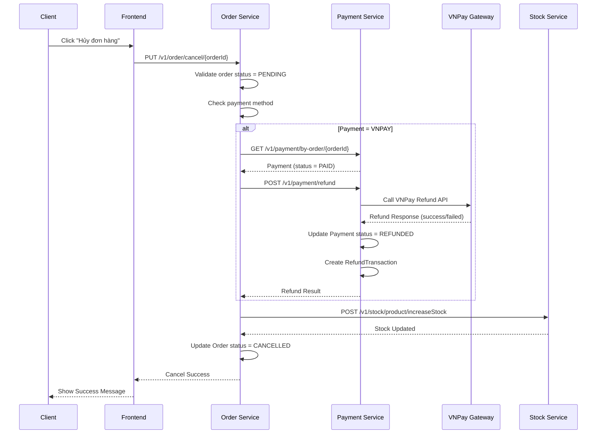

# Payout/Ledger System - Implementation Guide

## 📋 Tổng Quan Implementation

Tài liệu này mô tả chi tiết cách implement hệ thống Payout/Ledger, bao gồm:
- Models và Database Schema
- Refund Mechanism (không cần ví cho client)
- Cancel Order Flow với Refund
- Commission Calculation
- Ledger khi Order COMPLETED

---

## 🗄️ Database Schema Chi Tiết

### 1. shop_subscriptions (User Service)

```sql
CREATE TABLE shop_subscriptions (
    id VARCHAR(36) PRIMARY KEY,
    shop_owner_id VARCHAR(36) NOT NULL,
    subscription_type ENUM('FREESHIP_XTRA', 'VOUCHER_XTRA', 'BOTH', 'NONE') NOT NULL,
    plan_duration ENUM('MONTHLY', 'YEARLY') NOT NULL,
    start_date TIMESTAMP NOT NULL,
    end_date TIMESTAMP NOT NULL,
    is_active BOOLEAN DEFAULT TRUE,
    auto_renew BOOLEAN DEFAULT FALSE,
    price DECIMAL(15,2) DEFAULT 0,
    payment_status ENUM('PAID', 'PENDING', 'EXPIRED') DEFAULT 'PENDING',
    created_at TIMESTAMP DEFAULT CURRENT_TIMESTAMP,
    updated_at TIMESTAMP DEFAULT CURRENT_TIMESTAMP ON UPDATE CURRENT_TIMESTAMP,
    cancelled_at TIMESTAMP NULL,
    cancellation_reason TEXT NULL,
    FOREIGN KEY (shop_owner_id) REFERENCES shop_owners(user_id),
    INDEX idx_shop_owner_active (shop_owner_id, is_active),
    INDEX idx_end_date (end_date)
);
```

### 2. shop_ledger (Order Service)

```sql
CREATE TABLE shop_ledger (
    id VARCHAR(36) PRIMARY KEY,
    shop_owner_id VARCHAR(36) UNIQUE NOT NULL,
    balance_available DECIMAL(15,2) DEFAULT 0 COMMENT 'Số dư có thể rút',
    balance_pending DECIMAL(15,2) DEFAULT 0 COMMENT 'Số dư đang chờ (order chưa COMPLETED)',
    total_earnings DECIMAL(15,2) DEFAULT 0 COMMENT 'Tổng doanh thu',
    total_commission DECIMAL(15,2) DEFAULT 0 COMMENT 'Tổng phí đã trừ',
    total_payouts DECIMAL(15,2) DEFAULT 0 COMMENT 'Tổng đã rút',
    created_at TIMESTAMP DEFAULT CURRENT_TIMESTAMP,
    updated_at TIMESTAMP DEFAULT CURRENT_TIMESTAMP ON UPDATE CURRENT_TIMESTAMP,
    FOREIGN KEY (shop_owner_id) REFERENCES shop_owners(user_id),
    INDEX idx_shop_owner (shop_owner_id)
);
```

### 3. shop_ledger_entry (Order Service)

```sql
CREATE TABLE shop_ledger_entry (
    id VARCHAR(36) PRIMARY KEY,
    shop_owner_id VARCHAR(36) NOT NULL,
    order_id VARCHAR(36) NULL,
    entry_type ENUM('EARNING', 'PAYOUT', 'ADJUST', 'FEE_DEDUCTION') NOT NULL,
    amount_gross DECIMAL(15,2) DEFAULT 0 COMMENT 'Tổng tiền order',
    commission_payment DECIMAL(15,2) DEFAULT 0 COMMENT 'Phí thanh toán (4%)',
    commission_fixed DECIMAL(15,2) DEFAULT 0 COMMENT 'Phí cố định (4%)',
    commission_freeship DECIMAL(15,2) DEFAULT 0 COMMENT 'Phí Freeship Xtra (8%)',
    commission_voucher DECIMAL(15,2) DEFAULT 0 COMMENT 'Phí Voucher Xtra (5%)',
    commission_total DECIMAL(15,2) DEFAULT 0 COMMENT 'Tổng commission',
    amount_net DECIMAL(15,2) DEFAULT 0 COMMENT 'Tiền shop nhận (gross - commission)',
    shipping_fee DECIMAL(15,2) DEFAULT 0 COMMENT 'Phí ship phải trả',
    other_fees DECIMAL(15,2) DEFAULT 0 COMMENT 'Các phí khác',
    balance_before DECIMAL(15,2) DEFAULT 0 COMMENT 'Số dư trước',
    balance_after DECIMAL(15,2) DEFAULT 0 COMMENT 'Số dư sau',
    ref_txn VARCHAR(255) NOT NULL COMMENT 'Transaction reference (orderId + shopOwnerId)',
    description TEXT NULL,
    created_at TIMESTAMP DEFAULT CURRENT_TIMESTAMP,
    FOREIGN KEY (shop_owner_id) REFERENCES shop_owners(user_id),
    FOREIGN KEY (order_id) REFERENCES orders(id),
    UNIQUE KEY uk_ref_txn (ref_txn),
    INDEX idx_shop_owner (shop_owner_id),
    INDEX idx_order_id (order_id),
    INDEX idx_entry_type (entry_type),
    INDEX idx_created_at (created_at)
);
```

### 4. payout_batch (Order Service)

```sql
CREATE TABLE payout_batch (
    id VARCHAR(36) PRIMARY KEY,
    shop_owner_id VARCHAR(36) NOT NULL,
    amount DECIMAL(15,2) NOT NULL,
    status ENUM('PENDING', 'PROCESSING', 'COMPLETED', 'FAILED') DEFAULT 'PENDING',
    bank_account_number VARCHAR(50) NOT NULL,
    bank_name VARCHAR(100) NOT NULL,
    account_holder_name VARCHAR(255) NOT NULL,
    transaction_ref VARCHAR(255) UNIQUE NOT NULL,
    processed_at TIMESTAMP NULL,
    failure_reason TEXT NULL,
    created_at TIMESTAMP DEFAULT CURRENT_TIMESTAMP,
    updated_at TIMESTAMP DEFAULT CURRENT_TIMESTAMP ON UPDATE CURRENT_TIMESTAMP,
    FOREIGN KEY (shop_owner_id) REFERENCES shop_owners(user_id),
    INDEX idx_shop_owner (shop_owner_id),
    INDEX idx_status (status),
    INDEX idx_created_at (created_at)
);
```

### 5. refund_transactions (Payment Service) - MỚI

```sql
CREATE TABLE refund_transactions (
    id VARCHAR(36) PRIMARY KEY,
    payment_id VARCHAR(36) NOT NULL,
    order_id VARCHAR(36) NULL,
    amount DECIMAL(15,2) NOT NULL,
    status ENUM('PENDING', 'PROCESSING', 'COMPLETED', 'FAILED') DEFAULT 'PENDING',
    vnpay_request_id VARCHAR(100) NULL,
    vnpay_response_code VARCHAR(10) NULL,
    vnpay_transaction_status VARCHAR(10) NULL,
    refund_reason TEXT NULL,
    processed_at TIMESTAMP NULL,
    failure_reason TEXT NULL,
    vnpay_response TEXT NULL,
    created_at TIMESTAMP DEFAULT CURRENT_TIMESTAMP,
    updated_at TIMESTAMP DEFAULT CURRENT_TIMESTAMP ON UPDATE CURRENT_TIMESTAMP,
    FOREIGN KEY (payment_id) REFERENCES payments(id),
    INDEX idx_payment_id (payment_id),
    INDEX idx_order_id (order_id),
    INDEX idx_status (status),
    INDEX idx_created_at (created_at)
);
```

---

## 🔄 Flow Hủy Đơn Hàng với Refund

### Tình Huống

**Client thanh toán VNPay 100k:**
- Tiền đã bị trừ khỏi tài khoản ngân hàng client
- Payment status = PAID ✅
- Order status = PENDING ⚠️
- Client muốn hủy → Cần trả lại tiền

**Giải pháp: KHÔNG CẦN ví cho client!**

VNPay có cơ chế refund tự động:
- Gọi VNPay Refund API
- VNPay trả tiền về tài khoản ngân hàng của client (tự động)
- Client không cần ví trong hệ thống

### Flow Chi Tiết



### Logic Code

**OrderServiceImpl.cancelOrder():**
```java
@Transactional
public Order cancelOrder(String orderId, String reason) {
    Order order = orderRepository.findById(orderId)
        .orElseThrow(() -> new RuntimeException("Order not found: " + orderId));
    
    // Chỉ cho phép hủy nếu PENDING
    if (order.getOrderStatus() != OrderStatus.PENDING) {
        throw new RuntimeException("Cannot cancel order with status: " + order.getOrderStatus());
    }
    
    // Nếu là VNPay và đã PAID → Refund
    if ("VNPAY".equals(order.getPaymentMethod())) {
        try {
            PaymentDto payment = paymentServiceClient.getPaymentByOrderId(orderId);
            if (payment != null && "PAID".equals(payment.getStatus())) {
                // Gọi refund
                RefundResponse refundResponse = paymentServiceClient.refundPayment(
                    payment.getId(), 
                    BigDecimal.valueOf(order.getTotalPrice()),
                    reason
                );
                
                if (!refundResponse.isSuccess()) {
                    log.error("[CANCEL] Refund failed for order {}: {}", orderId, refundResponse.getMessage());
                    // Có thể throw exception hoặc chỉ log warning
                    // Tùy business logic: có cho phép hủy nếu refund fail không?
                }
            }
        } catch (Exception e) {
            log.error("[CANCEL] Failed to refund payment for order {}: {}", orderId, e.getMessage(), e);
            // Có thể throw exception hoặc chỉ log warning
        }
    }
    
    // Rollback stock
    rollbackOrderStock(orderId);
    
    // Update order status
    order.setOrderStatus(OrderStatus.CANCELLED);
    order.setCancelReason(reason);
    return orderRepository.save(order);
}
```

---

## 💰 VNPay Refund Implementation

### Payment Service - Refund API

**VnpayPaymentService.refundPayment():**
```java
public RefundResponse refundPayment(String paymentId, BigDecimal amount, String reason) {
    Payment payment = paymentRepository.findById(paymentId)
        .orElseThrow(() -> new NotFoundException("Payment not found: " + paymentId));
    
    // Validate payment status
    if (payment.getStatus() != PaymentStatus.PAID) {
        throw new RuntimeException("Cannot refund payment with status: " + payment.getStatus());
    }
    
    // Create refund transaction
    RefundTransaction refund = RefundTransaction.builder()
        .paymentId(paymentId)
        .orderId(payment.getOrderId())
        .amount(amount)
        .status(RefundStatus.PENDING)
        .refundReason(reason)
        .vnpayRequestId(UUID.randomUUID().toString())
        .build();
    refundTransactionRepository.save(refund);
    
    try {
        // Build VNPay refund request
        Map<String, String> vnpParams = new HashMap<>();
        vnpParams.put("vnp_RequestId", refund.getVnpayRequestId());
        vnpParams.put("vnp_Version", "2.1.0");
        vnpParams.put("vnp_Command", "refund");
        vnpParams.put("vnp_TmnCode", props.getTmnCode());
        vnpParams.put("vnp_TransactionType", "03"); // Refund
        vnpParams.put("vnp_TxnRef", payment.getTxnRef());
        vnpParams.put("vnp_Amount", String.valueOf(amount.multiply(new BigDecimal("100")).longValue()));
        
        // Format transaction date from payment
        SimpleDateFormat formatter = new SimpleDateFormat("yyyyMMddHHmmss");
        formatter.setTimeZone(TimeZone.getTimeZone("Etc/GMT+7"));
        String vnpTransactionDate = formatter.format(
            Date.from(payment.getCreatedAt())
        );
        vnpParams.put("vnp_TransactionDate", vnpTransactionDate);
        
        vnpParams.put("vnp_CreateBy", "admin");
        String vnpCreateDate = formatter.format(new Date());
        vnpParams.put("vnp_CreateDate", vnpCreateDate);
        vnpParams.put("vnp_IpAddr", "127.0.0.1");
        
        // Build hash
        String queryUrl = VnpayUtil.buildQueryAndHash(vnpParams, props.getHashSecret());
        
        // Call VNPay API
        String response = callVnpayRefundAPI(queryUrl);
        
        // Parse response
        Map<String, String> responseParams = parseVnpayResponse(response);
        String responseCode = responseParams.get("vnp_ResponseCode");
        String transactionStatus = responseParams.get("vnp_TransactionStatus");
        
        if ("00".equals(responseCode) && "00".equals(transactionStatus)) {
            // Refund thành công
            refund.setStatus(RefundStatus.COMPLETED);
            refund.setVnpayResponseCode(responseCode);
            refund.setVnpayTransactionStatus(transactionStatus);
            refund.setProcessedAt(LocalDateTime.now());
            refund.setVnpayResponse(response);
            
            // Update payment status
            payment.setStatus(PaymentStatus.REFUNDED);
            paymentRepository.save(payment);
            
            refundTransactionRepository.save(refund);
            
            log.info("[REFUND] Refund successful: paymentId={}, amount={}", paymentId, amount);
            return RefundResponse.success(refund.getId());
        } else {
            // Refund thất bại
            refund.setStatus(RefundStatus.FAILED);
            refund.setVnpayResponseCode(responseCode);
            refund.setFailureReason("VNPay response: " + responseParams.get("vnp_ResponseMessage"));
            refund.setVnpayResponse(response);
            refundTransactionRepository.save(refund);
            
            log.error("[REFUND] Refund failed: paymentId={}, responseCode={}", paymentId, responseCode);
            return RefundResponse.failed("Refund failed: " + responseParams.get("vnp_ResponseMessage"));
        }
    } catch (Exception e) {
        refund.setStatus(RefundStatus.FAILED);
        refund.setFailureReason(e.getMessage());
        refundTransactionRepository.save(refund);
        
        log.error("[REFUND] Refund error: paymentId={}, error={}", paymentId, e.getMessage(), e);
        return RefundResponse.failed("Refund error: " + e.getMessage());
    }
}

private String callVnpayRefundAPI(String queryUrl) {
    // Call VNPay refund API
    // Endpoint: https://sandbox.vnpayment.vn/merchant_webapi/merchant.html
    // Method: POST
    // Body: queryUrl
    
    try {
        URL url = new URL(props.getApiUrl() + "/merchant_webapi/merchant.html");
        HttpURLConnection conn = (HttpURLConnection) url.openConnection();
        conn.setRequestMethod("POST");
        conn.setRequestProperty("Content-Type", "application/x-www-form-urlencoded");
        conn.setDoOutput(true);
        
        try (OutputStream os = conn.getOutputStream()) {
            byte[] input = queryUrl.getBytes(StandardCharsets.UTF_8);
            os.write(input, 0, input.length);
        }
        
        StringBuilder response = new StringBuilder();
        try (BufferedReader br = new BufferedReader(
                new InputStreamReader(conn.getInputStream(), StandardCharsets.UTF_8))) {
            String responseLine;
            while ((responseLine = br.readLine()) != null) {
                response.append(responseLine.trim());
            }
        }
        
        return response.toString();
    } catch (Exception e) {
        throw new RuntimeException("Failed to call VNPay refund API: " + e.getMessage(), e);
    }
}
```

---

## 📝 Files Cần Tạo/Modify

### User Service

**New Files:**
1. `user-service/src/main/java/com/example/userservice/model/ShopSubscription.java`
2. `user-service/src/main/java/com/example/userservice/enums/SubscriptionType.java`
3. `user-service/src/main/java/com/example/userservice/enums/PlanDuration.java`
4. `user-service/src/main/java/com/example/userservice/repository/ShopSubscriptionRepository.java`

### Order Service

**New Files:**
1. `order-service/src/main/java/com/example/orderservice/model/ShopLedger.java`
2. `order-service/src/main/java/com/example/orderservice/model/ShopLedgerEntry.java`
3. `order-service/src/main/java/com/example/orderservice/model/PayoutBatch.java`
4. `order-service/src/main/java/com/example/orderservice/enums/LedgerEntryType.java`
5. `order-service/src/main/java/com/example/orderservice/enums/PayoutStatus.java`
6. `order-service/src/main/java/com/example/orderservice/repository/ShopLedgerRepository.java`
7. `order-service/src/main/java/com/example/orderservice/repository/ShopLedgerEntryRepository.java`
8. `order-service/src/main/java/com/example/orderservice/repository/PayoutBatchRepository.java`
9. `order-service/src/main/java/com/example/orderservice/dto/ShopEarningEvent.java`
10. `order-service/src/main/java/com/example/orderservice/client/PaymentServiceClient.java` (Feign client)

**Modified Files:**
1. `order-service/src/main/java/com/example/orderservice/service/OrderServiceImpl.java`
   - Update `cancelOrder()` để gọi refund
   - Thêm logic detect COMPLETED và publish ShopEarningEvent
2. `order-service/src/main/java/com/example/orderservice/controller/OrderController.java`
   - Update cancel endpoint

### Payment Service

**New Files:**
1. `payment-service/src/main/java/com/example/paymentservice/model/RefundTransaction.java`
2. `payment-service/src/main/java/com/example/paymentservice/enums/RefundStatus.java`
3. `payment-service/src/main/java/com/example/paymentservice/repository/RefundTransactionRepository.java`
4. `payment-service/src/main/java/com/example/paymentservice/dto/RefundRequest.java`
5. `payment-service/src/main/java/com/example/paymentservice/dto/RefundResponse.java`
6. `payment-service/src/main/java/com/example/paymentservice/service/RefundService.java`

**Modified Files:**
1. `payment-service/src/main/java/com/example/paymentservice/enums/PaymentStatus.java`
   - Đã có REFUNDED
2. `payment-service/src/main/java/com/example/paymentservice/service/VnpayPaymentService.java`
   - Thêm method `refundPayment()`
3. `payment-service/src/main/java/com/example/paymentservice/controller/PaymentController.java`
   - Thêm endpoint refund
4. `payment-service/src/main/java/com/example/paymentservice/repository/PaymentRepository.java`
   - Thêm method `findByOrderId()`

---

## 🔄 Thứ Tự Implementation

### Phase 1: Refund Mechanism (Ưu tiên cao)
1. Tạo `RefundTransaction` entity trong payment-service
2. Implement `RefundService` với VNPay Refund API
3. Thêm endpoint refund trong PaymentController
4. Thêm Feign client trong order-service để gọi refund
5. Update `cancelOrder()` để gọi refund khi cần
6. Test refund flow

### Phase 2: Shop Ledger (Ưu tiên cao)
1. Tạo `ShopLedger` entity trong order-service
2. Tạo `ShopLedgerRepository`
3. API GET `/v1/ledger/balance` để shop xem balance
4. Auto-create ledger khi shop owner được approve

### Phase 3: Shop Subscriptions (Ưu tiên trung bình)
1. Tạo `ShopSubscription` entity trong user-service
2. Tạo APIs để quản lý subscriptions
3. Logic kiểm tra subscription active

### Phase 4: Commission Calculation (Ưu tiên trung bình)
1. Tạo `CommissionCalculatorService`
2. Implement logic tính commission theo subscription
3. Test với các subscription types

### Phase 5: Ledger khi COMPLETED (Ưu tiên trung bình)
1. Listener khi order status = COMPLETED
2. Group order items theo shop owner
3. Tính commission và tạo ledger entry
4. Update shop_ledger balance

### Phase 6: Payout API (Ưu tiên thấp)
1. API request payout
2. API admin process payout
3. Job định kỳ process payout

---

## ✅ Checklist Implementation

### Refund Mechanism
- [ ] Tạo RefundTransaction entity
- [ ] Implement VNPay Refund API call
- [ ] Thêm refund endpoint
- [ ] Feign client trong order-service
- [ ] Update cancelOrder() để gọi refund
- [ ] Test refund flow

### Shop Ledger
- [ ] Tạo ShopLedger entity
- [ ] Tạo Repository
- [ ] API xem balance
- [ ] Auto-create ledger

### Cancel Order Flow
- [ ] Validate order status = PENDING
- [ ] Check payment method
- [ ] Gọi refund nếu VNPay + PAID
- [ ] Rollback stock
- [ ] Update order status = CANCELLED
- [ ] Test cancel flow

---

## 🧪 Test Cases

### Test Cancel Order COD
1. Tạo order COD với status PENDING
2. Hủy order
3. Verify: Order status = CANCELLED
4. Verify: Stock được rollback
5. Verify: Không có refund (vì COD)

### Test Cancel Order VNPay (PAID)
1. Tạo order VNPay, payment PAID, order PENDING
2. Hủy order
3. Verify: Refund được gọi
4. Verify: Payment status = REFUNDED
5. Verify: RefundTransaction được tạo
6. Verify: Stock được rollback
7. Verify: Order status = CANCELLED

### Test Cancel Order VNPay (PENDING)
1. Tạo order VNPay, payment PENDING, order PENDING
2. Hủy order
3. Verify: Không có refund (vì payment chưa PAID)
4. Verify: Stock được rollback
5. Verify: Order status = CANCELLED

