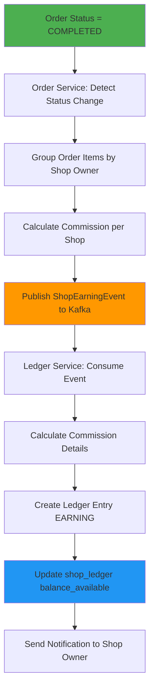
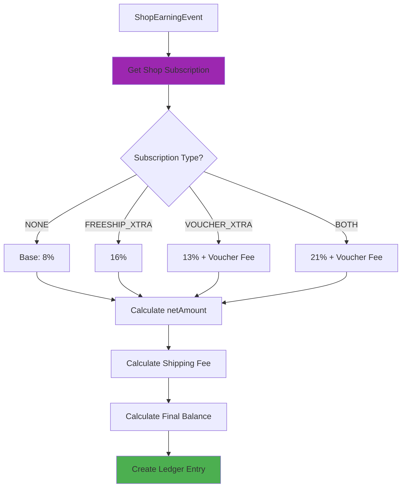
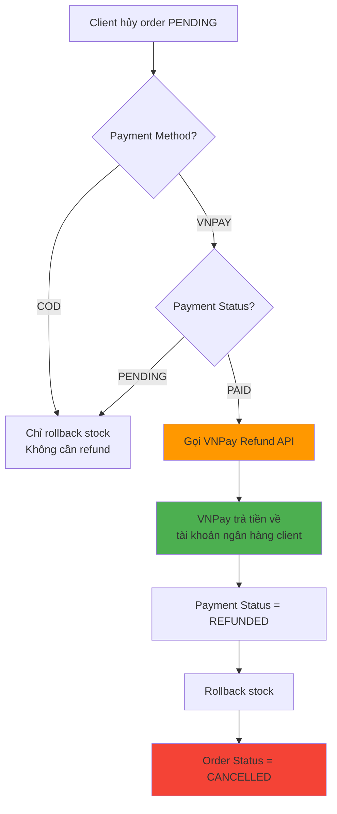

# Hệ Thống Payout/Ledger - Shopee Clone

## 📋 Tổng Quan

Hệ thống quản lý ví và payout cho shop owners với các tính năng:

- **Trigger**: Chỉ cộng tiền khi order status = COMPLETED (không phải PAID)
- **Ví riêng**: Mỗi shop có balance riêng (KHÔNG cần ví cho client)
- **Commission phức tạp**: Tính theo gói subscription (Freeship Xtra, Voucher Xtra)
- **Phí phải trả**: Lưu shipping fee và các phí khác, trả xong mới được rút
- **VNPay chung**: Tất cả tiền về platform account, shop không cần liên kết VNPay
- **Refund tự động**: Khi hủy order VNPay, tự động refund về tài khoản ngân hàng client (không cần ví client)

---

## 💰 Commission Structure

### Base Commission (Không có gói)

- Phí thanh toán: **4%**
- Phí cố định: **4%**
- **Tổng: 8%**

### Có Freeship Xtra

- Phí thanh toán: **4%**
- Phí cố định: **4%**
- Phí Freeship Xtra: **8%** (không giới hạn)
- **Tổng: 16%**

### Có Voucher Xtra

- Phí thanh toán: **4%**
- Phí cố định: **4%**
- Phí Voucher Xtra: **5%** giá trị mỗi sản phẩm (tối đa 50,000đ/sản phẩm)
- **Tổng: 13%** (nếu không vượt max)

### Có cả 2 gói

- Phí thanh toán: **4%**
- Phí cố định: **4%**
- Phí Freeship Xtra: **8%**
- Phí Voucher Xtra: **5%** (max 50k/sản phẩm)
- **Tổng: 21%** (nếu không vượt max)

---

## 📦 Chi Tiết Các Gói Subscription

### 1. Freeship Xtra

**Mô tả:**
- Shop đăng ký gói để cung cấp miễn phí ship cho khách hàng
- Khách hàng không phải trả phí ship khi mua sản phẩm từ shop có gói này
- Shop trả phí 8% trên tổng giá trị đơn hàng (không giới hạn số tiền)

**Đặc điểm:**
- Phí tính trên `grossAmount` (tổng giá trị đơn hàng)
- Không có giới hạn tối đa
- Áp dụng cho tất cả đơn hàng trong thời gian subscription active
- Shipping fee được platform chi trả, shop không cần trả riêng

**Ví dụ:**
```
Order: 1,000,000 VNĐ
Shipping fee: 30,000 VNĐ (khách hàng không trả)

Commission:
- Phí thanh toán (4%): 40,000
- Phí cố định (4%): 40,000
- Phí Freeship Xtra (8%): 80,000
- Tổng commission: 160,000

netAmount = 1,000,000 - 160,000 = 840,000 VNĐ
Shop nhận: 840,000 VNĐ (đã trừ shipping fee gián tiếp qua commission)
```

**Quản lý:**
- Shop đăng ký qua Admin hoặc tự đăng ký (nếu có payment)
- Có thể đăng ký theo tháng/năm
- Tự động gia hạn hoặc hết hạn
- Có thể hủy trước khi hết hạn

### 2. Voucher Xtra

**Mô tả:**
- Shop đăng ký gói để tạo và quản lý voucher giảm giá
- Cho phép shop tạo nhiều voucher với mức giảm giá khác nhau
- Shop trả phí 5% trên giá trị mỗi sản phẩm được áp dụng voucher
- **Giới hạn: Tối đa 50,000 VNĐ/sản phẩm**

**Đặc điểm:**
- Phí tính trên giá trị sản phẩm (không phải tổng đơn hàng)
- Có giới hạn tối đa: 50,000 VNĐ/sản phẩm
- Chỉ tính phí cho sản phẩm được áp dụng voucher
- Nếu voucher giảm 100,000 VNĐ cho sản phẩm 1,000,000 VNĐ:
    - Phí = 1,000,000 × 5% = 50,000 VNĐ (đạt max)
    - Không tính thêm nếu vượt max

**Ví dụ 1: Sản phẩm 500,000 VNĐ, voucher 10%**
```
Giá trị sản phẩm: 500,000 VNĐ
Phí Voucher Xtra: 500,000 × 5% = 25,000 VNĐ (< 50k max)
```

**Ví dụ 2: Sản phẩm 2,000,000 VNĐ, voucher 20%**
```
Giá trị sản phẩm: 2,000,000 VNĐ
Phí Voucher Xtra: 2,000,000 × 5% = 100,000 VNĐ
→ Áp dụng max: 50,000 VNĐ (vì vượt 50k)
```

**Ví dụ 3: Order có 3 sản phẩm với voucher**
```
Sản phẩm 1: 300,000 → Phí: 15,000
Sản phẩm 2: 800,000 → Phí: 40,000
Sản phẩm 3: 1,500,000 → Phí: 50,000 (max)
Tổng phí Voucher Xtra: 105,000 VNĐ
```

**Quản lý:**
- Shop tạo voucher qua UI
- Voucher có thể có điều kiện (min order value, số lượng, thời gian)
- Track voucher usage trong order
- Tính phí khi order COMPLETED

### 3. Cả 2 Gói (Freeship Xtra + Voucher Xtra)

**Mô tả:**
- Shop đăng ký cả 2 gói cùng lúc
- Được hưởng lợi ích của cả 2 gói
- Trả phí tổng hợp: 4% + 4% + 8% + 5% = 21% (base) + Voucher fee

**Ví dụ:**
```
Order: 1,000,000 VNĐ
Sản phẩm 1: 600,000 (có voucher)
Sản phẩm 2: 400,000 (không voucher)
Shipping fee: 30,000 VNĐ (miễn phí cho khách)

Commission:
- Phí thanh toán (4%): 40,000
- Phí cố định (4%): 40,000
- Phí Freeship Xtra (8%): 80,000
- Phí Voucher Xtra (5%): 600,000 × 5% = 30,000 (< 50k max)
- Tổng commission: 190,000

netAmount = 1,000,000 - 190,000 = 810,000 VNĐ
Shop nhận: 810,000 VNĐ
```

---

## 🗄️ Database Schema

### 1. subscription_plans (User Service - Admin quản lý catalog)

Lưu danh mục gói, để UI không phải hardcode:

```sql
CREATE TABLE subscription_plans (
    id VARCHAR(36) PRIMARY KEY,
    code VARCHAR(50) UNIQUE NOT NULL,                         -- FREESHIP_XTRA, VOUCHER_XTRA, BOTH...
    name VARCHAR(255) NOT NULL,
    description TEXT NULL,
    subscription_type ENUM('FREESHIP_XTRA', 'VOUCHER_XTRA', 'BOTH') NOT NULL,
    is_active BOOLEAN DEFAULT TRUE,
    display_order INT DEFAULT 0,
    color_hex VARCHAR(10) NULL,                              -- dùng cho UI nếu muốn
    icon VARCHAR(100) NULL,
    commission_payment_rate DECIMAL(5,4) DEFAULT 0.0400,     -- 4%
    commission_fixed_rate DECIMAL(5,4) DEFAULT 0.0400,       -- 4%
    commission_freeship_rate DECIMAL(5,4) DEFAULT 0.0800,    -- 8%
    commission_voucher_rate DECIMAL(5,4) DEFAULT 0.0500,     -- 5%
    voucher_max_per_item DECIMAL(15,2) DEFAULT 50000,
    freeship_enabled BOOLEAN DEFAULT FALSE,
    voucher_enabled BOOLEAN DEFAULT FALSE,
    created_at TIMESTAMP DEFAULT CURRENT_TIMESTAMP,
    updated_at TIMESTAMP DEFAULT CURRENT_TIMESTAMP ON UPDATE CURRENT_TIMESTAMP
);
```

### 2. subscription_plan_pricing (tùy chọn - giá theo kỳ)

```sql
CREATE TABLE subscription_plan_pricing (
    id VARCHAR(36) PRIMARY KEY,
    plan_id VARCHAR(36) NOT NULL,
    plan_duration ENUM('MONTHLY', 'YEARLY') NOT NULL,
    price DECIMAL(15,2) NOT NULL,
    is_active BOOLEAN DEFAULT TRUE,
    created_at TIMESTAMP DEFAULT CURRENT_TIMESTAMP,
    updated_at TIMESTAMP DEFAULT CURRENT_TIMESTAMP ON UPDATE CURRENT_TIMESTAMP,
    FOREIGN KEY (plan_id) REFERENCES subscription_plans(id),
    UNIQUE KEY uk_plan_duration (plan_id, plan_duration)
);
```

### 3. subscription_plan_feature (tùy chọn - bullet hiển thị UI)

```sql
CREATE TABLE subscription_plan_feature (
    id VARCHAR(36) PRIMARY KEY,
    plan_id VARCHAR(36) NOT NULL,
    feature_text VARCHAR(255) NOT NULL,
    display_order INT DEFAULT 0,
    FOREIGN KEY (plan_id) REFERENCES subscription_plans(id)
);
```

### 4. shop_subscriptions (User Service - lưu lượt mua)

Mỗi record là một lần đăng ký của shop; lưu snapshot để không bị đổi khi catalog thay đổi:

```sql
CREATE TABLE shop_subscriptions (
    id VARCHAR(36) PRIMARY KEY,
    shop_owner_id VARCHAR(36) NOT NULL,
    plan_id VARCHAR(36) NOT NULL,
    plan_code VARCHAR(50) NOT NULL,
    subscription_type ENUM('FREESHIP_XTRA', 'VOUCHER_XTRA', 'BOTH', 'NONE') NOT NULL,
    plan_duration ENUM('MONTHLY', 'YEARLY') NOT NULL,
    price_paid DECIMAL(15,2) DEFAULT 0,
    start_date TIMESTAMP NOT NULL,
    end_date TIMESTAMP NOT NULL,
    is_active BOOLEAN DEFAULT TRUE,
    auto_renew BOOLEAN DEFAULT FALSE,
    payment_status ENUM('PAID', 'PENDING', 'EXPIRED') DEFAULT 'PENDING',
    -- snapshot commission để tính phí đúng theo thời điểm mua
    commission_payment_rate DECIMAL(5,4) DEFAULT 0.0400,
    commission_fixed_rate DECIMAL(5,4) DEFAULT 0.0400,
    commission_freeship_rate DECIMAL(5,4) DEFAULT 0.0800,
    commission_voucher_rate DECIMAL(5,4) DEFAULT 0.0500,
    voucher_max_per_item DECIMAL(15,2) DEFAULT 50000,
    freeship_enabled BOOLEAN DEFAULT FALSE,
    voucher_enabled BOOLEAN DEFAULT FALSE,
    created_at TIMESTAMP DEFAULT CURRENT_TIMESTAMP,
    updated_at TIMESTAMP DEFAULT CURRENT_TIMESTAMP ON UPDATE CURRENT_TIMESTAMP,
    cancelled_at TIMESTAMP NULL,
    cancellation_reason TEXT NULL,
    FOREIGN KEY (shop_owner_id) REFERENCES shop_owners(user_id),
    FOREIGN KEY (plan_id) REFERENCES subscription_plans(id),
    INDEX idx_shop_owner_active (shop_owner_id, is_active)
);
```

### 5. shop_ledger (Order Service)

Ví của mỗi shop:

```sql
CREATE TABLE shop_ledger (
    id VARCHAR(36) PRIMARY KEY,
    shop_owner_id VARCHAR(36) UNIQUE NOT NULL,
    balance_available DECIMAL(15,2) DEFAULT 0 COMMENT 'Số dư có thể rút',
    balance_pending DECIMAL(15,2) DEFAULT 0 COMMENT 'Số dư đang chờ (order chưa COMPLETED)',
    total_earnings DECIMAL(15,2) DEFAULT 0 COMMENT 'Tổng doanh thu',
    total_commission DECIMAL(15,2) DEFAULT 0 COMMENT 'Tổng phí đã trừ',
    total_payouts DECIMAL(15,2) DEFAULT 0 COMMENT 'Tổng đã rút',
    created_at TIMESTAMP DEFAULT CURRENT_TIMESTAMP,
    updated_at TIMESTAMP DEFAULT CURRENT_TIMESTAMP ON UPDATE CURRENT_TIMESTAMP,
    FOREIGN KEY (shop_owner_id) REFERENCES shop_owners(user_id)
);
```

### 6. shop_ledger_entry (Order Service)

Lịch sử giao dịch:

```sql
CREATE TABLE shop_ledger_entry (
    id VARCHAR(36) PRIMARY KEY,
    shop_owner_id VARCHAR(36) NOT NULL,
    order_id VARCHAR(36) NULL,
    entry_type ENUM('EARNING', 'PAYOUT', 'ADJUST', 'FEE_DEDUCTION') NOT NULL,
    amount_gross DECIMAL(15,2) DEFAULT 0 COMMENT 'Tổng tiền order',
    commission_payment DECIMAL(15,2) DEFAULT 0 COMMENT 'Phí thanh toán (4%)',
    commission_fixed DECIMAL(15,2) DEFAULT 0 COMMENT 'Phí cố định (4%)',
    commission_freeship DECIMAL(15,2) DEFAULT 0 COMMENT 'Phí Freeship Xtra (8%)',
    commission_voucher DECIMAL(15,2) DEFAULT 0 COMMENT 'Phí Voucher Xtra (5%)',
    commission_total DECIMAL(15,2) DEFAULT 0 COMMENT 'Tổng commission',
    amount_net DECIMAL(15,2) DEFAULT 0 COMMENT 'Tiền shop nhận (gross - commission)',
    shipping_fee DECIMAL(15,2) DEFAULT 0 COMMENT 'Phí ship phải trả',
    other_fees DECIMAL(15,2) DEFAULT 0 COMMENT 'Các phí khác',
    balance_before DECIMAL(15,2) DEFAULT 0 COMMENT 'Số dư trước',
    balance_after DECIMAL(15,2) DEFAULT 0 COMMENT 'Số dư sau',
    ref_txn VARCHAR(255) NOT NULL COMMENT 'Transaction reference (orderId + shopOwnerId)',
    description TEXT NULL,
    created_at TIMESTAMP DEFAULT CURRENT_TIMESTAMP,
    FOREIGN KEY (shop_owner_id) REFERENCES shop_owners(user_id),
    FOREIGN KEY (order_id) REFERENCES orders(id),
    UNIQUE KEY uk_ref_txn (ref_txn),
    INDEX idx_shop_owner (shop_owner_id),
    INDEX idx_order_id (order_id),
    INDEX idx_entry_type (entry_type),
    INDEX idx_created_at (created_at)
);
```

### 7. payout_batch (Order Service)

Lịch sử rút tiền:

```sql
CREATE TABLE payout_batch (
    id VARCHAR(36) PRIMARY KEY,
    shop_owner_id VARCHAR(36) NOT NULL,
    amount DECIMAL(15,2) NOT NULL,
    status ENUM('PENDING', 'PROCESSING', 'COMPLETED', 'FAILED') DEFAULT 'PENDING',
    bank_account_number VARCHAR(50) NOT NULL,
    bank_name VARCHAR(100) NOT NULL,
    account_holder_name VARCHAR(255) NOT NULL,
    transaction_ref VARCHAR(255) UNIQUE NOT NULL,
    processed_at TIMESTAMP NULL,
    failure_reason TEXT NULL,
    created_at TIMESTAMP DEFAULT CURRENT_TIMESTAMP,
    updated_at TIMESTAMP DEFAULT CURRENT_TIMESTAMP ON UPDATE CURRENT_TIMESTAMP,
    FOREIGN KEY (shop_owner_id) REFERENCES shop_owners(user_id),
    INDEX idx_shop_owner (shop_owner_id),
    INDEX idx_status (status),
    INDEX idx_created_at (created_at)
);
```

### 8. Vouchers

#### 8.1 shop_vouchers (voucher do shop tạo khi có gói Voucher Xtra)

```sql
CREATE TABLE shop_vouchers (
    id VARCHAR(36) PRIMARY KEY,
    shop_owner_id VARCHAR(36) NOT NULL,
    code VARCHAR(50) NOT NULL,
    title VARCHAR(255) NOT NULL,
    description TEXT NULL,
    discount_type ENUM('PERCENT', 'FIXED') NOT NULL,
    discount_value DECIMAL(15,2) NOT NULL,
    max_discount_amount DECIMAL(15,2) NULL,
    min_order_value DECIMAL(15,2) NULL,
    start_at TIMESTAMP NOT NULL,
    end_at TIMESTAMP NOT NULL,
    quantity_total INT DEFAULT 0,
    quantity_used INT DEFAULT 0,
    status ENUM('ACTIVE', 'INACTIVE', 'EXPIRED') DEFAULT 'ACTIVE',
    applicable_scope ENUM('ALL_PRODUCTS', 'SELECTED_PRODUCTS', 'CATEGORIES') DEFAULT 'ALL_PRODUCTS',
    created_at TIMESTAMP DEFAULT CURRENT_TIMESTAMP,
    updated_at TIMESTAMP DEFAULT CURRENT_TIMESTAMP ON UPDATE CURRENT_TIMESTAMP,
    FOREIGN KEY (shop_owner_id) REFERENCES shop_owners(user_id),
    UNIQUE KEY uk_shop_code (shop_owner_id, code)
);
```

#### 8.2 platform_vouchers (voucher chung toàn sàn)

```sql
CREATE TABLE platform_vouchers (
    id VARCHAR(36) PRIMARY KEY,
    code VARCHAR(50) UNIQUE NOT NULL,
    title VARCHAR(255) NOT NULL,
    description TEXT NULL,
    discount_type ENUM('PERCENT', 'FIXED') NOT NULL,
    discount_value DECIMAL(15,2) NOT NULL,
    max_discount_amount DECIMAL(15,2) NULL,
    min_order_value DECIMAL(15,2) NULL,
    start_at TIMESTAMP NOT NULL,
    end_at TIMESTAMP NOT NULL,
    quantity_total INT DEFAULT 0,
    quantity_used INT DEFAULT 0,
    status ENUM('ACTIVE', 'INACTIVE', 'EXPIRED') DEFAULT 'ACTIVE',
    created_at TIMESTAMP DEFAULT CURRENT_TIMESTAMP,
    updated_at TIMESTAMP DEFAULT CURRENT_TIMESTAMP ON UPDATE CURRENT_TIMESTAMP
);
```

#### 8.3 voucher_applicability (tuỳ chọn, ánh xạ phạm vi)

```sql
CREATE TABLE voucher_applicability (
    id VARCHAR(36) PRIMARY KEY,
    voucher_id VARCHAR(36) NOT NULL, -- shop_vouchers.id hoặc platform_vouchers.id
    voucher_type ENUM('SHOP', 'PLATFORM') NOT NULL,
    product_id VARCHAR(36) NULL,
    category_id VARCHAR(36) NULL,
    UNIQUE KEY uk_scope (voucher_id, voucher_type, product_id, category_id)
);
```

#### 8.4 voucher_usage (log áp dụng, idempotent)

```sql
CREATE TABLE voucher_usage (
    id VARCHAR(36) PRIMARY KEY,
    voucher_id VARCHAR(36) NOT NULL,
    voucher_type ENUM('SHOP', 'PLATFORM') NOT NULL,
    order_id VARCHAR(36) NOT NULL,
    user_id VARCHAR(36) NOT NULL,
    amount_discount DECIMAL(15,2) NOT NULL,
    created_at TIMESTAMP DEFAULT CURRENT_TIMESTAMP,
    UNIQUE KEY uk_voucher_order (voucher_id, voucher_type, order_id)
);
```

---

## 🔄 Architecture Flow

### Flow 1: Order COMPLETED → Cộng tiền vào ví



### Flow 2: Commission Calculation



---

## 🚢 Shipping Fee Logic

### Khi Shop CÓ Freeship Xtra

```
User checkout:
- Shipping fee: 30,000 VNĐ
- User trả: 0 VNĐ (miễn phí ship)
- Platform trả: 30,000 VNĐ (từ commission của shop)

Shop ledger:
- grossAmount: 1,000,000
- commission: 160,000 (bao gồm 80k Freeship Xtra)
- shippingFee: 0 (đã tính trong commission)
- netAmount: 840,000
```

### Khi Shop KHÔNG CÓ Freeship Xtra

```
User checkout:
- Shipping fee: 30,000 VNĐ
- User trả: 30,000 VNĐ
- Platform thu: 30,000 VNĐ

Shop ledger:
- grossAmount: 1,000,000
- commission: 80,000 (base 8%)
- shippingFee: 30,000 (shop phải trả)
- netAmount: 1,000,000 - 80,000 - 30,000 = 890,000
```

### Lưu Shipping Fee vào Ledger

```java
// Trong shop_ledger_entry
shippingFee = {
    if (hasFreeshipXtra) {
        return 0; // Đã tính trong commission
    } else {
        return actualShippingFee; // Shop phải trả
    }
}

// Balance calculation
balance_available = netAmount - shippingFee - otherFees
```

---

## 📊 Commission Calculation Logic

### Step-by-Step Calculation

```java
public CommissionResult calculateCommission(
    String shopOwnerId, 
    BigDecimal grossAmount, 
    List<OrderItem> orderItems,
    BigDecimal shippingFee
) {
    // 1. Get subscription
    SubscriptionType subscription = getActiveSubscription(shopOwnerId);
    
    // 2. Base commission (luôn có)
    BigDecimal commissionPayment = grossAmount.multiply(new BigDecimal("0.04")); // 4%
    BigDecimal commissionFixed = grossAmount.multiply(new BigDecimal("0.04")); // 4%
    
    // 3. Freeship Xtra commission
    BigDecimal commissionFreeship = BigDecimal.ZERO;
    if (subscription == FREESHIP_XTRA || subscription == BOTH) {
        commissionFreeship = grossAmount.multiply(new BigDecimal("0.08")); // 8%
    }
    
    // 4. Voucher Xtra commission
    BigDecimal commissionVoucher = BigDecimal.ZERO;
    if (subscription == VOUCHER_XTRA || subscription == BOTH) {
        for (OrderItem item : orderItems) {
            if (item.hasVoucher()) {
                BigDecimal itemValue = BigDecimal.valueOf(item.getTotalPrice());
                BigDecimal voucherFee = itemValue.multiply(new BigDecimal("0.05")); // 5%
                BigDecimal maxFee = new BigDecimal("50000");
                commissionVoucher = commissionVoucher.add(
                    voucherFee.min(maxFee)
                );
            }
        }
    }
    
    // 5. Total commission
    BigDecimal totalCommission = commissionPayment
        .add(commissionFixed)
        .add(commissionFreeship)
        .add(commissionVoucher);
    
    // 6. Net amount
    BigDecimal netAmount = grossAmount.subtract(totalCommission);
    
    // 7. Shipping fee handling
    BigDecimal finalShippingFee = BigDecimal.ZERO;
    if (subscription != FREESHIP_XTRA && subscription != BOTH) {
        finalShippingFee = shippingFee; // Shop phải trả
    }
    
    // 8. Final balance
    BigDecimal finalBalance = netAmount.subtract(finalShippingFee);
    
    return CommissionResult.builder()
        .grossAmount(grossAmount)
        .commissionPayment(commissionPayment)
        .commissionFixed(commissionFixed)
        .commissionFreeship(commissionFreeship)
        .commissionVoucher(commissionVoucher)
        .totalCommission(totalCommission)
        .netAmount(netAmount)
        .shippingFee(finalShippingFee)
        .finalBalance(finalBalance)
        .build();
}
```

### Commission Calculation Example

**Ví dụ**: Order 1,000,000 VNĐ, shop có Freeship Xtra + Voucher Xtra

```
grossAmount = 1,000,000 VNĐ

Commission:
- Phí thanh toán (4%): 40,000
- Phí cố định (4%): 40,000
- Phí Freeship Xtra (8%): 80,000
- Phí Voucher Xtra (5%): 50,000 (max 50k/sản phẩm)
- Tổng commission: 210,000

netAmount = 1,000,000 - 210,000 = 790,000 VNĐ

Shipping fee: 0 VNĐ (đã tính trong Freeship Xtra)

Balance cộng vào ví: 790,000 VNĐ
```

---

## 📨 Kafka Events

### shop-earning-topic

**Producer**: Order Service  
**Consumer**: Ledger Service (Order Service)  
**Event**: `ShopEarningEvent`

```json
{
  "orderId": "uuid",
  "shopOwnerId": "uuid",
  "grossAmount": 1000000,
  "orderItems": [
    {
      "productId": "uuid",
      "sizeId": "uuid",
      "quantity": 2,
      "unitPrice": 500000,
      "totalPrice": 1000000,
      "hasVoucher": true
    }
  ],
  "shippingFee": 30000,
  "paymentMethod": "VNPAY|COD",
  "completedAt": "2024-01-15T10:30:00Z"
}
```

---

## 🔐 Security & Validation

1. **Idempotency**: Dùng `orderId + shopOwnerId` làm unique key (`ref_txn`)
2. **Transaction**: Đảm bảo atomic khi update ledger
3. **Validation**: Kiểm tra order status = COMPLETED trước khi cộng tiền
4. **Audit Trail**: Lưu đầy đủ thông tin vào ledger_entry
5. **Balance Check**: Kiểm tra balance trước khi cho phép payout

---

## 📝 API Endpoints

### Shop Owner APIs

#### Xem Balance
```
GET /v1/ledger/balance
Response: {
  "balanceAvailable": 1000000,
  "balancePending": 500000,
  "totalEarnings": 5000000,
  "totalCommission": 500000,
  "totalPayouts": 3500000
}
```

#### Xem Lịch Sử Giao Dịch
```
GET /v1/ledger/entries?page=0&size=20
Response: {
  "content": [...],
  "totalElements": 100,
  "totalPages": 5
}
```

#### Request Payout
```
POST /v1/ledger/payout/request
Body: {
  "amount": 500000,
  "bankAccountNumber": "1234567890",
  "bankName": "Vietcombank",
  "accountHolderName": "Nguyen Van A"
}
```

#### Xem Lịch Sử Payout
```
GET /v1/ledger/payout/history
```

### Admin APIs

#### Xem Tất Cả Ledgers
```
GET /v1/admin/ledger/all?page=0&size=20
```

#### Process Payout
```
PUT /v1/admin/ledger/payout/{id}/process
```

#### Xem Báo Cáo
```
GET /v1/admin/ledger/report?startDate=2024-01-01&endDate=2024-01-31
```

---

## 🧪 Testing Strategy

1. **Unit Test**: Commission calculation với các subscription types
2. **Integration Test**: Flow từ order COMPLETED → ledger update
3. **E2E Test**: Payout flow từ request → completion
4. **Idempotency Test**: Đảm bảo không duplicate khi retry
5. **Balance Test**: Kiểm tra balance calculation chính xác

---

## 📈 Monitoring & Reporting

### Metrics cần track:
- Tổng số earnings mỗi ngày
- Tổng commission thu được
- Số lượng payout requests
- Average payout amount
- Payout success rate

### Reports:
- Báo cáo doanh thu theo shop
- Báo cáo commission theo gói subscription
- Báo cáo payout theo thời gian
- Top shops by earnings

---

## 🔄 Flow Hủy Đơn Hàng với Refund

### Tình Huống: Client hủy order VNPay đã PAID

**Vấn đề:**
- Client thanh toán VNPay 100k → Tiền đã bị trừ khỏi tài khoản ngân hàng
- Payment status = PAID ✅
- Order status = PENDING ⚠️
- Client muốn hủy → Cần trả lại tiền

**Giải pháp: KHÔNG CẦN ví cho client!**

### Flow Refund:



### Logic Cancel Order:

```java
public Order cancelOrder(String orderId, String reason) {
    Order order = orderRepository.findById(orderId)
        .orElseThrow(() -> new RuntimeException("Order not found"));
    
    // Chỉ cho phép hủy nếu PENDING
    if (order.getOrderStatus() != OrderStatus.PENDING) {
        throw new RuntimeException("Cannot cancel order with status: " + order.getOrderStatus());
    }
    
    // Nếu là VNPay và đã PAID → Refund
    if ("VNPAY".equals(order.getPaymentMethod())) {
        Payment payment = paymentServiceClient.getPaymentByOrderId(orderId);
        if (payment != null && payment.getStatus() == PaymentStatus.PAID) {
            // Gọi refund qua VNPay API
            refundService.refundPayment(payment.getId(), order.getTotalPrice());
        }
    }
    
    // Rollback stock
    rollbackOrderStock(orderId);
    
    // Update order status
    order.setOrderStatus(OrderStatus.CANCELLED);
    order.setCancelReason(reason);
    return orderRepository.save(order);
}
```

### VNPay Refund API:

**Endpoint:** `https://sandbox.vnpayment.vn/merchant_webapi/merchant.html`

**Parameters:**
- `vnp_RequestId`: UUID unique
- `vnp_Version`: "2.1.0"
- `vnp_Command`: "refund"
- `vnp_TmnCode`: Merchant code
- `vnp_TransactionType`: "03" (refund)
- `vnp_TxnRef`: Transaction reference từ payment
- `vnp_Amount`: Số tiền refund (x100, vì VNPay dùng xu)
- `vnp_TransactionDate`: Ngày giao dịch gốc (format: yyyyMMddHHmmss)
- `vnp_CreateBy`: "admin" hoặc userId
- `vnp_CreateDate`: Ngày tạo refund (format: yyyyMMddHHmmss)
- `vnp_IpAddr`: IP address
- `vnp_SecureHash`: Hash để verify

**Response:**
- `vnp_ResponseCode`: "00" = thành công
- `vnp_TransactionStatus`: "00" = refund thành công
- Tiền sẽ được trả về tài khoản ngân hàng của client (tự động, không cần ví)

---

## 🚀 Implementation Roadmap

### Phase 1: Database & Models
- [ ] Tạo bảng `shop_subscriptions` trong user-service
- [ ] Tạo bảng `shop_ledger`, `shop_ledger_entry`, `payout_batch` trong order-service
- [ ] Tạo Entity models và DTOs
- [ ] Tạo Repositories

### Phase 2: Commission Calculation Service
- [ ] Tạo `CommissionCalculatorService`
- [ ] Implement logic tính commission theo subscription type
- [ ] Xử lý Voucher Xtra: 5% mỗi sản phẩm, max 50k/sản phẩm

### Phase 3: Order Status Listener
- [ ] Thêm logic trong `OrderServiceImpl` để detect COMPLETED
- [ ] Group order items theo shop owner
- [ ] Publish `ShopEarningEvent` lên Kafka

### Phase 4: Ledger Service
- [ ] Tạo `LedgerService` consumer `ShopEarningEvent`
- [ ] Tính commission chi tiết
- [ ] Tạo `shop_ledger_entry` với type = EARNING
- [ ] Update `shop_ledger.balance_available`
- [ ] Gửi notification

### Phase 5: Payout API
- [ ] API để shop owner xem balance
- [ ] API để shop owner request payout
- [ ] API admin để process payout batch
- [ ] Job định kỳ để process payout

### Phase 6: Shipping Fee Tracking
- [ ] Lưu shipping fee vào `shop_ledger_entry.shipping_fee`
- [ ] Trừ shipping fee khỏi balance khi tính toán
- [ ] Chỉ cho phép rút khi đã trả hết shipping fee

### Phase 7: Refund Mechanism (Ưu tiên cao)
- [ ] Implement VNPay Refund API trong payment-service
- [ ] Tạo `RefundTransaction` entity để lưu lịch sử refund
- [ ] Update `cancelOrder()` trong order-service để gọi refund khi cần
- [ ] Feign client để order-service gọi payment-service refund API
- [ ] Test refund flow

---

## 📦 Chi Tiết Models

### A. User Service

#### 1) SubscriptionPlan (catalog gói)
```java
@Entity
@Table(name = "subscription_plans")
public class SubscriptionPlan extends BaseEntity {
    @Id
    @GeneratedValue(strategy = GenerationType.UUID)
    private String id;

    @Column(name = "code", unique = true, nullable = false, length = 50)
    private String code; // FREESHIP_XTRA, VOUCHER_XTRA, BOTH...

    @Column(name = "name", nullable = false)
    private String name;

    @Column(name = "description")
    private String description;

    @Enumerated(EnumType.STRING)
    @Column(name = "subscription_type", nullable = false)
    private SubscriptionType subscriptionType; // FREESHIP_XTRA, VOUCHER_XTRA, BOTH

    @Column(name = "is_active", nullable = false)
    private Boolean isActive = true;

    @Column(name = "display_order")
    private Integer displayOrder = 0;

    @Column(name = "color_hex")
    private String colorHex;

    @Column(name = "icon")
    private String icon;

    // default commission settings
    @Column(name = "commission_payment_rate", precision = 5, scale = 4)
    private BigDecimal commissionPaymentRate; // 0.04

    @Column(name = "commission_fixed_rate", precision = 5, scale = 4)
    private BigDecimal commissionFixedRate; // 0.04

    @Column(name = "commission_freeship_rate", precision = 5, scale = 4)
    private BigDecimal commissionFreeshipRate; // 0.08

    @Column(name = "commission_voucher_rate", precision = 5, scale = 4)
    private BigDecimal commissionVoucherRate; // 0.05

    @Column(name = "voucher_max_per_item", precision = 15, scale = 2)
    private BigDecimal voucherMaxPerItem; // 50000

    @Column(name = "freeship_enabled")
    private Boolean freeshipEnabled = false;

    @Column(name = "voucher_enabled")
    private Boolean voucherEnabled = false;
}
```

#### 2) SubscriptionPlanPricing (giá theo kỳ)
```java
@Entity
@Table(name = "subscription_plan_pricing",
       uniqueConstraints = @UniqueConstraint(name = "uk_plan_duration", columnNames = {"plan_id", "plan_duration"}))
public class SubscriptionPlanPricing extends BaseEntity {
    @Id
    @GeneratedValue(strategy = GenerationType.UUID)
    private String id;

    @ManyToOne(fetch = FetchType.LAZY)
    @JoinColumn(name = "plan_id", nullable = false)
    private SubscriptionPlan plan;

    @Enumerated(EnumType.STRING)
    @Column(name = "plan_duration", nullable = false)
    private PlanDuration planDuration; // MONTHLY, YEARLY

    @Column(name = "price", precision = 15, scale = 2, nullable = false)
    private BigDecimal price;

    @Column(name = "is_active", nullable = false)
    private Boolean isActive = true;
}
```

#### 3) SubscriptionPlanFeature (bullet hiển thị)
```java
@Entity
@Table(name = "subscription_plan_feature")
public class SubscriptionPlanFeature extends BaseEntity {
    @Id
    @GeneratedValue(strategy = GenerationType.UUID)
    private String id;

    @ManyToOne(fetch = FetchType.LAZY)
    @JoinColumn(name = "plan_id", nullable = false)
    private SubscriptionPlan plan;

    @Column(name = "feature_text", nullable = false)
    private String featureText;

    @Column(name = "display_order")
    private Integer displayOrder = 0;
}
```

#### 4) ShopSubscription (lượt mua, có snapshot)
```java
@Entity
@Table(name = "shop_subscriptions", indexes = {
    @Index(name = "idx_shop_owner_active", columnList = "shop_owner_id, is_active")
})
public class ShopSubscription extends BaseEntity {
    @Id
    @GeneratedValue(strategy = GenerationType.UUID)
    private String id;

    @Column(name = "shop_owner_id", nullable = false)
    private String shopOwnerId;

    @ManyToOne(fetch = FetchType.LAZY)
    @JoinColumn(name = "plan_id", nullable = false)
    private SubscriptionPlan plan;

    @Column(name = "plan_code", nullable = false, length = 50)
    private String planCode;

    @Enumerated(EnumType.STRING)
    @Column(name = "subscription_type", nullable = false)
    private SubscriptionType subscriptionType; // FREESHIP_XTRA, VOUCHER_XTRA, BOTH, NONE

    @Enumerated(EnumType.STRING)
    @Column(name = "plan_duration", nullable = false)
    private PlanDuration planDuration; // MONTHLY, YEARLY

    @Column(name = "price_paid", precision = 15, scale = 2)
    private BigDecimal pricePaid = BigDecimal.ZERO;

    @Column(name = "start_date", nullable = false)
    private LocalDateTime startDate;

    @Column(name = "end_date", nullable = false)
    private LocalDateTime endDate;

    @Column(name = "is_active", nullable = false)
    private Boolean isActive = true;

    @Column(name = "auto_renew", nullable = false)
    private Boolean autoRenew = false;

    @Enumerated(EnumType.STRING)
    @Column(name = "payment_status")
    private PaymentStatus paymentStatus = PaymentStatus.PENDING;

    @Column(name = "cancelled_at")
    private LocalDateTime cancelledAt;

    @Column(name = "cancellation_reason", columnDefinition = "TEXT")
    private String cancellationReason;

    // snapshot commission at purchase time
    @Column(name = "commission_payment_rate", precision = 5, scale = 4)
    private BigDecimal commissionPaymentRate; // 0.04

    @Column(name = "commission_fixed_rate", precision = 5, scale = 4)
    private BigDecimal commissionFixedRate; // 0.04

    @Column(name = "commission_freeship_rate", precision = 5, scale = 4)
    private BigDecimal commissionFreeshipRate; // 0.08

    @Column(name = "commission_voucher_rate", precision = 5, scale = 4)
    private BigDecimal commissionVoucherRate; // 0.05

    @Column(name = "voucher_max_per_item", precision = 15, scale = 2)
    private BigDecimal voucherMaxPerItem; // 50000

    @Column(name = "freeship_enabled")
    private Boolean freeshipEnabled = false;

    @Column(name = "voucher_enabled")
    private Boolean voucherEnabled = false;

    @CreationTimestamp
    @Column(name = "created_at", updatable = false)
    private LocalDateTime createdAt;

    @UpdateTimestamp
    @Column(name = "updated_at")
    private LocalDateTime updatedAt;
}
```

#### Enum dùng chung (User Service)
```java
public enum SubscriptionType { FREESHIP_XTRA, VOUCHER_XTRA, BOTH, NONE }
public enum PlanDuration { MONTHLY, YEARLY }
public enum PaymentStatus { PAID, PENDING, EXPIRED }
```

### B. Order Service

#### 1) ShopLedger

**Package:** `com.example.orderservice.model`

**Entity:**
```java
@Entity
@Table(name = "shop_ledger")
public class ShopLedger extends BaseEntity {
    @Column(name = "shop_owner_id", unique = true, nullable = false)
    private String shopOwnerId;

    @Column(name = "balance_available", precision = 15, scale = 2, nullable = false)
    private BigDecimal balanceAvailable = BigDecimal.ZERO; // Số dư có thể rút

    @Column(name = "balance_pending", precision = 15, scale = 2, nullable = false)
    private BigDecimal balancePending = BigDecimal.ZERO; // Số dư đang chờ (order chưa COMPLETED)

    @Column(name = "total_earnings", precision = 15, scale = 2, nullable = false)
    private BigDecimal totalEarnings = BigDecimal.ZERO; // Tổng doanh thu

    @Column(name = "total_commission", precision = 15, scale = 2, nullable = false)
    private BigDecimal totalCommission = BigDecimal.ZERO; // Tổng phí đã trừ

    @Column(name = "total_payouts", precision = 15, scale = 2, nullable = false)
    private BigDecimal totalPayouts = BigDecimal.ZERO; // Tổng đã rút
}
```

#### 2) ShopLedgerEntry
```java
@Entity
@Table(name = "shop_ledger_entry")
public class ShopLedgerEntry extends BaseEntity {
    @Column(name = "shop_owner_id", nullable = false)
    private String shopOwnerId;

    @Column(name = "order_id")
    private String orderId; // nullable

    @Enumerated(EnumType.STRING)
    @Column(name = "entry_type", nullable = false)
    private LedgerEntryType entryType; // EARNING, PAYOUT, ADJUST, FEE_DEDUCTION

    @Column(name = "amount_gross", precision = 15, scale = 2)
    private BigDecimal amountGross = BigDecimal.ZERO; // Tổng tiền order

    @Column(name = "commission_payment", precision = 15, scale = 2)
    private BigDecimal commissionPayment = BigDecimal.ZERO; // Phí thanh toán (4%)

    @Column(name = "commission_fixed", precision = 15, scale = 2)
    private BigDecimal commissionFixed = BigDecimal.ZERO; // Phí cố định (4%)

    @Column(name = "commission_freeship", precision = 15, scale = 2)
    private BigDecimal commissionFreeship = BigDecimal.ZERO; // Phí Freeship Xtra (8%)

    @Column(name = "commission_voucher", precision = 15, scale = 2)
    private BigDecimal commissionVoucher = BigDecimal.ZERO; // Phí Voucher Xtra (5%)

    @Column(name = "commission_total", precision = 15, scale = 2)
    private BigDecimal commissionTotal = BigDecimal.ZERO; // Tổng commission

    @Column(name = "amount_net", precision = 15, scale = 2)
    private BigDecimal amountNet = BigDecimal.ZERO; // Tiền shop nhận (gross - commission)

    @Column(name = "shipping_fee", precision = 15, scale = 2)
    private BigDecimal shippingFee = BigDecimal.ZERO; // Phí ship phải trả

    @Column(name = "other_fees", precision = 15, scale = 2)
    private BigDecimal otherFees = BigDecimal.ZERO; // Các phí khác

    @Column(name = "balance_before", precision = 15, scale = 2)
    private BigDecimal balanceBefore = BigDecimal.ZERO; // Số dư trước

    @Column(name = "balance_after", precision = 15, scale = 2)
    private BigDecimal balanceAfter = BigDecimal.ZERO; // Số dư sau

    @Column(name = "ref_txn", unique = true, nullable = false, length = 255)
    private String refTxn; // Transaction reference (orderId + shopOwnerId)

    @Column(name = "description", columnDefinition = "TEXT")
    private String description;
}
```

#### Enum LedgerEntryType
```java
public enum LedgerEntryType { EARNING, PAYOUT, ADJUST, FEE_DEDUCTION }
```

#### 3) PayoutBatch
```java
@Entity
@Table(name = "payout_batch")
public class PayoutBatch extends BaseEntity {
    @Column(name = "shop_owner_id", nullable = false)
    private String shopOwnerId;

    @Column(name = "amount", precision = 15, scale = 2, nullable = false)
    private BigDecimal amount;

    @Enumerated(EnumType.STRING)
    @Column(name = "status", nullable = false)
    private PayoutStatus status = PayoutStatus.PENDING; // PENDING, PROCESSING, COMPLETED, FAILED

    @Column(name = "bank_account_number", length = 50, nullable = false)
    private String bankAccountNumber;

    @Column(name = "bank_name", length = 100, nullable = false)
    private String bankName;

    @Column(name = "account_holder_name", length = 255, nullable = false)
    private String accountHolderName;

    @Column(name = "transaction_ref", unique = true, nullable = false, length = 255)
    private String transactionRef; // Unique transaction reference

    @Column(name = "processed_at")
    private LocalDateTime processedAt;

    @Column(name = "failure_reason", columnDefinition = "TEXT")
    private String failureReason;
}
```

#### Enum PayoutStatus
```java
public enum PayoutStatus { PENDING, PROCESSING, COMPLETED, FAILED }
```

#### 4) Voucher models (Order Service hoặc module marketing)

- Shop voucher (shop tự tạo, cần gói Voucher Xtra active):
```java
@Entity
@Table(name = "shop_vouchers",
       uniqueConstraints = @UniqueConstraint(name = "uk_shop_code", columnNames = {"shop_owner_id", "code"}))
public class ShopVoucher extends BaseEntity {
    @Column(name = "shop_owner_id", nullable = false)
    private String shopOwnerId;

    @Column(name = "code", nullable = false, length = 50)
    private String code;

    @Column(name = "title", nullable = false)
    private String title;

    @Column(name = "description")
    private String description;

    @Enumerated(EnumType.STRING)
    @Column(name = "discount_type", nullable = false)
    private DiscountType discountType; // PERCENT, FIXED

    @Column(name = "discount_value", precision = 15, scale = 2, nullable = false)
    private BigDecimal discountValue;

    @Column(name = "max_discount_amount", precision = 15, scale = 2)
    private BigDecimal maxDiscountAmount;

    @Column(name = "min_order_value", precision = 15, scale = 2)
    private BigDecimal minOrderValue;

    @Column(name = "start_at", nullable = false)
    private LocalDateTime startAt;

    @Column(name = "end_at", nullable = false)
    private LocalDateTime endAt;

    @Column(name = "quantity_total")
    private Integer quantityTotal = 0;

    @Column(name = "quantity_used")
    private Integer quantityUsed = 0;

    @Enumerated(EnumType.STRING)
    @Column(name = "status", nullable = false)
    private VoucherStatus status = VoucherStatus.ACTIVE; // ACTIVE, INACTIVE, EXPIRED

    @Enumerated(EnumType.STRING)
    @Column(name = "applicable_scope", nullable = false)
    private VoucherScope applicableScope = VoucherScope.ALL_PRODUCTS;
}
```

- Platform voucher (voucher chung toàn sàn):
```java
@Entity
@Table(name = "platform_vouchers",
       uniqueConstraints = @UniqueConstraint(name = "uk_platform_code", columnNames = "code"))
public class PlatformVoucher extends BaseEntity {
    @Column(name = "code", nullable = false, length = 50)
    private String code;

    @Column(name = "title", nullable = false)
    private String title;

    @Column(name = "description")
    private String description;

    @Enumerated(EnumType.STRING)
    @Column(name = "discount_type", nullable = false)
    private DiscountType discountType; // PERCENT, FIXED

    @Column(name = "discount_value", precision = 15, scale = 2, nullable = false)
    private BigDecimal discountValue;

    @Column(name = "max_discount_amount", precision = 15, scale = 2)
    private BigDecimal maxDiscountAmount;

    @Column(name = "min_order_value", precision = 15, scale = 2)
    private BigDecimal minOrderValue;

    @Column(name = "start_at", nullable = false)
    private LocalDateTime startAt;

    @Column(name = "end_at", nullable = false)
    private LocalDateTime endAt;

    @Column(name = "quantity_total")
    private Integer quantityTotal = 0;

    @Column(name = "quantity_used")
    private Integer quantityUsed = 0;

    @Enumerated(EnumType.STRING)
    @Column(name = "status", nullable = false)
    private VoucherStatus status = VoucherStatus.ACTIVE; // ACTIVE, INACTIVE, EXPIRED
}
```

- VoucherApplicability (ánh xạ phạm vi)
```java
@Entity
@Table(name = "voucher_applicability",
       uniqueConstraints = @UniqueConstraint(name = "uk_scope", columnNames = {"voucher_id","voucher_type","product_id","category_id"}))
public class VoucherApplicability extends BaseEntity {
    @Id
    @GeneratedValue(strategy = GenerationType.UUID)
    private String id;

    @Column(name = "voucher_id", nullable = false)
    private String voucherId;

    @Enumerated(EnumType.STRING)
    @Column(name = "voucher_type", nullable = false)
    private VoucherType voucherType; // SHOP, PLATFORM

    @Column(name = "product_id")
    private String productId;

    @Column(name = "category_id")
    private String categoryId;
}
```

- VoucherUsage (log áp dụng, idempotent)
```java
@Entity
@Table(name = "voucher_usage",
       uniqueConstraints = @UniqueConstraint(name = "uk_voucher_order", columnNames = {"voucher_id","voucher_type","order_id"}))
public class VoucherUsage extends BaseEntity {
    @Column(name = "voucher_id", nullable = false)
    private String voucherId;

    @Enumerated(EnumType.STRING)
    @Column(name = "voucher_type", nullable = false)
    private VoucherType voucherType; // SHOP, PLATFORM

    @Column(name = "order_id", nullable = false)
    private String orderId;

    @Column(name = "user_id", nullable = false)
    private String userId;

    @Column(name = "amount_discount", precision = 15, scale = 2, nullable = false)
    private BigDecimal amountDiscount;
}
```

#### Enums Voucher
```java
public enum DiscountType { PERCENT, FIXED }
public enum VoucherStatus { ACTIVE, INACTIVE, EXPIRED }
public enum VoucherScope { ALL_PRODUCTS, SELECTED_PRODUCTS, CATEGORIES }
public enum VoucherType { SHOP, PLATFORM }
```

### C. Payment Service

#### RefundTransaction (giữ nguyên)
```java
@Entity
@Table(name = "refund_transactions")
public class RefundTransaction extends BaseEntity {
    @Column(name = "payment_id", nullable = false)
    private String paymentId; // FK to Payment

    @Column(name = "order_id")
    private String orderId; // FK to Order

    @Column(name = "amount", precision = 15, scale = 2, nullable = false)
    private BigDecimal amount; // Số tiền refund

    @Enumerated(EnumType.STRING)
    @Column(name = "status", nullable = false)
    private RefundStatus status = RefundStatus.PENDING; // PENDING, PROCESSING, COMPLETED, FAILED

    @Column(name = "vnpay_request_id", length = 100)
    private String vnpayRequestId; // vnp_RequestId từ VNPay

    @Column(name = "vnpay_response_code", length = 10)
    private String vnpayResponseCode; // Response code từ VNPay

    @Column(name = "vnpay_transaction_status", length = 10)
    private String vnpayTransactionStatus; // Transaction status từ VNPay

    @Column(name = "refund_reason", columnDefinition = "TEXT")
    private String refundReason; // Lý do refund

    @Column(name = "processed_at")
    private LocalDateTime processedAt;

    @Column(name = "failure_reason", columnDefinition = "TEXT")
    private String failureReason;

    @Lob
    @Column(name = "vnpay_response", columnDefinition = "TEXT")
    private String vnpayResponse; // Raw response từ VNPay
}
```

#### Enum RefundStatus
```java
public enum RefundStatus { PENDING, PROCESSING, COMPLETED, FAILED }
```

---

## 📚 References

- [Payout_Ledger.md](./Payout_Ledger.md) - Initial design document
- [EVENT_DRIVEN_ARCHITECTURE.md](./EVENT_DRIVEN_ARCHITECTURE.md) - Kafka event flow
- [ORDER_FLOW_EXPLANATION.md](./ORDER_FLOW_EXPLANATION.md) - Order lifecycle

