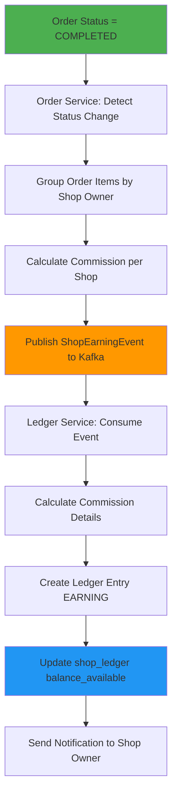
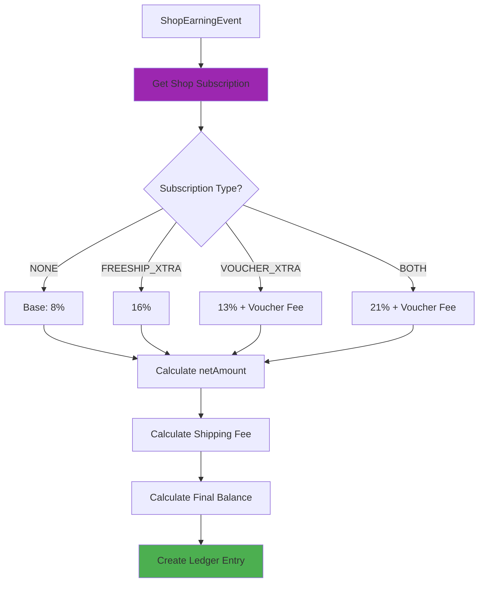

# Hệ Thống Payout/Ledger - Shopee Clone

## 📋 Tổng Quan

Hệ thống quản lý ví và payout cho shop owners với các tính năng:

- **Trigger**: Chỉ cộng tiền khi order status = COMPLETED (không phải PAID)
- **Ví riêng**: Mỗi shop có balance riêng
- **Commission phức tạp**: Tính theo gói subscription (Freeship Xtra, Voucher Xtra)
- **Phí phải trả**: Lưu shipping fee và các phí khác, trả xong mới được rút
- **VNPay chung**: Tất cả tiền về platform account, shop không cần liên kết VNPay

---

## 💰 Commission Structure

### Base Commission (Không có gói)

- Phí thanh toán: **4%**
- Phí cố định: **4%**
- **Tổng: 8%**

### Có Freeship Xtra

- Phí thanh toán: **4%**
- Phí cố định: **4%**
- Phí Freeship Xtra: **8%** (không giới hạn)
- **Tổng: 16%**

### Có Voucher Xtra

- Phí thanh toán: **4%**
- Phí cố định: **4%**
- Phí Voucher Xtra: **5%** giá trị mỗi sản phẩm (tối đa 50,000đ/sản phẩm)
- **Tổng: 13%** (nếu không vượt max)

### Có cả 2 gói

- Phí thanh toán: **4%**
- Phí cố định: **4%**
- Phí Freeship Xtra: **8%**
- Phí Voucher Xtra: **5%** (max 50k/sản phẩm)
- **Tổng: 21%** (nếu không vượt max)

---

## 📦 Chi Tiết Các Gói Subscription

### 1. Freeship Xtra

**Mô tả:**
- Shop đăng ký gói để cung cấp miễn phí ship cho khách hàng
- Khách hàng không phải trả phí ship khi mua sản phẩm từ shop có gói này
- Shop trả phí 8% trên tổng giá trị đơn hàng (không giới hạn số tiền)

**Đặc điểm:**
- Phí tính trên `grossAmount` (tổng giá trị đơn hàng)
- Không có giới hạn tối đa
- Áp dụng cho tất cả đơn hàng trong thời gian subscription active
- Shipping fee được platform chi trả, shop không cần trả riêng

**Ví dụ:**
```
Order: 1,000,000 VNĐ
Shipping fee: 30,000 VNĐ (khách hàng không trả)

Commission:
- Phí thanh toán (4%): 40,000
- Phí cố định (4%): 40,000
- Phí Freeship Xtra (8%): 80,000
- Tổng commission: 160,000

netAmount = 1,000,000 - 160,000 = 840,000 VNĐ
Shop nhận: 840,000 VNĐ (đã trừ shipping fee gián tiếp qua commission)
```

**Quản lý:**
- Shop đăng ký qua Admin hoặc tự đăng ký (nếu có payment)
- Có thể đăng ký theo tháng/năm
- Tự động gia hạn hoặc hết hạn
- Có thể hủy trước khi hết hạn

### 2. Voucher Xtra

**Mô tả:**
- Shop đăng ký gói để tạo và quản lý voucher giảm giá
- Cho phép shop tạo nhiều voucher với mức giảm giá khác nhau
- Shop trả phí 5% trên giá trị mỗi sản phẩm được áp dụng voucher
- **Giới hạn: Tối đa 50,000 VNĐ/sản phẩm**

**Đặc điểm:**
- Phí tính trên giá trị sản phẩm (không phải tổng đơn hàng)
- Có giới hạn tối đa: 50,000 VNĐ/sản phẩm
- Chỉ tính phí cho sản phẩm được áp dụng voucher
- Nếu voucher giảm 100,000 VNĐ cho sản phẩm 1,000,000 VNĐ:
  - Phí = 1,000,000 × 5% = 50,000 VNĐ (đạt max)
  - Không tính thêm nếu vượt max

**Ví dụ 1: Sản phẩm 500,000 VNĐ, voucher 10%**
```
Giá trị sản phẩm: 500,000 VNĐ
Phí Voucher Xtra: 500,000 × 5% = 25,000 VNĐ (< 50k max)
```

**Ví dụ 2: Sản phẩm 2,000,000 VNĐ, voucher 20%**
```
Giá trị sản phẩm: 2,000,000 VNĐ
Phí Voucher Xtra: 2,000,000 × 5% = 100,000 VNĐ
→ Áp dụng max: 50,000 VNĐ (vì vượt 50k)
```

**Ví dụ 3: Order có 3 sản phẩm với voucher**
```
Sản phẩm 1: 300,000 → Phí: 15,000
Sản phẩm 2: 800,000 → Phí: 40,000
Sản phẩm 3: 1,500,000 → Phí: 50,000 (max)
Tổng phí Voucher Xtra: 105,000 VNĐ
```

**Quản lý:**
- Shop tạo voucher qua UI
- Voucher có thể có điều kiện (min order value, số lượng, thời gian)
- Track voucher usage trong order
- Tính phí khi order COMPLETED

### 3. Cả 2 Gói (Freeship Xtra + Voucher Xtra)

**Mô tả:**
- Shop đăng ký cả 2 gói cùng lúc
- Được hưởng lợi ích của cả 2 gói
- Trả phí tổng hợp: 4% + 4% + 8% + 5% = 21% (base) + Voucher fee

**Ví dụ:**
```
Order: 1,000,000 VNĐ
Sản phẩm 1: 600,000 (có voucher)
Sản phẩm 2: 400,000 (không voucher)
Shipping fee: 30,000 VNĐ (miễn phí cho khách)

Commission:
- Phí thanh toán (4%): 40,000
- Phí cố định (4%): 40,000
- Phí Freeship Xtra (8%): 80,000
- Phí Voucher Xtra (5%): 600,000 × 5% = 30,000 (< 50k max)
- Tổng commission: 190,000

netAmount = 1,000,000 - 190,000 = 810,000 VNĐ
Shop nhận: 810,000 VNĐ
```

---

## 🗄️ Database Schema

### 1. shop_subscriptions (User Service)

Lưu gói subscription của shop:

```sql
CREATE TABLE shop_subscriptions (
    id VARCHAR(36) PRIMARY KEY,
    shop_owner_id VARCHAR(36) NOT NULL,
    subscription_type ENUM('FREESHIP_XTRA', 'VOUCHER_XTRA', 'BOTH', 'NONE') NOT NULL,
    plan_duration ENUM('MONTHLY', 'YEARLY') NOT NULL,
    start_date TIMESTAMP NOT NULL,
    end_date TIMESTAMP NOT NULL,
    is_active BOOLEAN DEFAULT TRUE,
    auto_renew BOOLEAN DEFAULT FALSE,
    price DECIMAL(15,2) DEFAULT 0,
    payment_status ENUM('PAID', 'PENDING', 'EXPIRED') DEFAULT 'PENDING',
    created_at TIMESTAMP DEFAULT CURRENT_TIMESTAMP,
    updated_at TIMESTAMP DEFAULT CURRENT_TIMESTAMP ON UPDATE CURRENT_TIMESTAMP,
    cancelled_at TIMESTAMP NULL,
    cancellation_reason TEXT NULL,
    FOREIGN KEY (shop_owner_id) REFERENCES shop_owners(user_id),
    INDEX idx_shop_owner_active (shop_owner_id, is_active)
);
```

### 2. shop_ledger (Order Service)

Ví của mỗi shop:

```sql
CREATE TABLE shop_ledger (
    id VARCHAR(36) PRIMARY KEY,
    shop_owner_id VARCHAR(36) UNIQUE NOT NULL,
    balance_available DECIMAL(15,2) DEFAULT 0 COMMENT 'Số dư có thể rút',
    balance_pending DECIMAL(15,2) DEFAULT 0 COMMENT 'Số dư đang chờ (order chưa COMPLETED)',
    total_earnings DECIMAL(15,2) DEFAULT 0 COMMENT 'Tổng doanh thu',
    total_commission DECIMAL(15,2) DEFAULT 0 COMMENT 'Tổng phí đã trừ',
    total_payouts DECIMAL(15,2) DEFAULT 0 COMMENT 'Tổng đã rút',
    created_at TIMESTAMP DEFAULT CURRENT_TIMESTAMP,
    updated_at TIMESTAMP DEFAULT CURRENT_TIMESTAMP ON UPDATE CURRENT_TIMESTAMP,
    FOREIGN KEY (shop_owner_id) REFERENCES shop_owners(user_id)
);
```

### 3. shop_ledger_entry (Order Service)

Lịch sử giao dịch:

```sql
CREATE TABLE shop_ledger_entry (
    id VARCHAR(36) PRIMARY KEY,
    shop_owner_id VARCHAR(36) NOT NULL,
    order_id VARCHAR(36) NULL,
    entry_type ENUM('EARNING', 'PAYOUT', 'ADJUST', 'FEE_DEDUCTION') NOT NULL,
    amount_gross DECIMAL(15,2) DEFAULT 0 COMMENT 'Tổng tiền order',
    commission_payment DECIMAL(15,2) DEFAULT 0 COMMENT 'Phí thanh toán (4%)',
    commission_fixed DECIMAL(15,2) DEFAULT 0 COMMENT 'Phí cố định (4%)',
    commission_freeship DECIMAL(15,2) DEFAULT 0 COMMENT 'Phí Freeship Xtra (8%)',
    commission_voucher DECIMAL(15,2) DEFAULT 0 COMMENT 'Phí Voucher Xtra (5%)',
    commission_total DECIMAL(15,2) DEFAULT 0 COMMENT 'Tổng commission',
    amount_net DECIMAL(15,2) DEFAULT 0 COMMENT 'Tiền shop nhận (gross - commission)',
    shipping_fee DECIMAL(15,2) DEFAULT 0 COMMENT 'Phí ship phải trả',
    other_fees DECIMAL(15,2) DEFAULT 0 COMMENT 'Các phí khác',
    balance_before DECIMAL(15,2) DEFAULT 0 COMMENT 'Số dư trước',
    balance_after DECIMAL(15,2) DEFAULT 0 COMMENT 'Số dư sau',
    ref_txn VARCHAR(255) NOT NULL COMMENT 'Transaction reference (orderId + shopOwnerId)',
    description TEXT NULL,
    created_at TIMESTAMP DEFAULT CURRENT_TIMESTAMP,
    FOREIGN KEY (shop_owner_id) REFERENCES shop_owners(user_id),
    FOREIGN KEY (order_id) REFERENCES orders(id),
    UNIQUE KEY uk_ref_txn (ref_txn),
    INDEX idx_shop_owner (shop_owner_id),
    INDEX idx_order_id (order_id),
    INDEX idx_entry_type (entry_type),
    INDEX idx_created_at (created_at)
);
```

### 4. payout_batch (Order Service)

Lịch sử rút tiền:

```sql
CREATE TABLE payout_batch (
    id VARCHAR(36) PRIMARY KEY,
    shop_owner_id VARCHAR(36) NOT NULL,
    amount DECIMAL(15,2) NOT NULL,
    status ENUM('PENDING', 'PROCESSING', 'COMPLETED', 'FAILED') DEFAULT 'PENDING',
    bank_account_number VARCHAR(50) NOT NULL,
    bank_name VARCHAR(100) NOT NULL,
    account_holder_name VARCHAR(255) NOT NULL,
    transaction_ref VARCHAR(255) UNIQUE NOT NULL,
    processed_at TIMESTAMP NULL,
    failure_reason TEXT NULL,
    created_at TIMESTAMP DEFAULT CURRENT_TIMESTAMP,
    updated_at TIMESTAMP DEFAULT CURRENT_TIMESTAMP ON UPDATE CURRENT_TIMESTAMP,
    FOREIGN KEY (shop_owner_id) REFERENCES shop_owners(user_id),
    INDEX idx_shop_owner (shop_owner_id),
    INDEX idx_status (status),
    INDEX idx_created_at (created_at)
);
```

---

## 🔄 Architecture Flow

### Flow 1: Order COMPLETED → Cộng tiền vào ví



### Flow 2: Commission Calculation



---

## 🚢 Shipping Fee Logic

### Khi Shop CÓ Freeship Xtra

```
User checkout:
- Shipping fee: 30,000 VNĐ
- User trả: 0 VNĐ (miễn phí ship)
- Platform trả: 30,000 VNĐ (từ commission của shop)

Shop ledger:
- grossAmount: 1,000,000
- commission: 160,000 (bao gồm 80k Freeship Xtra)
- shippingFee: 0 (đã tính trong commission)
- netAmount: 840,000
```

### Khi Shop KHÔNG CÓ Freeship Xtra

```
User checkout:
- Shipping fee: 30,000 VNĐ
- User trả: 30,000 VNĐ
- Platform thu: 30,000 VNĐ

Shop ledger:
- grossAmount: 1,000,000
- commission: 80,000 (base 8%)
- shippingFee: 30,000 (shop phải trả)
- netAmount: 1,000,000 - 80,000 - 30,000 = 890,000
```

### Lưu Shipping Fee vào Ledger

```java
// Trong shop_ledger_entry
shippingFee = {
    if (hasFreeshipXtra) {
        return 0; // Đã tính trong commission
    } else {
        return actualShippingFee; // Shop phải trả
    }
}

// Balance calculation
balance_available = netAmount - shippingFee - otherFees
```

---

## 📊 Commission Calculation Logic

### Step-by-Step Calculation

```java
public CommissionResult calculateCommission(
    String shopOwnerId, 
    BigDecimal grossAmount, 
    List<OrderItem> orderItems,
    BigDecimal shippingFee
) {
    // 1. Get subscription
    SubscriptionType subscription = getActiveSubscription(shopOwnerId);
    
    // 2. Base commission (luôn có)
    BigDecimal commissionPayment = grossAmount.multiply(new BigDecimal("0.04")); // 4%
    BigDecimal commissionFixed = grossAmount.multiply(new BigDecimal("0.04")); // 4%
    
    // 3. Freeship Xtra commission
    BigDecimal commissionFreeship = BigDecimal.ZERO;
    if (subscription == FREESHIP_XTRA || subscription == BOTH) {
        commissionFreeship = grossAmount.multiply(new BigDecimal("0.08")); // 8%
    }
    
    // 4. Voucher Xtra commission
    BigDecimal commissionVoucher = BigDecimal.ZERO;
    if (subscription == VOUCHER_XTRA || subscription == BOTH) {
        for (OrderItem item : orderItems) {
            if (item.hasVoucher()) {
                BigDecimal itemValue = BigDecimal.valueOf(item.getTotalPrice());
                BigDecimal voucherFee = itemValue.multiply(new BigDecimal("0.05")); // 5%
                BigDecimal maxFee = new BigDecimal("50000");
                commissionVoucher = commissionVoucher.add(
                    voucherFee.min(maxFee)
                );
            }
        }
    }
    
    // 5. Total commission
    BigDecimal totalCommission = commissionPayment
        .add(commissionFixed)
        .add(commissionFreeship)
        .add(commissionVoucher);
    
    // 6. Net amount
    BigDecimal netAmount = grossAmount.subtract(totalCommission);
    
    // 7. Shipping fee handling
    BigDecimal finalShippingFee = BigDecimal.ZERO;
    if (subscription != FREESHIP_XTRA && subscription != BOTH) {
        finalShippingFee = shippingFee; // Shop phải trả
    }
    
    // 8. Final balance
    BigDecimal finalBalance = netAmount.subtract(finalShippingFee);
    
    return CommissionResult.builder()
        .grossAmount(grossAmount)
        .commissionPayment(commissionPayment)
        .commissionFixed(commissionFixed)
        .commissionFreeship(commissionFreeship)
        .commissionVoucher(commissionVoucher)
        .totalCommission(totalCommission)
        .netAmount(netAmount)
        .shippingFee(finalShippingFee)
        .finalBalance(finalBalance)
        .build();
}
```

### Commission Calculation Example

**Ví dụ**: Order 1,000,000 VNĐ, shop có Freeship Xtra + Voucher Xtra

```
grossAmount = 1,000,000 VNĐ

Commission:
- Phí thanh toán (4%): 40,000
- Phí cố định (4%): 40,000
- Phí Freeship Xtra (8%): 80,000
- Phí Voucher Xtra (5%): 50,000 (max 50k/sản phẩm)
- Tổng commission: 210,000

netAmount = 1,000,000 - 210,000 = 790,000 VNĐ

Shipping fee: 0 VNĐ (đã tính trong Freeship Xtra)

Balance cộng vào ví: 790,000 VNĐ
```

---

## 📨 Kafka Events

### shop-earning-topic

**Producer**: Order Service  
**Consumer**: Ledger Service (Order Service)  
**Event**: `ShopEarningEvent`

```json
{
  "orderId": "uuid",
  "shopOwnerId": "uuid",
  "grossAmount": 1000000,
  "orderItems": [
    {
      "productId": "uuid",
      "sizeId": "uuid",
      "quantity": 2,
      "unitPrice": 500000,
      "totalPrice": 1000000,
      "hasVoucher": true
    }
  ],
  "shippingFee": 30000,
  "paymentMethod": "VNPAY|COD",
  "completedAt": "2024-01-15T10:30:00Z"
}
```

---

## 🔐 Security & Validation

1. **Idempotency**: Dùng `orderId + shopOwnerId` làm unique key (`ref_txn`)
2. **Transaction**: Đảm bảo atomic khi update ledger
3. **Validation**: Kiểm tra order status = COMPLETED trước khi cộng tiền
4. **Audit Trail**: Lưu đầy đủ thông tin vào ledger_entry
5. **Balance Check**: Kiểm tra balance trước khi cho phép payout

---

## 📝 API Endpoints

### Shop Owner APIs

#### Xem Balance
```
GET /v1/ledger/balance
Response: {
  "balanceAvailable": 1000000,
  "balancePending": 500000,
  "totalEarnings": 5000000,
  "totalCommission": 500000,
  "totalPayouts": 3500000
}
```

#### Xem Lịch Sử Giao Dịch
```
GET /v1/ledger/entries?page=0&size=20
Response: {
  "content": [...],
  "totalElements": 100,
  "totalPages": 5
}
```

#### Request Payout
```
POST /v1/ledger/payout/request
Body: {
  "amount": 500000,
  "bankAccountNumber": "1234567890",
  "bankName": "Vietcombank",
  "accountHolderName": "Nguyen Van A"
}
```

#### Xem Lịch Sử Payout
```
GET /v1/ledger/payout/history
```

### Admin APIs

#### Xem Tất Cả Ledgers
```
GET /v1/admin/ledger/all?page=0&size=20
```

#### Process Payout
```
PUT /v1/admin/ledger/payout/{id}/process
```

#### Xem Báo Cáo
```
GET /v1/admin/ledger/report?startDate=2024-01-01&endDate=2024-01-31
```

---

## 🧪 Testing Strategy

1. **Unit Test**: Commission calculation với các subscription types
2. **Integration Test**: Flow từ order COMPLETED → ledger update
3. **E2E Test**: Payout flow từ request → completion
4. **Idempotency Test**: Đảm bảo không duplicate khi retry
5. **Balance Test**: Kiểm tra balance calculation chính xác

---

## 📈 Monitoring & Reporting

### Metrics cần track:
- Tổng số earnings mỗi ngày
- Tổng commission thu được
- Số lượng payout requests
- Average payout amount
- Payout success rate

### Reports:
- Báo cáo doanh thu theo shop
- Báo cáo commission theo gói subscription
- Báo cáo payout theo thời gian
- Top shops by earnings

---

## 🚀 Implementation Roadmap

### Phase 1: Database & Models ✅
- [x] Tạo bảng `shop_subscriptions` trong user-service
- [x] Tạo bảng `shop_ledger`, `shop_ledger_entry`, `payout_batch` trong order-service
- [x] Tạo Entity models và DTOs
- [x] Tạo Repositories

### Phase 2: Commission Calculation Service
- [ ] Tạo `CommissionCalculatorService`
- [ ] Implement logic tính commission theo subscription type
- [ ] Xử lý Voucher Xtra: 5% mỗi sản phẩm, max 50k/sản phẩm

### Phase 3: Order Status Listener
- [ ] Thêm logic trong `OrderServiceImpl` để detect COMPLETED
- [ ] Group order items theo shop owner
- [ ] Publish `ShopEarningEvent` lên Kafka

### Phase 4: Ledger Service
- [ ] Tạo `LedgerService` consumer `ShopEarningEvent`
- [ ] Tính commission chi tiết
- [ ] Tạo `shop_ledger_entry` với type = EARNING
- [ ] Update `shop_ledger.balance_available`
- [ ] Gửi notification

### Phase 5: Payout API
- [ ] API để shop owner xem balance
- [ ] API để shop owner request payout
- [ ] API admin để process payout batch
- [ ] Job định kỳ để process payout

### Phase 6: Shipping Fee Tracking
- [ ] Lưu shipping fee vào `shop_ledger_entry.shipping_fee`
- [ ] Trừ shipping fee khỏi balance khi tính toán
- [ ] Chỉ cho phép rút khi đã trả hết shipping fee

---

## 📚 References

- [Payout_Ledger.md](./Payout_Ledger.md) - Initial design document
- [EVENT_DRIVEN_ARCHITECTURE.md](./EVENT_DRIVEN_ARCHITECTURE.md) - Kafka event flow
- [ORDER_FLOW_EXPLANATION.md](./ORDER_FLOW_EXPLANATION.md) - Order lifecycle

