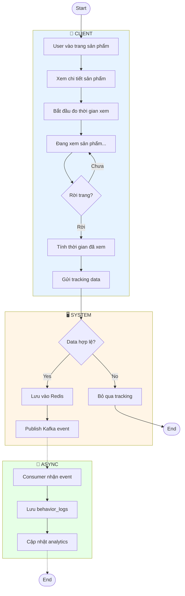
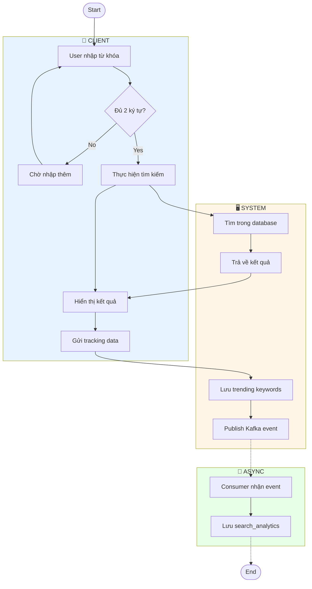
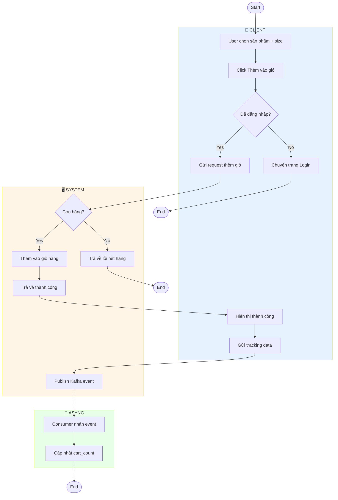
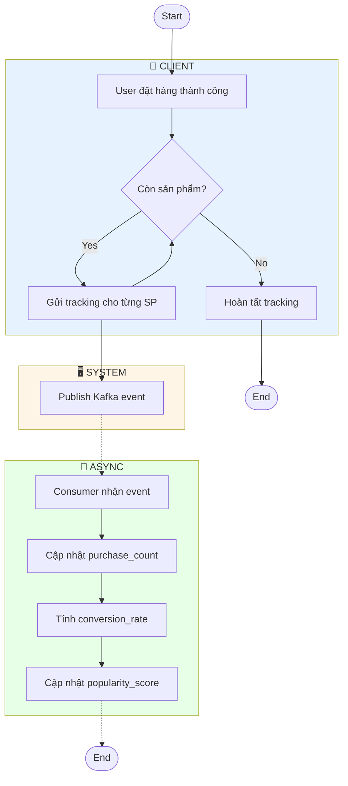
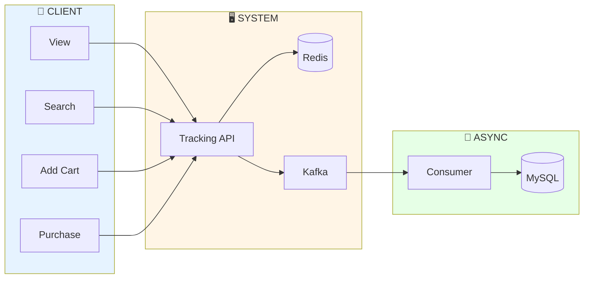

# Activity Diagrams - Behavior Tracking

Tài liệu mô tả Activity Diagram cho hệ thống theo dõi hành vi người dùng.

---

## 1. Track Product View (Xem Sản Phẩm)

---

## 2. Track Search (Tìm Kiếm)

---

## 3. Track Add to Cart (Thêm Giỏ Hàng)

---

## 4. Track Purchase (Mua Hàng)

---

## 5. Tổng Quan Data Flow

---

## Bảng Tổng Hợp

| Event | Trigger | Redis | MySQL Table |
|-------|---------|-------|-------------|
| VIEW | Rời trang sản phẩm | view counter | behavior_logs, product_analytics |
| SEARCH | Tìm kiếm | trending keywords | behavior_logs, search_analytics |
| ADD_CART | Thêm giỏ hàng | - | behavior_logs, product_analytics |
| PURCHASE | Đặt hàng thành công | - | behavior_logs, product_analytics |
