# Activity Diagrams - Behavior Tracking

Tài liệu mô tả Activity Diagram cho hệ thống theo dõi hành vi người dùng.

---

## 1. Track Product View (Xem Sản Phẩm)

```mermaid
flowchart TD
    Start([Start]) --> Navigate[User vào trang sản phẩm]
    
    subgraph Client["👤 CLIENT"]
        Navigate --> ViewProduct[Xem chi tiết sản phẩm]
        ViewProduct --> StartTimer[Bắt đầu đo thời gian xem]
        StartTimer --> Viewing[Đang xem sản phẩm...]
        Viewing --> Leave{Rời trang?}
        Leave -->|Chưa| Viewing
        Leave -->|Rời| CalcTime[Tính thời gian đã xem]
        CalcTime --> SendTrack[Gửi tracking data]
    end
    
    subgraph System["🖥️ SYSTEM"]
        SendTrack --> ValidateData{Data hợp lệ?}
        ValidateData -->|No| Error[Bỏ qua tracking]
        ValidateData -->|Yes| SaveRedis[Lưu vào Redis]
        SaveRedis --> PublishKafka[Publish Kafka event]
    end
    
    subgraph Async["📨 ASYNC"]
        PublishKafka -.-> Consume[Consumer nhận event]
        Consume --> SaveDB[Lưu behavior_logs]
        SaveDB --> UpdateAnalytics[Cập nhật analytics]
    end
    
    Error --> EndErr([End])
    UpdateAnalytics -.-> EndOK([End])
    
    style Client fill:#e6f3ff
    style System fill:#fff5e6
    style Async fill:#e6ffe6
```

---

## 2. Track Search (Tìm Kiếm)

```mermaid
flowchart TD
    Start([Start]) --> TypeKeyword[User nhập từ khóa]
    
    subgraph Client["👤 CLIENT"]
        TypeKeyword --> CheckLength{Đủ 2 ký tự?}
        CheckLength -->|No| Wait[Chờ nhập thêm]
        Wait --> TypeKeyword
        CheckLength -->|Yes| TriggerSearch[Thực hiện tìm kiếm]
        TriggerSearch --> DisplayResults[Hiển thị kết quả]
        DisplayResults --> SendTrack[Gửi tracking data]
    end
    
    subgraph System["🖥️ SYSTEM"]
        TriggerSearch --> SearchDB[Tìm trong database]
        SearchDB --> ReturnResults[Trả về kết quả]
        ReturnResults --> DisplayResults
        SendTrack --> SaveTrending[Lưu trending keywords]
        SaveTrending --> PublishKafka[Publish Kafka event]
    end
    
    subgraph Async["📨 ASYNC"]
        PublishKafka -.-> Consume[Consumer nhận event]
        Consume --> SaveDB[Lưu search_analytics]
    end
    
    SaveDB -.-> EndOK([End])
    
    style Client fill:#e6f3ff
    style System fill:#fff5e6
    style Async fill:#e6ffe6
```

---

## 3. Track Add to Cart (Thêm Giỏ Hàng)

```mermaid
flowchart TD
    Start([Start]) --> SelectProduct[User chọn sản phẩm + size]
    
    subgraph Client["👤 CLIENT"]
        SelectProduct --> ClickAdd[Click Thêm vào giỏ]
        ClickAdd --> CheckLogin{Đã đăng nhập?}
        CheckLogin -->|No| RedirectLogin[Chuyển trang Login]
        CheckLogin -->|Yes| SendRequest[Gửi request thêm giỏ]
        ShowSuccess[Hiển thị thành công] --> SendTrack[Gửi tracking data]
    end
    
    subgraph System["🖥️ SYSTEM"]
        SendRequest --> ValidateStock{Còn hàng?}
        ValidateStock -->|No| ReturnError[Trả về lỗi hết hàng]
        ValidateStock -->|Yes| AddToCart[Thêm vào giỏ hàng]
        AddToCart --> ReturnSuccess[Trả về thành công]
        ReturnSuccess --> ShowSuccess
        SendTrack --> PublishKafka[Publish Kafka event]
    end
    
    subgraph Async["📨 ASYNC"]
        PublishKafka -.-> Consume[Consumer nhận event]
        Consume --> UpdateAnalytics[Cập nhật cart_count]
    end
    
    RedirectLogin --> EndLogin([End])
    ReturnError --> EndErr([End])
    UpdateAnalytics -.-> EndOK([End])
    
    style Client fill:#e6f3ff
    style System fill:#fff5e6
    style Async fill:#e6ffe6
```

---

## 4. Track Purchase (Mua Hàng)

```mermaid
flowchart TD
    Start([Start]) --> Checkout[User đặt hàng thành công]
    
    subgraph Client["👤 CLIENT"]
        Checkout --> LoopProducts{Còn sản phẩm?}
        LoopProducts -->|Yes| SendTrack[Gửi tracking cho từng SP]
        SendTrack --> LoopProducts
        LoopProducts -->|No| Done[Hoàn tất tracking]
    end
    
    subgraph System["🖥️ SYSTEM"]
        SendTrack --> PublishKafka[Publish Kafka event]
    end
    
    subgraph Async["📨 ASYNC"]
        PublishKafka -.-> Consume[Consumer nhận event]
        Consume --> UpdatePurchase[Cập nhật purchase_count]
        UpdatePurchase --> CalcConversion[Tính conversion_rate]
        CalcConversion --> UpdatePopularity[Cập nhật popularity_score]
    end
    
    Done --> EndClient([End])
    UpdatePopularity -.-> EndAsync([End])
    
    style Client fill:#e6f3ff
    style System fill:#fff5e6
    style Async fill:#e6ffe6
```

---

## 5. Tổng Quan Data Flow

```mermaid
flowchart LR
    subgraph Client["👤 CLIENT"]
        A[View] 
        B[Search]
        C[Add Cart]
        D[Purchase]
    end
    
    subgraph System["🖥️ SYSTEM"]
        API[Tracking API]
        Redis[(Redis)]
        Kafka[Kafka]
    end
    
    subgraph Async["📨 ASYNC"]
        Consumer[Consumer]
        MySQL[(MySQL)]
    end
    
    A --> API
    B --> API
    C --> API
    D --> API
    API --> Redis
    API --> Kafka
    Kafka --> Consumer
    Consumer --> MySQL
    
    style Client fill:#e6f3ff
    style System fill:#fff5e6
    style Async fill:#e6ffe6
```

---

## Bảng Tổng Hợp

| Event | Trigger | Redis | MySQL Table |
|-------|---------|-------|-------------|
| VIEW | Rời trang sản phẩm | view counter | behavior_logs, product_analytics |
| SEARCH | Tìm kiếm | trending keywords | behavior_logs, search_analytics |
| ADD_CART | Thêm giỏ hàng | - | behavior_logs, product_analytics |
| PURCHASE | Đặt hàng thành công | - | behavior_logs, product_analytics |
