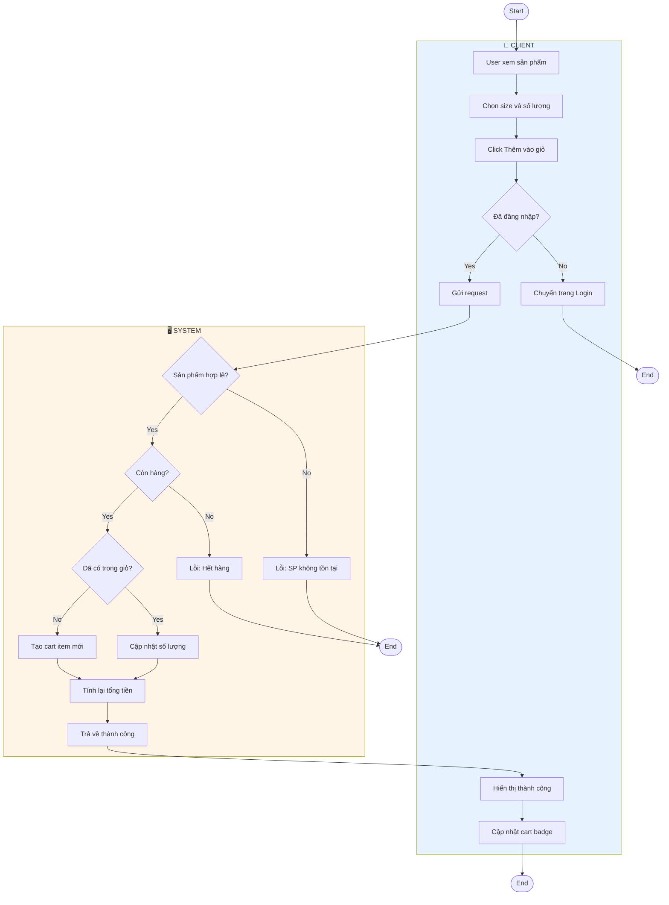
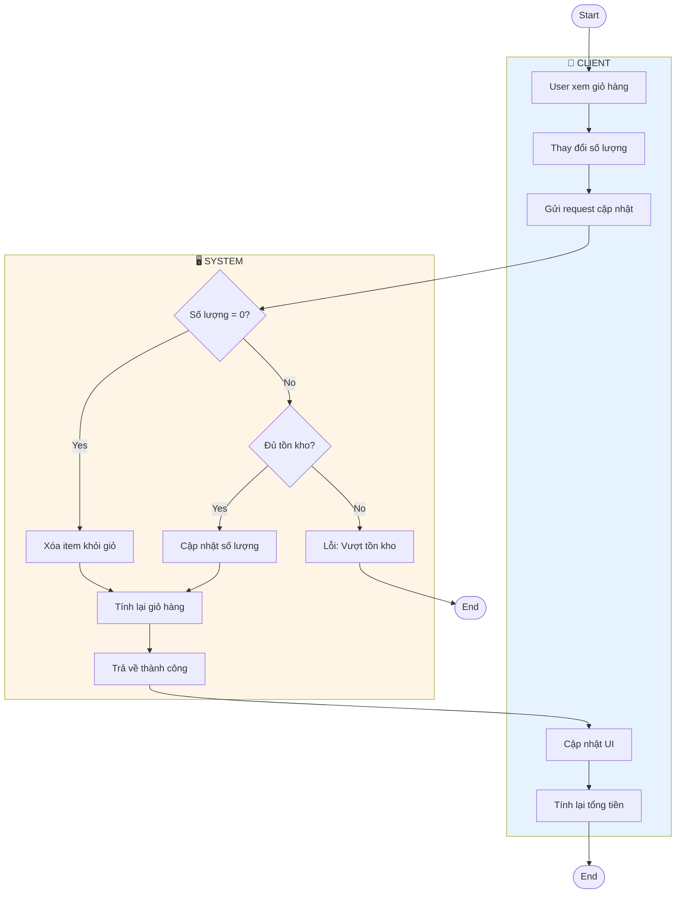
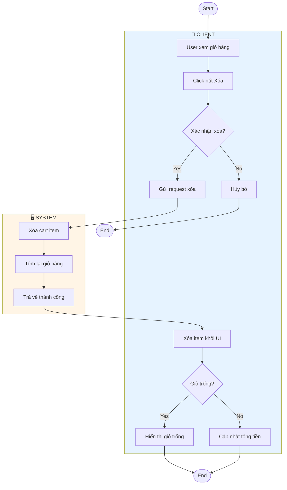
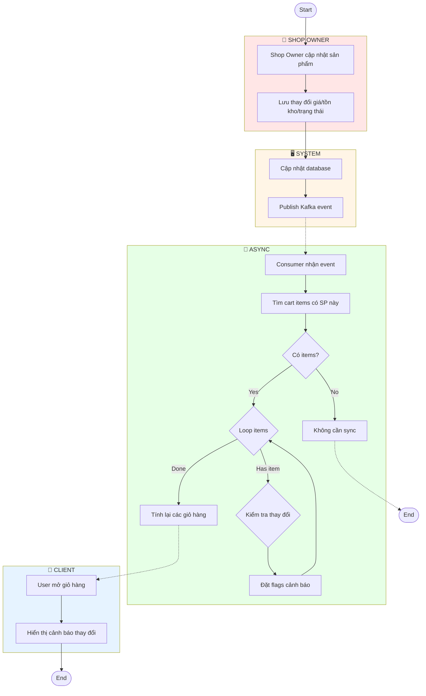
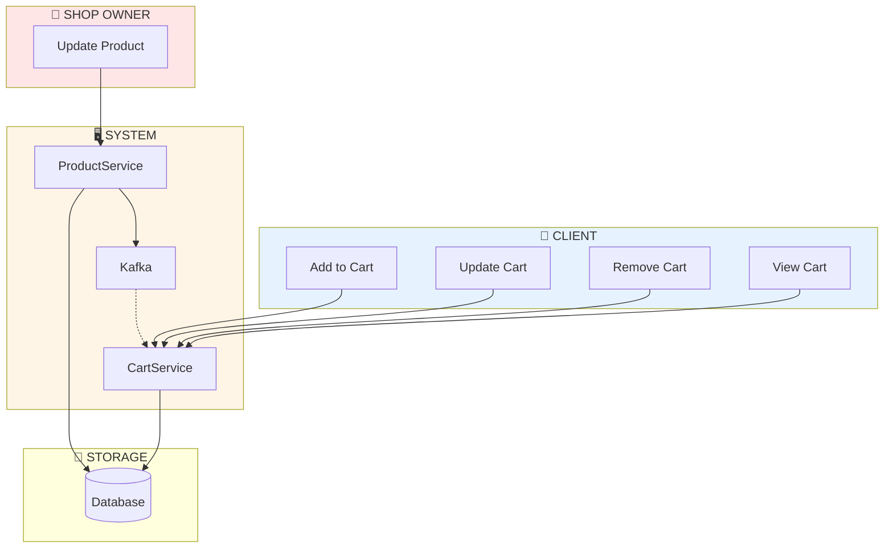

# Activity Diagrams - Cart Management

Tài liệu mô tả Activity Diagram cho hệ thống quản lý Giỏ Hàng.

---

## 1. Add to Cart (Thêm Vào Giỏ)

---

## 2. Update Cart Item (Cập Nhật Số Lượng)

---

## 3. Remove from Cart (Xóa Khỏi Giỏ)

---

## 4. Product Update Sync (Đồng Bộ Khi SP Thay Đổi)

---

## 5. Tổng Quan Kiến Trúc

---

## Bảng Tổng Hợp API

| Chức Năng | Endpoint | Method |
|-----------|----------|--------|
| Xem giỏ hàng | `/v1/stock/cart` | GET |
| Thêm vào giỏ | `/v1/stock/cart/add` | POST |
| Cập nhật số lượng | `/v1/stock/cart/update` | PUT |
| Xóa khỏi giỏ | `/v1/stock/cart/remove` | DELETE |
