# Activity Diagrams - Cart Management

Tài liệu mô tả Activity Diagram cho hệ thống quản lý Giỏ Hàng.

---

## 1. Add to Cart (Thêm Vào Giỏ)

```mermaid
flowchart TD
    Start([Start]) --> ViewProduct[User xem sản phẩm]
    
    subgraph Client["👤 CLIENT"]
        ViewProduct --> SelectSize[Chọn size và số lượng]
        SelectSize --> ClickAdd[Click Thêm vào giỏ]
        ClickAdd --> CheckLogin{Đã đăng nhập?}
        CheckLogin -->|No| RedirectLogin[Chuyển trang Login]
        CheckLogin -->|Yes| SendRequest[Gửi request]
        ShowSuccess[Hiển thị thành công]
        ShowSuccess --> UpdateBadge[Cập nhật cart badge]
    end
    
    subgraph System["🖥️ SYSTEM"]
        SendRequest --> CheckProduct{Sản phẩm hợp lệ?}
        CheckProduct -->|No| ErrProduct[Lỗi: SP không tồn tại]
        CheckProduct -->|Yes| CheckStock{Còn hàng?}
        CheckStock -->|No| ErrStock[Lỗi: Hết hàng]
        CheckStock -->|Yes| CheckExist{Đã có trong giỏ?}
        CheckExist -->|Yes| UpdateQty[Cập nhật số lượng]
        CheckExist -->|No| CreateItem[Tạo cart item mới]
        UpdateQty --> RecalcTotal[Tính lại tổng tiền]
        CreateItem --> RecalcTotal
        RecalcTotal --> ReturnSuccess[Trả về thành công]
        ReturnSuccess --> ShowSuccess
    end
    
    RedirectLogin --> EndLogin([End])
    ErrProduct --> EndErr([End])
    ErrStock --> EndErr
    UpdateBadge --> EndOK([End])
    
    style Client fill:#e6f3ff
    style System fill:#fff5e6
```

---

## 2. Update Cart Item (Cập Nhật Số Lượng)

```mermaid
flowchart TD
    Start([Start]) --> ViewCart[User xem giỏ hàng]
    
    subgraph Client["👤 CLIENT"]
        ViewCart --> ChangeQty[Thay đổi số lượng]
        ChangeQty --> SendUpdate[Gửi request cập nhật]
        UpdateUI[Cập nhật UI]
        UpdateUI --> RecalcUI[Tính lại tổng tiền]
    end
    
    subgraph System["🖥️ SYSTEM"]
        SendUpdate --> CheckQty{Số lượng = 0?}
        CheckQty -->|Yes| DeleteItem[Xóa item khỏi giỏ]
        CheckQty -->|No| CheckStock{Đủ tồn kho?}
        CheckStock -->|No| ErrStock[Lỗi: Vượt tồn kho]
        CheckStock -->|Yes| UpdateItem[Cập nhật số lượng]
        DeleteItem --> RecalcCart[Tính lại giỏ hàng]
        UpdateItem --> RecalcCart
        RecalcCart --> ReturnSuccess[Trả về thành công]
        ReturnSuccess --> UpdateUI
    end
    
    ErrStock --> EndErr([End])
    RecalcUI --> EndOK([End])
    
    style Client fill:#e6f3ff
    style System fill:#fff5e6
```

---

## 3. Remove from Cart (Xóa Khỏi Giỏ)

```mermaid
flowchart TD
    Start([Start]) --> ViewCart[User xem giỏ hàng]
    
    subgraph Client["👤 CLIENT"]
        ViewCart --> ClickRemove[Click nút Xóa]
        ClickRemove --> Confirm{Xác nhận xóa?}
        Confirm -->|No| Cancel[Hủy bỏ]
        Confirm -->|Yes| SendDelete[Gửi request xóa]
        RemoveUI[Xóa item khỏi UI]
        RemoveUI --> CheckEmpty{Giỏ trống?}
        CheckEmpty -->|Yes| ShowEmpty[Hiển thị giỏ trống]
        CheckEmpty -->|No| UpdateTotal[Cập nhật tổng tiền]
    end
    
    subgraph System["🖥️ SYSTEM"]
        SendDelete --> DeleteItem[Xóa cart item]
        DeleteItem --> RecalcCart[Tính lại giỏ hàng]
        RecalcCart --> ReturnSuccess[Trả về thành công]
        ReturnSuccess --> RemoveUI
    end
    
    Cancel --> EndCancel([End])
    ShowEmpty --> EndOK([End])
    UpdateTotal --> EndOK
    
    style Client fill:#e6f3ff
    style System fill:#fff5e6
```

---

## 4. Product Update Sync (Đồng Bộ Khi SP Thay Đổi)

```mermaid
flowchart TD
    Start([Start]) --> UpdateProduct[Shop Owner cập nhật sản phẩm]
    
    subgraph ShopOwner["🏪 SHOP OWNER"]
        UpdateProduct --> SaveChanges[Lưu thay đổi giá/tồn kho/trạng thái]
    end
    
    subgraph System["🖥️ SYSTEM"]
        SaveChanges --> UpdateDB[Cập nhật database]
        UpdateDB --> PublishEvent[Publish Kafka event]
    end
    
    subgraph Async["📨 ASYNC"]
        PublishEvent -.-> ConsumeEvent[Consumer nhận event]
        ConsumeEvent --> FindCarts[Tìm cart items có SP này]
        FindCarts --> HasItems{Có items?}
        HasItems -->|No| Done[Không cần sync]
        HasItems -->|Yes| SyncLoop{Loop items}
        SyncLoop -->|Has item| CheckChange{Kiểm tra thay đổi}
        CheckChange --> SetFlags[Đặt flags cảnh báo]
        SetFlags --> SyncLoop
        SyncLoop -->|Done| RecalcCarts[Tính lại các giỏ hàng]
    end
    
    subgraph Client["👤 CLIENT"]
        RecalcCarts -.-> LoadCart[User mở giỏ hàng]
        LoadCart --> ShowWarnings[Hiển thị cảnh báo thay đổi]
    end
    
    Done -.-> EndNoSync([End])
    ShowWarnings --> EndOK([End])
    
    style ShopOwner fill:#ffe6e6
    style System fill:#fff5e6
    style Async fill:#e6ffe6
    style Client fill:#e6f3ff
```

---

## 5. Tổng Quan Kiến Trúc

```mermaid
flowchart TB
    subgraph ShopOwner["🏪 SHOP OWNER"]
        UP[Update Product]
    end
    
    subgraph Client["👤 CLIENT"]
        AC[Add to Cart]
        UC[Update Cart]
        RC[Remove Cart]
        VC[View Cart]
    end
    
    subgraph System["🖥️ SYSTEM"]
        CS[CartService]
        PS[ProductService]
        K[Kafka]
    end
    
    subgraph Storage["💾 STORAGE"]
        DB[(Database)]
    end
    
    UP --> PS
    PS --> DB
    PS --> K
    K -.-> CS
    AC --> CS
    UC --> CS
    RC --> CS
    VC --> CS
    CS --> DB
    
    style ShopOwner fill:#ffe6e6
    style Client fill:#e6f3ff
    style System fill:#fff5e6
```

---

## Bảng Tổng Hợp API

| Chức Năng | Endpoint | Method |
|-----------|----------|--------|
| Xem giỏ hàng | `/v1/stock/cart` | GET |
| Thêm vào giỏ | `/v1/stock/cart/add` | POST |
| Cập nhật số lượng | `/v1/stock/cart/update` | PUT |
| Xóa khỏi giỏ | `/v1/stock/cart/remove` | DELETE |
