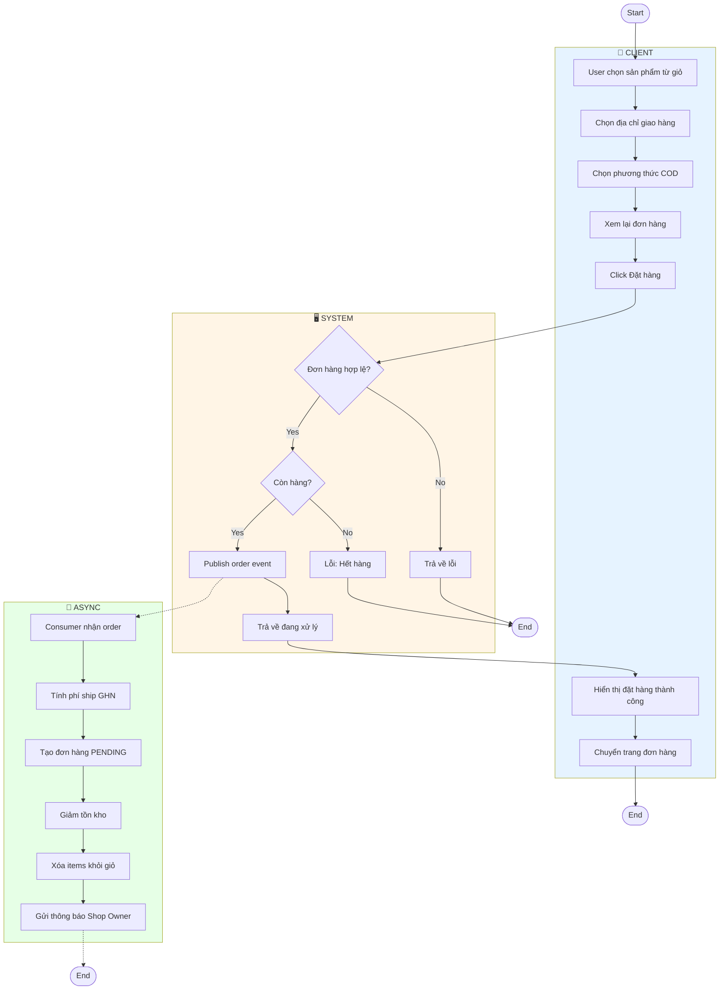
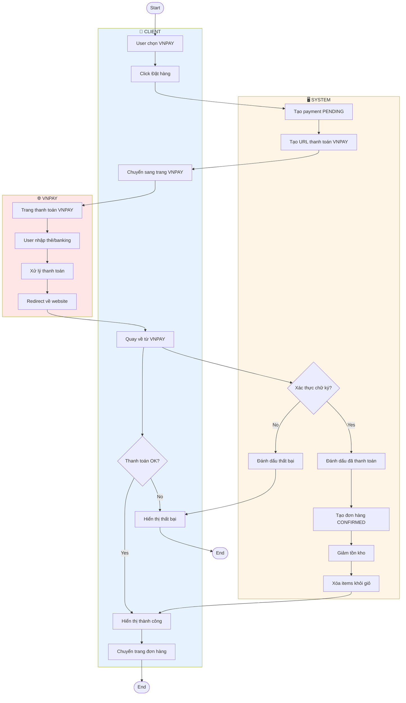
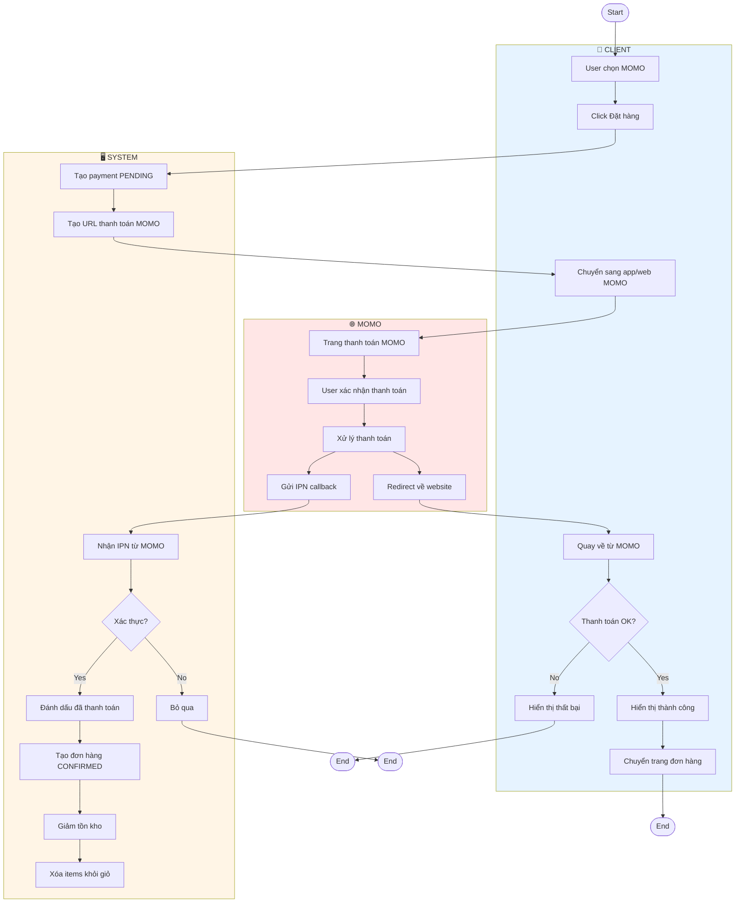
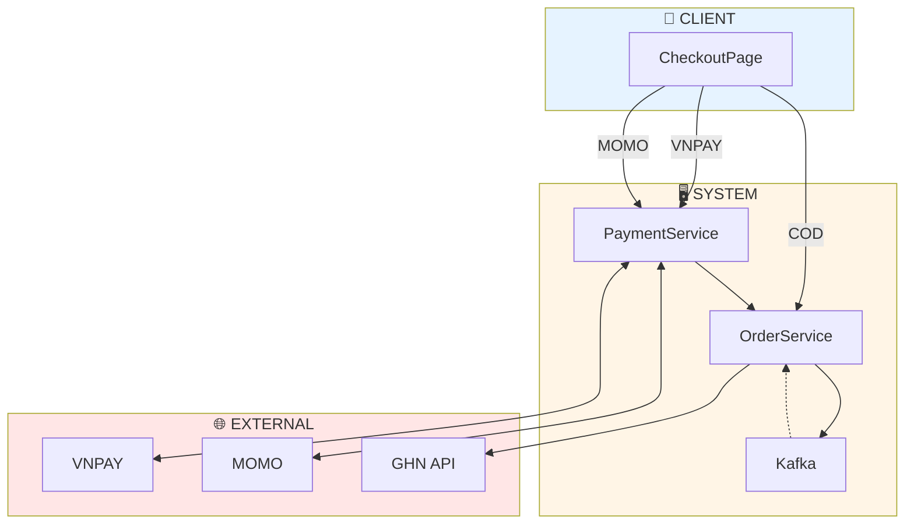

# Activity Diagrams - Checkout System

Tài liệu mô tả Activity Diagram cho hệ thống Checkout với các phương thức COD, VNPAY, MOMO.

---

## 1. Checkout COD (Thanh Toán Khi Nhận Hàng)

---

## 2. Checkout VNPAY (Thanh Toán Online)

---

## 3. Checkout MOMO (Thanh Toán Ví MoMo)

---

## 4. So Sánh Các Luồng Checkout

| Đặc Điểm | COD | VNPAY | MOMO |
|----------|-----|-------|------|
| **Luồng** | Đặt hàng → Ship → Trả tiền | Trả tiền → Đặt hàng | Trả tiền → Đặt hàng |
| **Xử lý Order** | Async qua Kafka | Sync sau thanh toán | Sync sau IPN |
| **Status ban đầu** | PENDING | CONFIRMED | CONFIRMED |
| **Callback** | ❌ | Return URL | ✅ IPN Callback |

---

## 5. Tổng Quan Kiến Trúc

