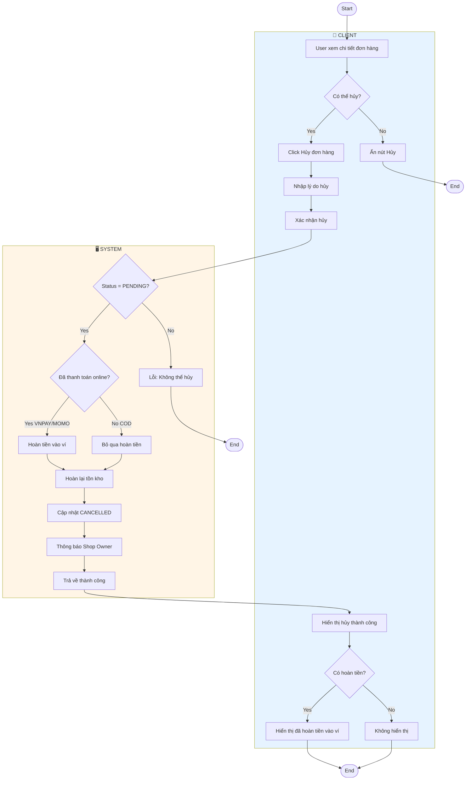
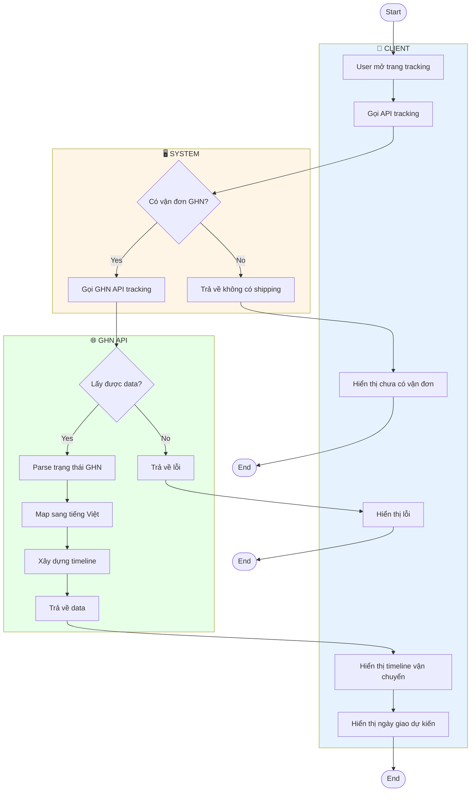
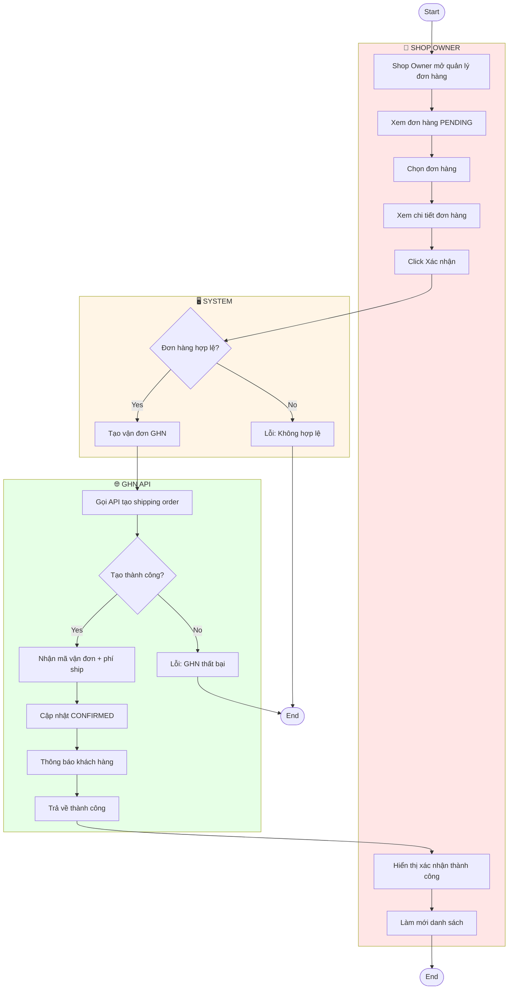
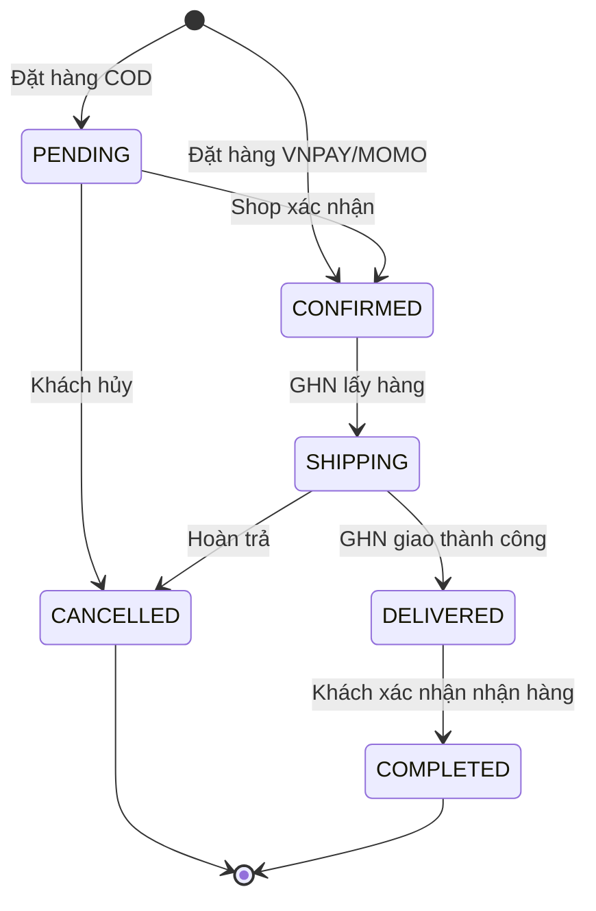
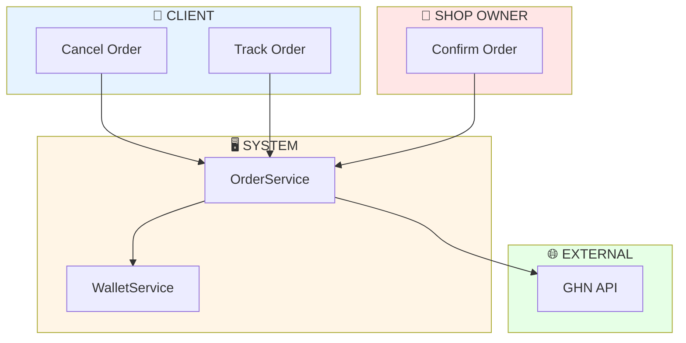

# Activity Diagrams - Order Management

Tài liệu mô tả Activity Diagram cho hệ thống quản lý đơn hàng.

---

## 1. Cancel Order (Hủy Đơn Hàng)

---

## 2. GHN Tracking (Theo Dõi Vận Chuyển)

---

## 3. Shop Owner Confirm Order (Xác Nhận Đơn Hàng)

---

## 4. Order Status Flow

---

## 5. Tổng Quan Kiến Trúc

---

## Bảng Tổng Hợp

| Chức Năng | Actor | Điều Kiện | Kết Quả |
|-----------|-------|-----------|---------|
| Cancel Order | Client | Status = PENDING | CANCELLED + Refund nếu đã thanh toán |
| Track Order | Client/Shop | Có GHN order code | Timeline vận chuyển |
| Confirm Order | Shop Owner | Status = PENDING | CONFIRMED + Tạo vận đơn GHN |
| Confirm Receipt | Client | Status = DELIVERED | COMPLETED |
