# Activity Diagrams - Order Management

Tài liệu mô tả Activity Diagram cho hệ thống quản lý đơn hàng.

---

## 1. Cancel Order (Hủy Đơn Hàng)

```mermaid
flowchart TD
    Start([Start]) --> ViewOrder[User xem chi tiết đơn hàng]
    
    subgraph Client["👤 CLIENT"]
        ViewOrder --> CheckCancel{Có thể hủy?}
        CheckCancel -->|No| HideButton[Ẩn nút Hủy]
        CheckCancel -->|Yes| ClickCancel[Click Hủy đơn hàng]
        ClickCancel --> InputReason[Nhập lý do hủy]
        InputReason --> ConfirmCancel[Xác nhận hủy]
        ShowSuccess[Hiển thị hủy thành công]
        ShowSuccess --> CheckRefund{Có hoàn tiền?}
        CheckRefund -->|Yes| ShowRefund[Hiển thị đã hoàn tiền vào ví]
        CheckRefund -->|No| NoRefund[Không hiển thị]
    end
    
    subgraph System["🖥️ SYSTEM"]
        ConfirmCancel --> ValidateStatus{Status = PENDING?}
        ValidateStatus -->|No| ErrStatus[Lỗi: Không thể hủy]
        ValidateStatus -->|Yes| CheckPayment{Đã thanh toán online?}
        CheckPayment -->|No COD| SkipRefund[Bỏ qua hoàn tiền]
        CheckPayment -->|Yes VNPAY/MOMO| RefundWallet[Hoàn tiền vào ví]
        RefundWallet --> RestoreStock[Hoàn lại tồn kho]
        SkipRefund --> RestoreStock
        RestoreStock --> UpdateCancelled[Cập nhật CANCELLED]
        UpdateCancelled --> NotifyShop[Thông báo Shop Owner]
        NotifyShop --> ReturnSuccess[Trả về thành công]
        ReturnSuccess --> ShowSuccess
    end
    
    HideButton --> EndNoAction([End])
    ErrStatus --> EndErr([End])
    ShowRefund --> EndOK([End])
    NoRefund --> EndOK
    
    style Client fill:#e6f3ff
    style System fill:#fff5e6
```

---

## 2. GHN Tracking (Theo Dõi Vận Chuyển)

```mermaid
flowchart TD
    Start([Start]) --> OpenTracking[User mở trang tracking]
    
    subgraph Client["👤 CLIENT"]
        OpenTracking --> LoadTracking[Gọi API tracking]
        DisplayTimeline[Hiển thị timeline vận chuyển]
        DisplayTimeline --> ShowExpected[Hiển thị ngày giao dự kiến]
        ShowNoShipping[Hiển thị chưa có vận đơn]
        ShowError[Hiển thị lỗi]
    end
    
    subgraph System["🖥️ SYSTEM"]
        LoadTracking --> CheckShipping{Có vận đơn GHN?}
        CheckShipping -->|No| ReturnNoShip[Trả về không có shipping]
        ReturnNoShip --> ShowNoShipping
        CheckShipping -->|Yes| CallGHN[Gọi GHN API tracking]
    end
    
    subgraph External["🌐 GHN API"]
        CallGHN --> GetGHNData{Lấy được data?}
        GetGHNData -->|No| ReturnGHNErr[Trả về lỗi]
        ReturnGHNErr --> ShowError
        GetGHNData -->|Yes| ParseStatus[Parse trạng thái GHN]
        ParseStatus --> MapVietnamese[Map sang tiếng Việt]
        MapVietnamese --> BuildTimeline[Xây dựng timeline]
        BuildTimeline --> ReturnData[Trả về data]
        ReturnData --> DisplayTimeline
    end
    
    ShowExpected --> EndOK([End])
    ShowNoShipping --> EndNoShip([End])
    ShowError --> EndErr([End])
    
    style Client fill:#e6f3ff
    style System fill:#fff5e6
    style External fill:#e6ffe6
```

---

## 3. Shop Owner Confirm Order (Xác Nhận Đơn Hàng)

```mermaid
flowchart TD
    Start([Start]) --> OpenDashboard[Shop Owner mở quản lý đơn hàng]
    
    subgraph ShopOwner["🏪 SHOP OWNER"]
        OpenDashboard --> ViewPending[Xem đơn hàng PENDING]
        ViewPending --> SelectOrder[Chọn đơn hàng]
        SelectOrder --> ReviewOrder[Xem chi tiết đơn hàng]
        ReviewOrder --> ClickConfirm[Click Xác nhận]
        ShowSuccess[Hiển thị xác nhận thành công]
        ShowSuccess --> RefreshList[Làm mới danh sách]
    end
    
    subgraph System["🖥️ SYSTEM"]
        ClickConfirm --> ValidateOrder{Đơn hàng hợp lệ?}
        ValidateOrder -->|No| ErrOrder[Lỗi: Không hợp lệ]
        ValidateOrder -->|Yes| CreateGHN[Tạo vận đơn GHN]
    end
    
    subgraph External["🌐 GHN API"]
        CreateGHN --> CallGHNCreate[Gọi API tạo shipping order]
        CallGHNCreate --> GHNSuccess{Tạo thành công?}
        GHNSuccess -->|No| ErrGHN[Lỗi: GHN thất bại]
        GHNSuccess -->|Yes| GetGHNCode[Nhận mã vận đơn + phí ship]
        GetGHNCode --> UpdateConfirmed[Cập nhật CONFIRMED]
        UpdateConfirmed --> NotifyCustomer[Thông báo khách hàng]
        NotifyCustomer --> ReturnSuccess[Trả về thành công]
        ReturnSuccess --> ShowSuccess
    end
    
    ErrOrder --> EndErr([End])
    ErrGHN --> EndErr
    RefreshList --> EndOK([End])
    
    style ShopOwner fill:#ffe6e6
    style System fill:#fff5e6
    style External fill:#e6ffe6
```

---

## 4. Order Status Flow

```mermaid
stateDiagram-v2
    [*] --> PENDING: Đặt hàng COD
    [*] --> CONFIRMED: Đặt hàng VNPAY/MOMO
    
    PENDING --> CANCELLED: Khách hủy
    PENDING --> CONFIRMED: Shop xác nhận
    
    CONFIRMED --> SHIPPING: GHN lấy hàng
    
    SHIPPING --> DELIVERED: GHN giao thành công
    SHIPPING --> CANCELLED: Hoàn trả
    
    DELIVERED --> COMPLETED: Khách xác nhận nhận hàng
    
    CANCELLED --> [*]
    COMPLETED --> [*]
```

---

## 5. Tổng Quan Kiến Trúc

```mermaid
flowchart TB
    subgraph Client["👤 CLIENT"]
        CO[Cancel Order]
        TO[Track Order]
    end
    
    subgraph ShopOwner["🏪 SHOP OWNER"]
        CF[Confirm Order]
    end
    
    subgraph System["🖥️ SYSTEM"]
        OS[OrderService]
        WS[WalletService]
    end
    
    subgraph External["🌐 EXTERNAL"]
        GHN[GHN API]
    end
    
    CO --> OS
    OS --> WS
    TO --> OS
    OS --> GHN
    CF --> OS
    
    style Client fill:#e6f3ff
    style ShopOwner fill:#ffe6e6
    style System fill:#fff5e6
    style External fill:#e6ffe6
```

---

## Bảng Tổng Hợp

| Chức Năng | Actor | Điều Kiện | Kết Quả |
|-----------|-------|-----------|---------|
| Cancel Order | Client | Status = PENDING | CANCELLED + Refund nếu đã thanh toán |
| Track Order | Client/Shop | Có GHN order code | Timeline vận chuyển |
| Confirm Order | Shop Owner | Status = PENDING | CONFIRMED + Tạo vận đơn GHN |
| Confirm Receipt | Client | Status = DELIVERED | COMPLETED |
